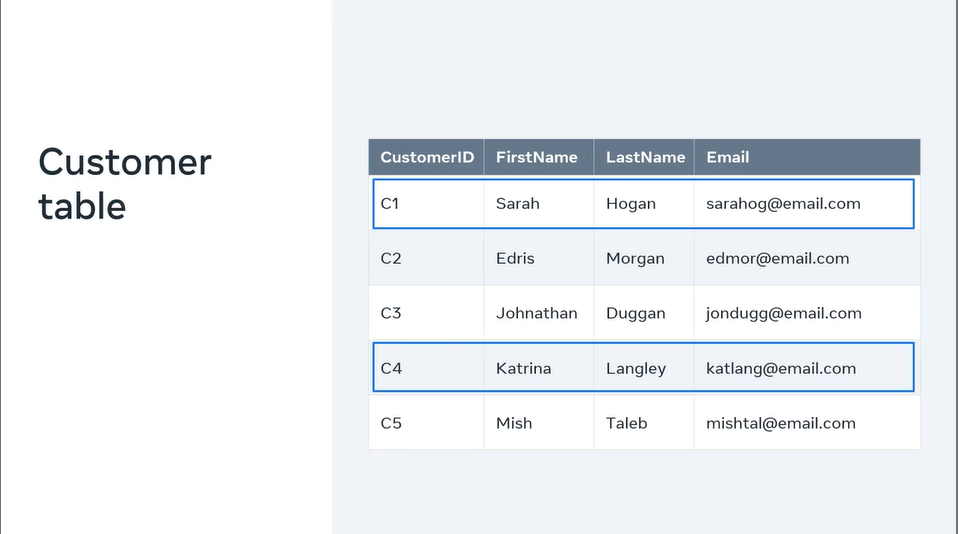
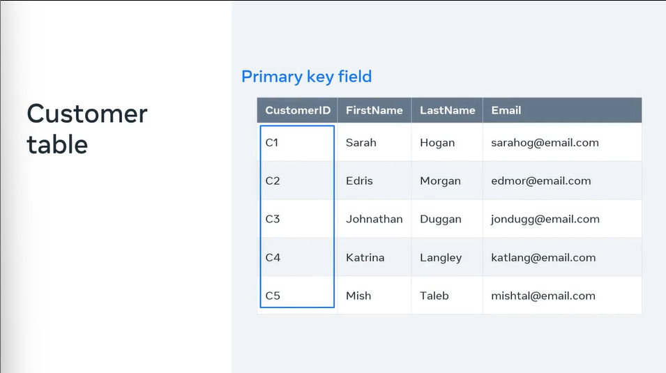
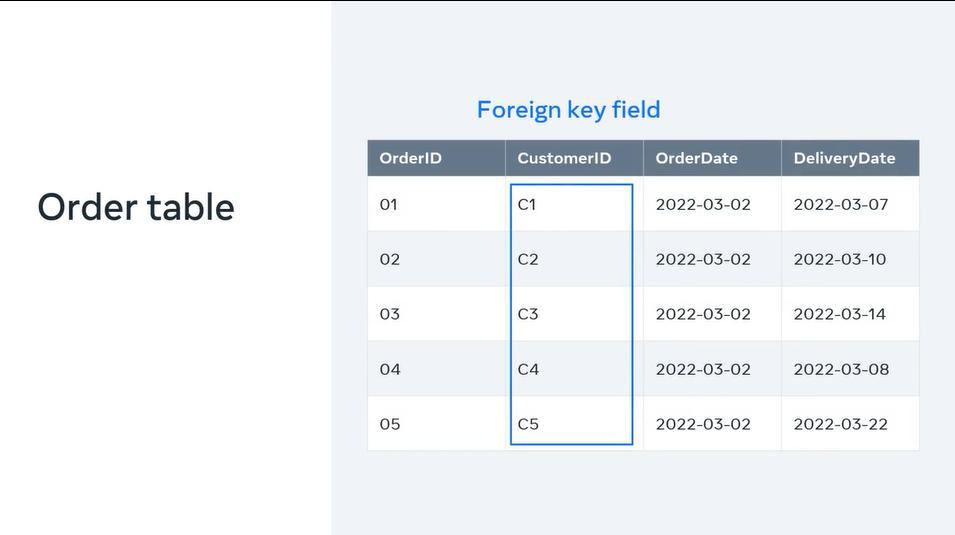
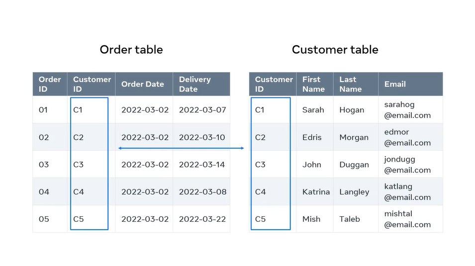
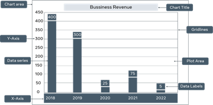
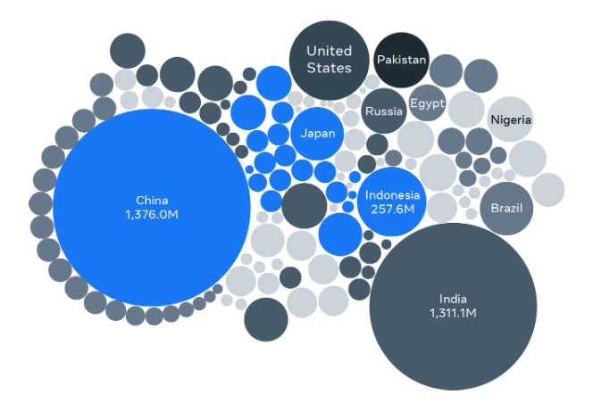
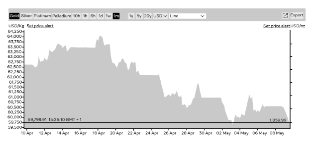

# How is Data Related

Your database must be able to retrieve the customer's details from one table and then find the order recorded against another table. How does the database establish a relationship between these pieces of data?

Data stored in a database cannot exist in isolation. It must have a relationship with other data so that it can be processed into meaningful information. How do you make sure that all the data in your database is related? Let's explore how data is related by using the online store as our example.

In the database of your online store, you could have an order table and a customer table.

To locate the details of a customer's order, you will check the order number against the customer ID. In other words, the database establishes a link between the data in the tables. Let's look at the customer table in more detail. In this table, the columns are: **Customer ID**, **FirstName**, **LastName**, and **Email**. In relational database terms, these are **fields**. Then there are several rows which contain data for each of these fields. In relational databases, they're known as **records** of the table. 

All these fields and rows work together to store information on the **customer**, also known as the **entity**. Every row and record in the customer table is an instance of the customer entity. 

For example, Sarah Hogan, who has a customer ID of C1, is one customer instance and Katrina Langley, who has a customer ID of C4 is another customer instance.

What's most important is that each of these customer instances or records must be uniquely identifiable. But what if two or more customers share similar info, like the same first name or last name. To avoid this confusion within the database, you can use a field that contains only unique values like the customer ID. This is called a **primary key** field.

It contains unique values that cannot be replicated elsewhere in the table. Even if two customers share the same name, they'll still have separate customer IDs. This means that your database can determine which customer is the required one.

Let's look at the order table next. Just like the customer table, the order table also has fields and records. In this table, the primary key field is the order ID. But there's also a field named customer ID with the exact same data as the customer data. What is the purpose of the customer ID in this table? The Customer ID is there to help identify who it is that place the order. **By adding the customer ID field to the order table**, our relationship is established between the customer table and the order table. Because of this relationship, you can pull data in a meaningful way from both tables. The customer ID field in the order table is known as the **foreign key** field.

**A foreign key is a field in one table that connects to the primary key field in the original table**, which in this case is the customer table. The customer ID is the primary key of the customer table, but it becomes a foreign key in the order table. This way, the relationship is established and the data in these two tables are related.

You should now be able to explain the relationships between data in a database and identify instances of related data. Great work.

## Relational Data Example Charts 

Data gets collected and stored in databases from various sources for various reasons. For example, customer orders, student course enrollments, and user interaction and feedback to personalize content and improve services. 

It’s important to organize data, process it, and present it efficiently to make it more useful and meaningful to people. The way data is related and presented enables people to form a better understanding of existing data. This understanding can be aided by relevant charts that present data visually using combinations of text, symbols, and graphic elements to illustrate the relationship between data in a meaningful way.

Charts can convey a great deal of information and can capture people’s attention in a way that helps them to make better decisions and take suitable actions.  Here, you will learn about basic charts commonly used to relate data together and present it in a simple visual way.

### Bar chart

A bar chart is a graph that presents categorical data with rectangular bars, where the heights of the bars are proportional to the values that they represent. 

For example, the owner of a bookshop in London has had many challenges during the COVID-19 lockdown and wants to know more about their business performance and progress each year from 2019. A bar chart could be very useful to show how sales revenue has changed over the past few years and how the pandemic impacted the business during lockdown.

This chart uses bars to present the bookshop’s sales data between 2019 and 2022. The x-axis presents the individual years, while the y-axis presents the sales value. The bars illustrate the sales achieved each year. The taller the bar, the greater the value of sales. In this case, the tallest bar is in 2018, which indicates that this was the most successful year for the business. The smallest bar is in 2022, which indicates that this was the worst year for sales.

### Bubble chart

A Bubble chart is another popular type of data chart. It shows how different values compare to each other in terms of bubble size. The smaller bubbles represent smaller values, and the larger bubbles represent larger values. 

Let's examine the bubble chart below, which presents information about the 10 largest countries in the world in terms of population in 2015.  

In this example, a country's population value determines the size of each country’s bubble. 

There are large bubbles for China (around 1.4 billion people) and India (about 1.3 billion people), as these countries have the largest populations. Then there are medium-sized bubbles for the USA (about 330 million people) and Indonesia (about 270 million people). Russia (about 145 million people) and Egypt (around 100 million people) have smaller-sized bubbles, as they have smaller comparable populations. 

These bubbles give you a good idea of the difference between the countries regarding population sizes. The bubbles also help people to remember this kind of information, as human memory prefers graphical representation of data. After all, "a picture is worth a thousand words". 

### Line chart

A line chart presents information as a series of data points called “markers” connected by straight line segments. Line charts are extremely popular and are widely used in most data analytics fields.

The chart below depicts a company's gold price over the past month. There is a line that starts with the 10th of April when gold stood at $62,650 for 1kg. This line connects the dots that visualize the change in the gold price over time. The up-and-down movement of the line helps highlight positive and negative changes. 

Data analysts commonly use this chart to predict the market's future based on overall trends.

### Pie Chart

A pie chart is another type of data chart that displays how various data make up a whole of 100 percent. In this type of chart, each data point is allocated a "slice" of the pie according to its value. 

The following “Sports pie chart” depicts the type of sport students prefer in a class.

If you ask someone looking at this chart about the percentage of students who like soccer, their answer will be 50%, as it is the slice's size that helps them to identify the percentage. In this case, “Soccer” occupies half of the pie and, therefore, it is 50% of the whole. “Tennis” and “Swimming” represent the other half of the pie. Since they are equals, each is a quarter of the pie, which is 25% of the whole. 

In addition to the charts introduced earlier in this reading, other charts could be used for different purposes. An example is the area chart, which combines the line chart and the bar chart to compare two or more quantities of data. Other commonly used charts include:

  + Dual axis charts,  
  + Gantt charts,  
  + Heat maps, and 
  + Scatter plot charts. 

### What Chart do I Choose to Present My Data? 

Some charts can serve multiple purposes, whereas others are much better at conveying specific types of information to the audience. Line charts, for example, are best used to identify trends that help predict the future. Pie charts are a simple way to show how various parts create a whole. They are also quite easy to build. However, it’s difficult to add a percentage to each slice if there are many slices or if the slices are not exactly a half, a quarter, or a third of the whole. 

The answer to the question depends on several factors, including:

  + The target audience who will use the information,  
  + The idea you intend to present, 
  + The goal you want to achieve, 
  + The message you want to deliver to your audience, 
  + The type and amount of data you want to load to the graph, and so on. 

Once you have identified the audience and assessed the data, you can experiment with different charts to find the best option. If multiple charts are suitable to present your data, choose the one that engages your audience and boosts their interest in the information.

By considering all these factors, you should be able to identify the most appropriate chart that serves your purpose.

## Alternative Types of Databases 

You've probably heard of terms like big data and cloud databases, Maybe you've even encountered them in this course. But do you know what they mean in this lesson, you'll discover more about these terms and you'll be able to:

  + Identify different types of databases, and
  + Explain how databases have evolved in response to new trends like big data.

Databases have been around for a long time and have been influenced by many different trends. But they've undergone a huge change in recent decades. Thanks to the growth of the internet, they now must be able to store ever increasing amounts of unstructured data. However, this poses difficulties as they mostly store structured data. Let's briefly look at some of the different types of databases and how they've been affected by this trend.

### Relational databases

Relational databases have limitations when it comes to storing data because they mostly store structured data. Yet databases are now required to store more and more unstructured data. So the trend in recent years has been to rely on NoSQL databases.

### NoSQL databases

NoSQL databases are a type of database that store data in a variety of different formats. Essentially they provide databases with a flexible structure. This makes scaling easy by facilitating a change to the database structure itself without the need for complex data models. 

NoSQL databases are used by social media platforms, the Internet of Things, artificial intelligence and other applications that generate massive amounts of unstructured data. Types of NoSQL databases include:

  + Document Databases
  + Key-Value Databases, and
  + Graph Databases.

Now that you're familiar with different types of databases. Let's take a closer look at Big data and cloud databases. Essentially these terms are used to describe a recent change in our approach to data and databases. Let's start with a look at big data.

## Big data

Big data is complex data that can increase in volume with time. In other words is data that can grow exponentially with time. Where does this kind of complex data come from? Social media platforms, online shopping sites and other services generate massive amounts of data every second of the day as they capture the actions of billions of users around the world and with the internet of things (IOT) more and more devices are connected to the Internet, generating even more and more data. This is how complex data or big data is created. All this data is highly unstructured or semi-structured. Traditional database systems could deal with structured data using tables, records and relationships. But big data is a whole new challenge.

Big data is a combination of structured, semi structured and unstructured data collected from many different sources and it adds more power to data because it can address complex business problems that traditionally structured data can't handle.

Finally, big data helps to provide unique insights that can help to improve decision making. So it's highly valued across many industries. For example, the manufacturing sector processes big data to predict equipment failure by evaluating the current state of machinery, assess production processes by monitoring the production line, respond to customer feedback pro-actively, and anticipate future demands by monitoring current sales. The retail sector processes, big data to anticipate customer demand, improve customer experience, analyze customer behavior and spending patterns and identify pricing improvement opportunities. And the telecommunications sector utilizes big data analytics and network usage analytics to plan for infrastructure investments, design new services that meet customer demands, analyze service quality data to predict customer satisfaction and plan for customer retention mechanisms.

Now that you're familiar with big data and how it helps to power businesses. Let's move on to another trend and databases, cloud databases.

## Cloud databases

The use of cloud databases, organizations are moving to the cloud to free themselves from the difficulties of dealing with the infrastructure of physical servers like maintenance and storage costs. Some examples of cloud storage services include Dropbox and iCloud. With these cloud storage services, it's possible to store documents and other data on the cloud, a much more affordable solution.

## Business Intelligence

Another trend and databases is business intelligence (BI). Traditionally databases were just a means of storing data, but organizations now utilize their data with business intelligence related technologies and strategies with these technologies, organizations can analyze their data and extract valuable information to help them to make informed business decisions.

New trends are constantly emerging in database technology and they'll keep advancing with time. But for now these are a few of the leading trends that you should be aware of. 
