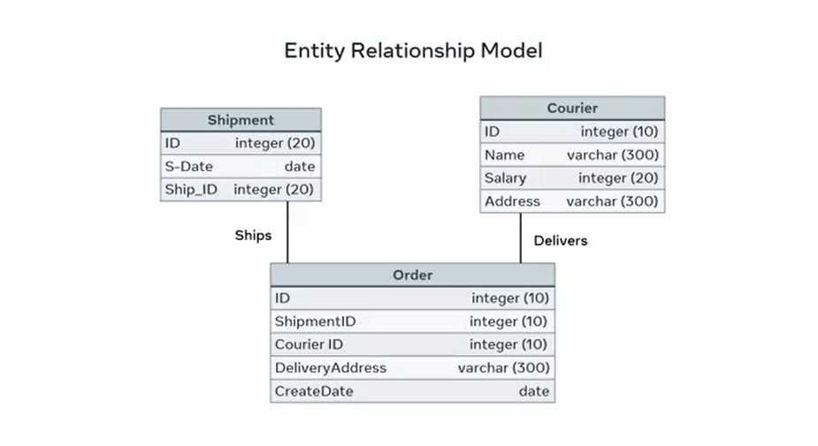
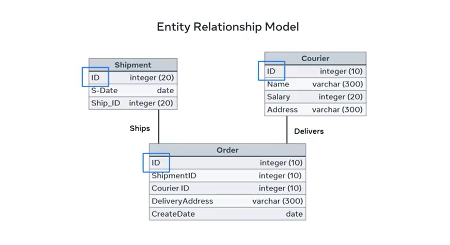
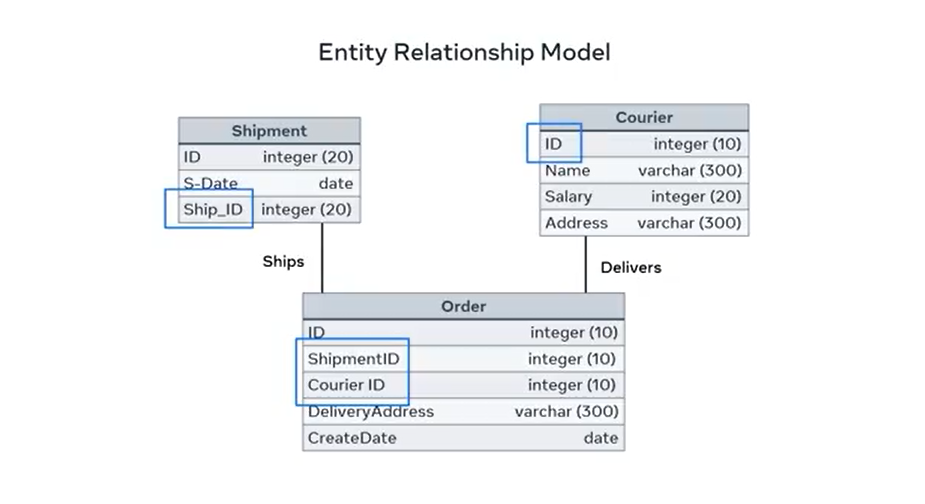
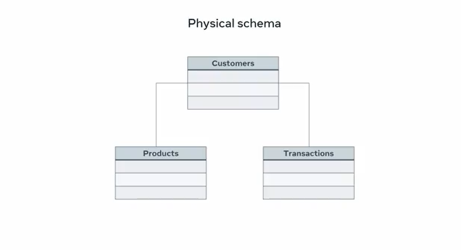

# **Types of Database Schema**

When creating your databases, you need to be able to distinguish between different kinds of database schemas. In other words, you need to answer the question:  
**What kind of database best suits my project?**

Over the next few minutes, you'll explore some different types of database schemas. By the end of this lesson, you'll be able to explain the concept of a logical database schema and outline the concept of a physical database schema.

## **Logical Database Schema**

A logical database schema is how the data is organized in terms of tables.  
In other words, it shows what tables should be in a database and explains how the attributes of different tables are linked together.

Creating a logical database schema means illustrating relationships between components of your data. This is also called **Entity Relationship (ER) modeling**. It specifies what the relationships between entity types are.

### **Example: ER Model of an Ordering Application**

Let’s take the example of a simple ER model that shows the logical schema of an ordering application.

It demonstrates the relationship between:

- An order
- The shipment in which it will be shipped
- The courier assigned to it

---

The `ID` attribute in each table is the primary key of the respective entities. It provides a unique identifier for each entry, row, or record in the entities.

---

In the order entity, the `shipment ID` and `courier ID` are called foreign keys.  
But in fact, they are also the primary keys of the shipment and courier entities respectively.  
This creates a relation between these entities and the order table, which in turn has its own `ID` as its primary key.

---

## **Physical Database Schema**

The other type of schema is a physical schema.

**Physical schema** is how data is stored on disk. In other words, this involves creating the actual structure of your database using code.

In MySQL and other relational databases, developers use SQL to create:

- Database tables
- Other database objects

### **Example: Physical Schema for an Online Store**

You can create a physical schema for an online store database by writing SQL statements to create tables for:

- Customers
- Products
- Transactions

---

However, physical schema creation could differ slightly between different database systems.

## **Conclusion**

Database schemas are vital when it comes to the creation of databases and they form the basis of your application.

You should be able to:

- Describe how a logical database schema refers to the organization of data in tables  
- Use an ER model to specify relationships between entities  
- Understand that you can control how data is physically stored on disk by creating a physical schema with SQL statements.
