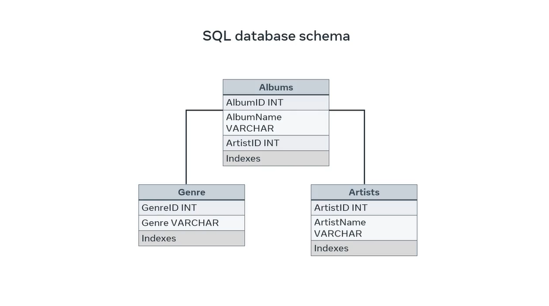
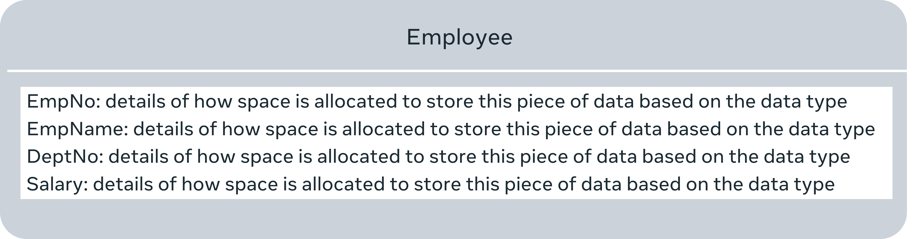

# Exploring Database Schema

Before developing a database or a software application, you first need to plan how you will organize your data. This plan is referred to as a **schema**. It's essentially a blueprint of what your data looks like. In this lesson, you'll learn how to explain the concept of a database schema, identify the different meanings of the term schema across different database systems and outline the advantages of a database schema.

Let's begin focusing on what developers mean when they use the term **schema**. The general meaning of a **schema** is that it's an **organization or grouping of information and the relationships** among them. In the context of a MySQL database, a schema, i.e., a **database schema** means a **collection of data structures or an abstract design of how data is stored in a database**. Essentially, schema and database schema are interchangeable terms within MySQL.

A schema is how data is organized in the database and how it's related to other data. But schema is defined in different ways across different database systems. **In a SQL server**, a database schema is a collection of different components like tables, fields, datatypes, and keys. **In Postgres SQL**, a database schema is a namespace with the name database objects like views, indexes, and functions. **An oracle schema** system assigns a single schema to each user. Oracle even names each schema after its respective user. But no matter which type of database you encounter, the two most important concepts you need to understand when working with schemas remain the same,

+ organizational data in the form of tables, and

+ The relationships between the tables.

## Schema Objects

Let's now cover the components of a database. A SQL Server schema is comprised of what are known as schema objects. Many of these objects will probably already be familiar to you from your study of databases. They include: tables, columns, relationships, data-types, and keys.

An example of a SQL database schema is a music database with data and artists, albums, and genres, all stored in separate tables.

However, these tables can still be related to one another through various keys. In other words, the data within this database is organized in separate tables or entities. You have the tables are also related to one another.

Essentially, a database schema is comprised of:

+ Data relationships: all of the important data and the relationships,

+ Unique object keys: the unique keys for all entries in databases, and

+ Name and data types: a name and datatype for each column in a table.

You have already been exposed to the concept of a database schema and you have explored a simple example of what a database schema looks like. We will explain the concept of database schema in more detail by focusing on the three main types of database schema. **Database schema is an important concept to understand in terms of relational databases**.

Designing the schema or structure of a database is the very first step in designing a database system. Database schema is about the structure of a database. In other words, how data is organized in a database. Data in a database is organized into tables that have columns and rows. Each column or field has a defined data type, and the tables are related to each other. The simplest way of understanding database schema is to think of it as the blueprint of a database. Before anyone can use a database to store and manipulate data, the database schema must first be designed. This process of database schema design is also known as data modeling.

Usually, the database schema is designed by database designers. The database schema is just the skeleton of the database, and it doesn’t store any actual data. Once the designers have provided the database schema, the developers can understand how the data should be stored by the application that they are implementing.

Database schema can be broadly divided into three categories. 

+ Conceptual or logical schema that defines entities, attributes and relationships. 

+ Internal or physical schema that defines how data is stored in a secondary storage. In other words, the actual storage of data and access paths. 

+ External or view schema that defines different user views. 

## Conceptual or logical schema

The conceptual or logical schema describes the structure of the entire database for all the users. It describes the structure in terms of entities and features of the entities and the relationships between them. An Entity Relationship Diagram (ER-D) is usually drawn to represent the logical schema of a database. At this level, details about the physical storage and retrieval of data are hidden, and the database structure is described only at a concept level. The software developers work with the database at this level.

Here’s an example of a logical schema.

This depicts the employee and department entities in the database along with their attributes and how these two entities are related to each other. This is just a simple example and there’ll be more entities in a real database.

## Internal or physical schema

The internal or physical schema describes the physical storage of the database. It represents the entire database but at a very low level. This means it describes how the data is really stored on disk in the form of tables, columns and records. It defines what data is stored in the database and how.

Here’s an example of what’s meant by an internal schema.

This example depicts how the employee table should physically store its data. A real database would have more tables and the internal schema would describe the physical representation of all those tables in the entire database.

## External or view schema

The external or view schema describes the database like an external user would want to see it. This schema only describes the part of the database that the specific user is interested in. It hides the nonrelevant details of the database from a user. For example, a user from the sales department will see only sales-related data in a database. There can be many external schemas of a single database for different users. Examine the following example of view schema.

There are three different schemas of how three different users want to view the employee table. Though this example only includes the employee table, in the actual database there’ll be many tables, namely employee, department, job, invoice and so on. The different view schemas will have different subsets of the database. 

Also, these different view schemas will have different subsets of the attributes in the tables. For example, User1’s view schemas could have employee, department and job tables. User2’s view schema could have employee, department and invoice tables. And User3’s view schemas could have all four tables. The attributes of tables that are available to these three different user view schemas could be different as well.

These three levels of schema are also known as the three-schema architecture. It can be diagrammatically depicted like this.

## Why are database schemas important?

Now that you're familiar with what a database is, let's move on and explore the advantages of a database schema. A database schema helps database engineers to organize data into well-defined tables with relevant attributes in them. It also shows the interrelationships between tables and depicts the data types that each column must have. A well-designed database schema makes life easier for database engineers as well as developers. It helps to:

+ Management: Schemas provide logical groupings for database objects.

+ Accessibility: They also make it easier to access and manipulate these database objects than other available methods.

+ Security: Schemas also provide greater database security. You can grant permission to separate and protect database objects based on user access rights.

+ Ownership: It's possible to transfer ownership of schemas and their objects between users and other schemas.

+ Maintain a clean set of data in the database related to an application.

+ Avoid reverse-engineering of the underlying data model from time to time.

+ Write efficient queries to retrieve data for reporting purposes, analytics and so on.