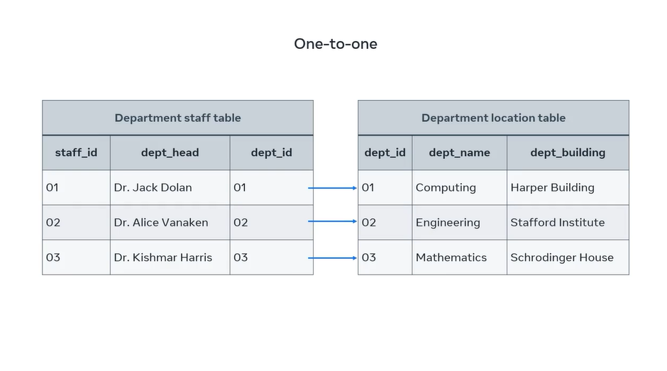

## **One-to-One Relationship**

Let's take a look at one-to-one relationships. In order to understand one-to-one relationships, let’s take the example of two tables: Table A and Table B. **A one-to-one (1:1) relationship means that each record in Table A relates to one, and only one, record in Table B. Likewise, each record in Table B relates to one, and only one, record in Table A**.

In one-to-one relationships, one single record of one table is associated with one single record of another table. To demonstrate this relationship, I'll use two new tables.


---

One table headlines key information about the staff in each college department. The other is the department location table that records key data where the location of each department on campus is. In this instance, each department head is in one department building on the college campus. Each staff member from the department staff table is associated with one record from the department table.



These relationships can also be depicted in an ER diagram as one department head leads one department.


---

### **Representing One-to-One Relationship**

We are using the tables `department_head` and `department`.

```sql
-- Table `department`
CREATE TABLE `department` (
    `id` INT PRIMARY KEY AUTO_INCREMENT,
    `department_name` VARCHAR(100) NOT NULL,
    `created_at` TIMESTAMP DEFAULT CURRENT_TIMESTAMP
);

-- Table `department_head`
CREATE TABLE `department_head` (
    `id` INT PRIMARY KEY AUTO_INCREMENT,
    `first_name` VARCHAR(50) NOT NULL,
    `last_name` VARCHAR(50) NOT NULL,
    `email` VARCHAR(100) UNIQUE NOT NULL,
    `phone_number` VARCHAR(20)
);
```

#### **Relationship Ownership**

Here, the `department` is the central table and is thus the non-owning side. Consequently, the entity `department_head` holds the foreign key that references the ID in the `department` entity.

The following statement adds the **foreign key**:

```sql
ALTER TABLE `department_staff`
ADD COLUMN `department_location_id` INT NOT NULL;
```

Then to establish the relationship with the foreign key:

```sql
ALTER TABLE `department_head`
ADD CONSTRAINT `fk_department_head_department`
FOREIGN KEY (`department_id`) REFERENCES `department`(`id`)
ON DELETE SET NULL ON UPDATE CASCADE;
```

  + **`ON DELETE SET NULL`**: If a department is deleted, the department head’s department reference is set to `NULL`.
  + **`ON UPDATE CASCADE`**: If a department’s ID changes, the reference in `department_head` updates automatically.

Let's populate our database with some data to test.

```sql
-- Data for `department`
INSERT INTO `department` (`department_name`) VALUES
    ('Computer Science'),
    ('Mechanical Engineering'),
    ('Business Administration'),
    ('Electrical Engineering'),
    ('Biotechnology');

-- Data for `department_head`
INSERT INTO `department_head` (`first_name`, `last_name`, `email`, `phone_number`, `department_id`) VALUES
    ('John', 'Doe', 'johndoe@example.com', '+1234567890', 1),
    ('Jane', 'Smith', 'janesmith@example.com', '+1987654321', 2),
    ('David', 'Johnson', 'davidjohnson@example.com', '+1122334455', 3),
    ('Emily', 'Brown', 'emilybrown@example.com', '+1445566778', 4),
    ('Michael', 'Davis', 'michaeldavis@example.com', '+1555666778', 5);
```

We can query the two tables for the information in just one statement:

```sql
SELECT *
FROM `department`, `department_head`
WHERE `department`.`id` = `department_head`.`department_id`;
```
