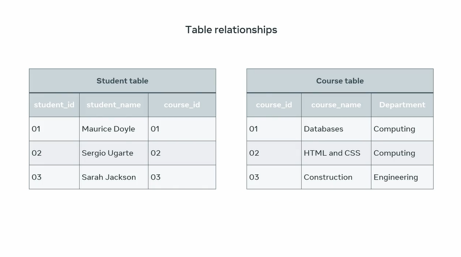

# **Table Relationships**

At this stage of the course, you will spend some time exploring the relational model for databases. However, it's crucial that you have a proper understanding of how the relational model influences the design and structure of a database and how it helps to build relationships between tables. Once you understand how your database is structured, then you can determine how best to extract information from it.

To understand how the relational model influences our databases, let's take the examples of two tables from a college database.

---

The first table shows a list of students along with their assigned ID and course identification numbers. The second table list courses that students can study along with the ID for each course and its department.

The big question in this example is: **which student is studying what course? Is each student studying one or multiple courses?** These are basic examples of why it's important to structure and connect tables correctly. There are three types of relationships between any two tables in a relational database.

   + **One-to-many**,
   + **One-to-one**, and
   + **Many-to-many**.

Before we dive into the types of relationships, let's go through the **cascade types in relationships**.
