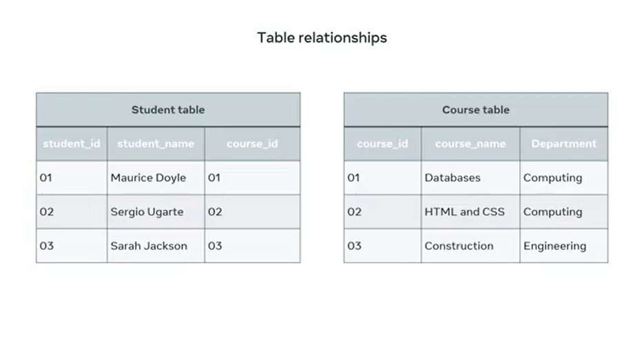
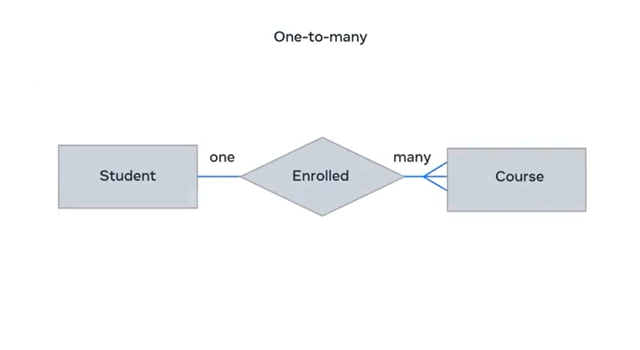
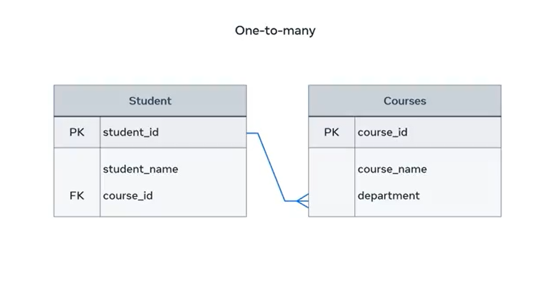
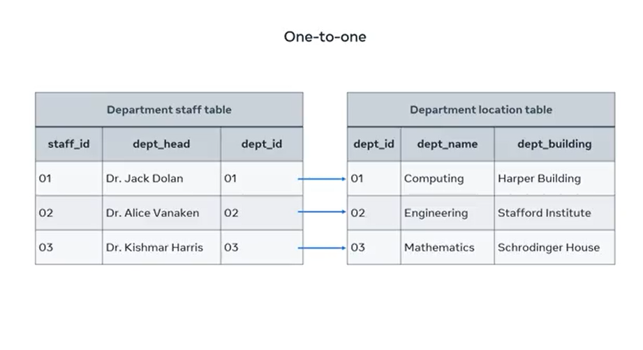
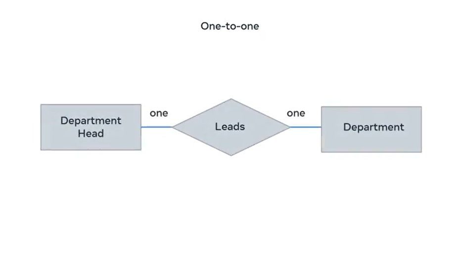
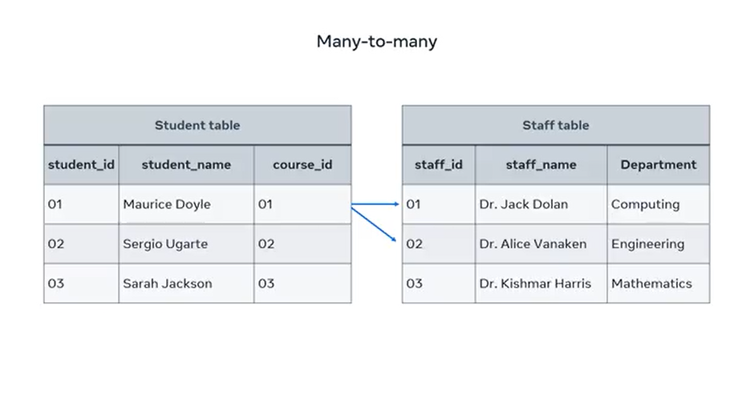
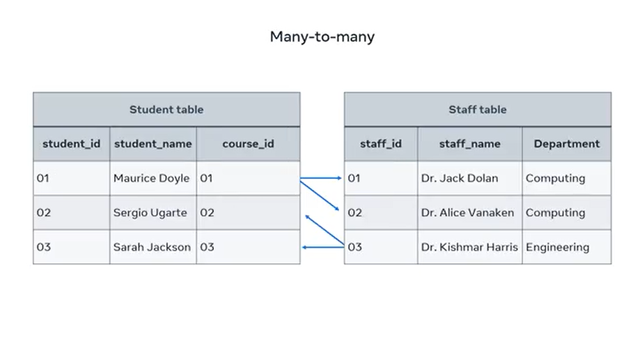
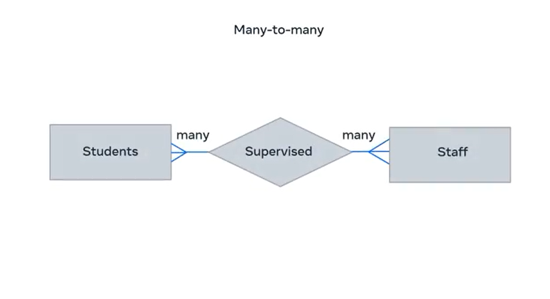

# **Table Relationships**

At this stage of the course, you spend some time exploring the relational model for databases. However, it's crucial that you have a proper understanding of how the relational model influences the design and structure of a database and how it helps to build relationships between tables. **Once you understand how your database is structured, then you can determine how best to extract information from it.**

Over the next few minutes, you'll learn how to outline the basics of the relational model, identify the different relationships between tables, and explain the basics of an ER-Diagram.

## **How the Relational Model Influences Database Design**

To understand how the relational model influences our databases, let's **take the examples of two tables from a college database.** The first table shows a list of students along with their assigned student and course identification numbers. The second table lists courses that students can study along with the ID for each course and its department.

---

**The big question in this example is:** which student is studying what course? Is each student studying one or multiple courses? These are basic examples of why it's important to structure and connect tables correctly.

## **Types of Relationships in Relational Databases**

There are three types of relationships between any two tables in a relational database:

- One-to-Many  
- One-to-One  
- Many-to-Many  

#### **One-to-Many Relationship**

In a one-to-many relationship, a record of data in a row of one table is linked to multiple records in different rows of another.

Example: In the student table, a student with the ID of 1 is enrolled in two courses on the course table. A one-to-many relationship can be drawn between these tables.

---

This relationship can also be illustrated in a basic entity relationship diagram, or ERD. A student is enrolled in many courses using shapes and symbols. The diagram depicts the two entities, student and course, in rectangle shapes with "enrolled" to describe the relationship in a diamond shape. "Many" is depicted using the Crow's Foot notation symbol.

---

The relationship can also be illustrated using a more complex ER-Diagram that depicts keys. `Course ID` in the student table is a foreign key (FK). This references the primary key (PK) `Course ID` column that exists in the course table.

---

### **One-to-One Relationship**

In one-to-one relationships, one single record of one table is associated with one single record of another table.

To demonstrate this relationship, two new tables are used:

- One that outlines key information about the **staff** in each college department.  
- The other is the **department location** table that records key data about the location of each department on campus.

---

In this instance, each department head is in one department building on the college campus. Each staff member from the department staff table is associated with one record from the department table.

These relationships can also be depicted in an ER diagram as: one department head leads one department.

---

### **Many-to-Many Relationship**

This type of relationship associates one record of one table with multiple records of another table. The same relationship also works in the other direction.

Example: The student, Maurice Doyle, is undertaking two research projects and each project is supervised by different staff members.

---

Likewise, one staff member can supervise or collaborate with multiple students on their research projects.

---

These relationships can also be depicted in an ER diagram as: many students are supervised by many staff.

---

In summary, in a Many-to-Many relationship, one record in a Table A can relate to more than one records in a Table B. On the other way around, one record in the Table B can relate to more than one record in the Table A.

## **Conclusion**

You should now be able to outline the different relationships that exist between tables in a relational database model. Good work.
