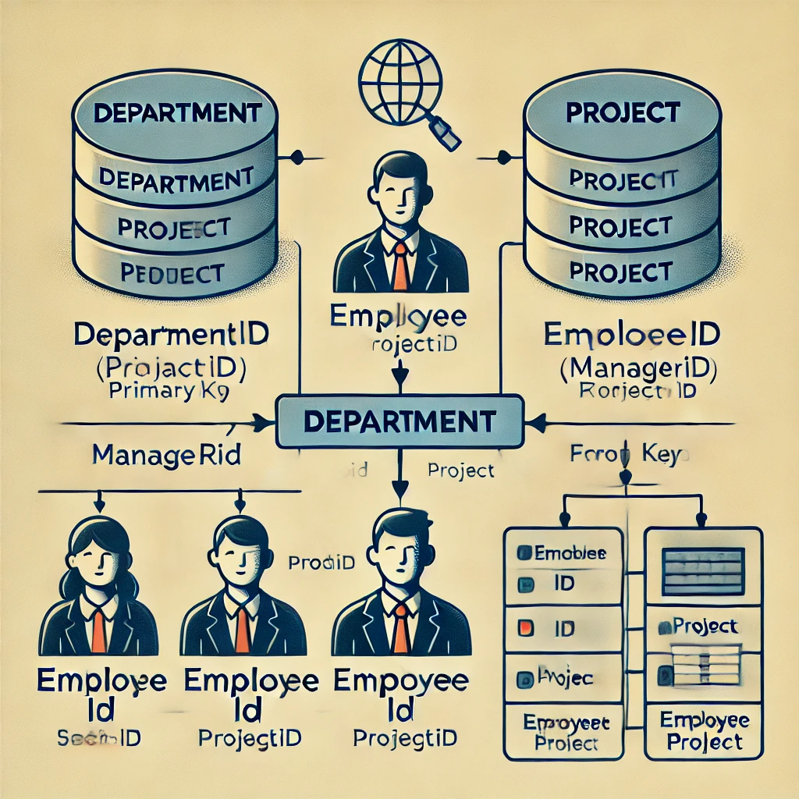

# Office

Below is the diagram of the working of an office's database:

Here’s a breakdown of the relationships between the four tables:

1. `Department`: This table stores information about different departments within the organization. It has a DepartmentID as the primary key and also includes a ManagerID which is a foreign key referencing the EmployeeID in the Employee table. This sets up a relationship where each department is managed by an employee.

2. `Employee`: This table contains information about employees. It includes fields such as EmployeeID, FullName, Email, DateOfBirth, SSN, EmployeeID_Manager, and DepartmentID. The EmployeeID_Manager is a foreign key that references EmployeeID within the same table, establishing a managerial hierarchy. The DepartmentID is a foreign key that links each employee to their respective department in the Department table.

3. `Project`: This table holds data about various projects. The DepartmentID in this table is a foreign key that references the DepartmentID in the Department table, indicating which department is responsible for each project.

4. `EmployeeProject`: This junction table handles the many-to-many relationship between employees and projects. It includes EmployeeID and ProjectID, both of which are foreign keys referencing EmployeeID in the Employee table and ProjectID in the Project table, respectively. This allows for recording which employees are assigned to which projects and in what roles.

This structure helps organize the data in a relational manner, making it efficient to manage and query information about employees, departments, and projects.
