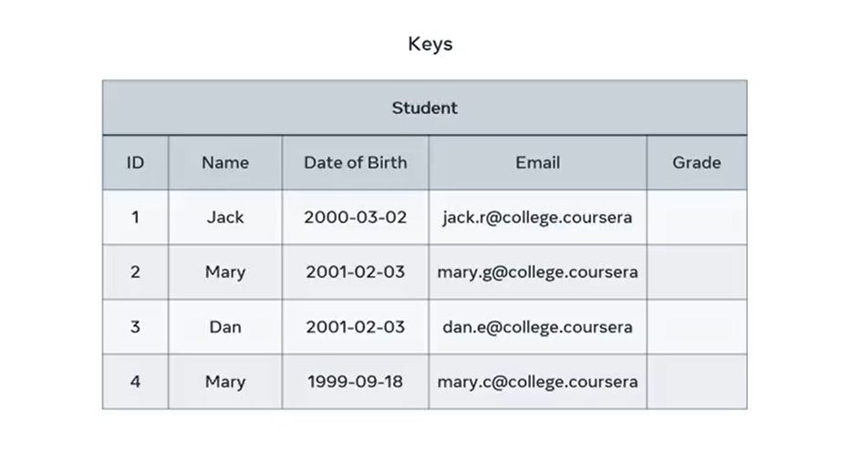
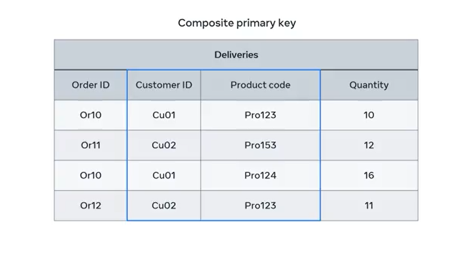

# **Primary Key**

By now, you're probably familiar with querying values or records within database tables. But how do you query specific records and values if they're duplicated across the table? When you come across obstacles like these, you can use **keys** as your solution.

In this guide, you'll learn how to explain the purpose of a **primary key** in a database table and how to select a **simple** and **composite** primary key.

## **Purpose of a Primary Key**

You may have encountered several examples of primary keys during this course. In these examples, you saw that they use tables as a unique method to identify a record and prevent duplicates.

Let’s take an example of a student table with five attributes:

- ID  
- Name  
- Date of Birth  
- Email, and  
- Grade

---

How could we identify a specific student to enter their grade? Consider the student **Mary**, on row 2. All you need to do is find the **unique ID** of Mary to identify her data record.

However, in this example:

- You **can't use** the **name** column because there are **two students** in the table called Mary.
- You **can't use** the **date of birth** either because another student named Dan has the same birthday.

Neither of these attributes is unique to Mary.

## **Candidate Keys**

The solution is to locate a **candidate key**.

A **candidate key** is:
- An attribute that is **unique** to each row of the table.
- **Cannot** have a **null** (empty) value.

In this example, there are two possible candidate keys:
- **Student ID**
- **Student Email**

Both columns contain a unique value for each student. So either one can be used as the **primary key**.

Let’s assign **Student ID** as the **primary key**.

> **Note:** The column you do **not** choose as the primary key becomes the **alternate key** (also known as a secondary key).  
> In this case, the **email** column is the secondary key.

## **Composite Primary Keys**

But what happens if you can’t locate a unique value within the table—if all rows have duplicated values?

In this case, you can create a **composite primary key**.

A **composite primary key** is a combination of **two or more attributes** used together to uniquely identify a record.

### Example: Delivery Table

Consider the delivery department of an online store. They have a delivery table that tracks deliveries placed by customers.

---

There is:
- **No single column** with unique values in each row.
- **No attribute** that can be used as a standalone primary key.

The best approach here is to **combine** the following two columns:
- **Customer ID**
- **Product Code**

Together, these columns create a unique identifier for each specific data record.

This **composite primary key** can be used to:
- Determine which customer ordered what product.
- Track the delivery status for each customer.

## **Summary**

You are now familiar with:
- **Single-column primary keys**
- **Composite primary keys**

You should now be able to:
- Identify primary and secondary (alternate) keys
- Choose when to use a composite primary key
