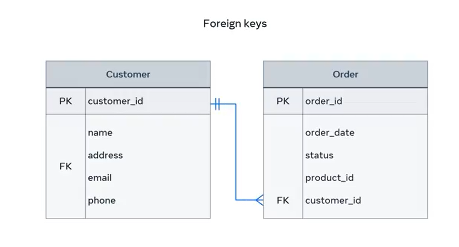
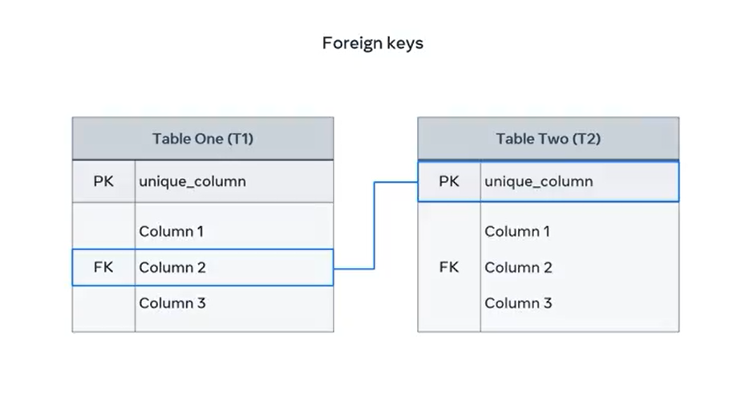
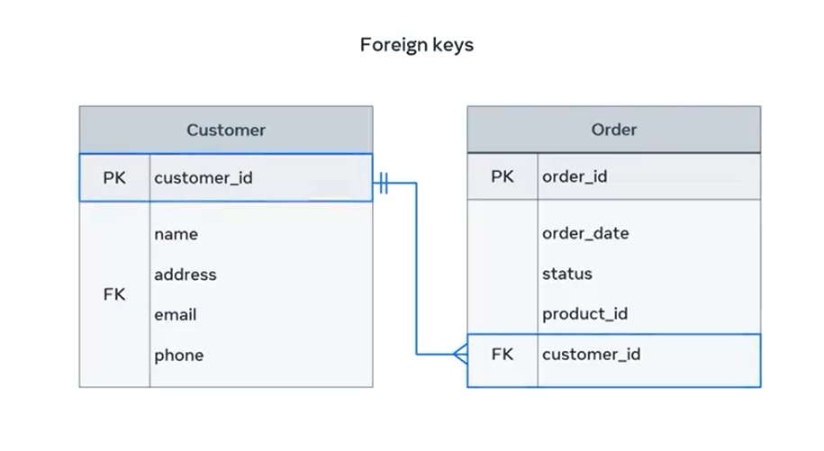
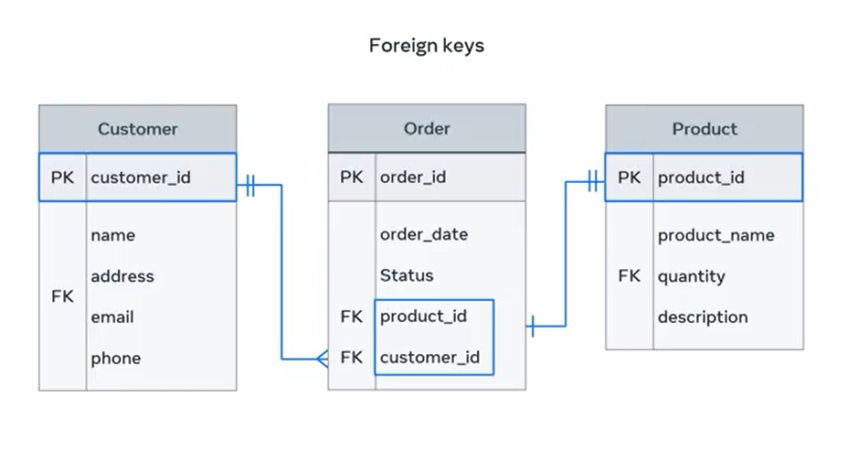

# **Foreign Key**

Imagine a scenario where a bookstore has a database that contains two tables:

- A **Customer** table to track customer information  
- An **Order** table to track customer orders

But how can they determine which customer made which order? The solution is to add a **customer ID** column into the **Order** table as a **foreign key**.

Over the next few minutes, you'll learn how to:
- Describe the purpose of a foreign key
- Demonstrate how to use it to connect different tables in a relational database

## **What Is a Foreign Key?**

A **foreign key** is one or more columns used to connect two tables in order to create **cross-referencing** between them.

"Foreign" here means "external". A foreign key in one table refers to an **external (foreign)** column in another table.

## **Example: Online Store Tables**

Let’s explore how foreign keys work using the database of an online store.

- The store's **Customer** table contains information about the customer's **name** and **address**
- The **Order** table contains information about each customer's **order date** and **status**

---

The issue is how to connect these tables to make sure that **each order is associated with the right customer**.

Establishing this connection is important so that you can:
- Process and deliver orders to the right customers
- Update order details
- Cancel orders if required

A foreign key is a great method of establishing a relationship between these tables to carry out these tasks.

## **Abstract Example: Table 1 and Table 2**

To explore the concept further, consider two generic entity tables:

- **Table 1 (T1)**
- **Table 2 (T2)**

---

The purpose of connecting these tables is to relate records of data that exist in both tables.

### **Foreign Key Behavior**

- The **foreign key** in **T1** should point to a related column in **T2**
- The foreign key column values in T1 must correspond to **existing values** in the **reference column** in T2
- The reference column in T2 must contain **unique values**, likely a **primary key**

T2 is known as the **parent table**, while T1 is known as the **child table.**

## **Visualizing the Concept: Customer and Order Tables**

Let’s return to the bookstore example and look at an **Entity Relationship Diagram (ER-D)**.

---

In this diagram:

- The **Order** table relates to the **Customer** table by including the **customer ID** attribute
- This customer ID is defined as a **foreign key** inside the Order table

### **One-to-Many Relationship**

This relationship is **one-to-many**:

- Each **customer** may have **many orders**
- Each **order** must refer to **one single customer only**

This means:
- A customer record **must exist** in the Customer table before an order can be made
- It is **not necessary** to have an order once a new customer is created

So:
- The **Customer** table = **Parent table**
- The **Order** table = **Child table**

The parent can exist without the child, but **not the other way around**.

## **Purpose of the Foreign Key in This Example**

The **customer ID** value in the Order table can be used to:
- Fetch the record of a specific customer
- Determine **who placed the order**
- Generate an **invoice**
- Deliver an order using the **customer address**

## **Multiple Foreign Keys in a Table**

It is possible for a table to have **more than one foreign key**.

Each foreign key is used to connect the referencing (child) table with other referenced (parent) tables. This creates **multiple parents** for the same child.

Let’s add a **Product** table to the previous diagram.

---

Now the Order table has **two foreign keys**:
- One links it with the Customer table via **customer ID**
- The other links it with the Product table via **product ID**

### **One-to-One Relationship**

This relationship is **one-to-one**:
- Each order must be related to a **specific product**
- Each product **might** be related to an order, but **doesn’t have to be**

For example:
- You can receive a new product in your inventory
- No customer may have placed an order on it **yet**

If no order is placed, then the product isn’t related to any order.

## **Identifying Parents and Child**

So, who is the parent and who is the child?

- **Customer table** = Parent  
- **Product table** = Parent  
- **Order table** = Child

The **Order** table is now the child of **two parent** tables.

## **Conclusion**

You should now:
- Understand the purpose of a **foreign key**
- Be able to **demonstrate** how it can be used to connect tables in a relational database.
