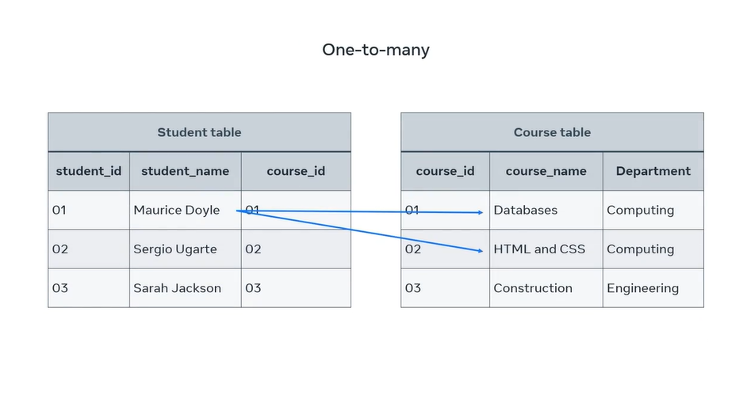
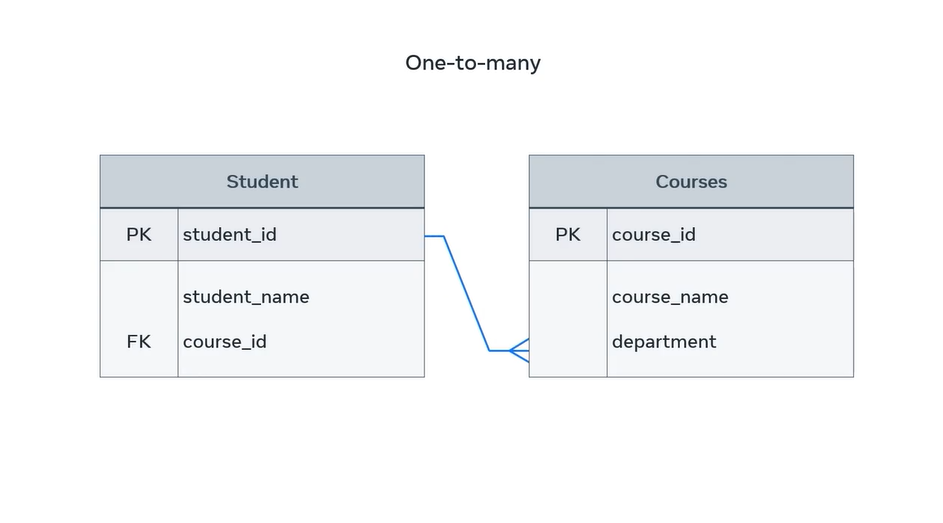

## **One-to-Many Relationship**

If there are two tables, Table A and Table B, **a one-to-many (1:N) relationship means a record in Table A can relate to zero, one, or many records in Table B. Many records in Table B can relate to one record in Table A**.

In a one-to-many relationship, a record of data in a row of one table is linked to multiple records in different rows of another. In the student table, a student with the ID of 1 is enrolled in two courses on the course table. Let's assume that: a record in `student` can relate to zero, one, or many records in `course`. Many records in `course` can relate to one record in `student`. The script to generate the physical database is seen in the `z-Project/college_db` folder.



---

One-to-many relationship can be drawn between these tables. This relationship can also be illustrated in a basic entity relationship diagram, or ERD. A student is enrolled in many courses using shapes and symbols.


---

The diagram depicts the two entities, `student` and `course`, in rectangle shapes with **enrolled** to describe the relationship in a diamond shape. Many is depicted using the **crow's foot** notation symbol.

The relationship can also be illustrated using a more complex ER-Diagram that depicts keys.



---

`course_id` in the `student` table is a foreign key or FK. This references the primary key or PK `course_id` column that exists in the `course` table.

### **Representing One-to-Many Relationship**

Creating the `student` and `course` tables:

```sql
-- Table `student`
CREATE TABLE `Student` (
    `id` INT PRIMARY KEY AUTO_INCREMENT,
    `first_name` VARCHAR(100) NOT NULL,
    `last_name` VARCHAR(100) NOT NULL,
    `date_of_birth` DATE,
    `email` VARCHAR(100) UNIQUE NOT NULL
);

-- Table `course`
CREATE TABLE `course` (
    `id` INT PRIMARY KEY AUTO_INCREMENT,
    `name` VARCHAR(100) NOT NULL,
    `credits` INT CHECK (`credits` > 0)
);
```

#### **Relationship Ownership**

The **owning side** of a relationship is the entity that **controls** how the relationship is managed in the database, particularly the foreign key (FK) or join table.

- The owning side:
  - **Defines the foreign key** (in One-to-One or Many-to-One).
  - **Defines the join table** (in Many-to-Many).
  - **Determines how persistence operations (insert, update, delete) affect the relationship**.

- The non-owning side:
  - **It does not manage the relationship**.
  - Is **only a mirror** of the relationship.
  - Does not contain the foreign key or join table.

**The non-owning side is usually the parent/central entity**. Considering that the `student` entity is the **central entity** if the database revolves around students and their relationships with other entities. However, this depends on the focus of the system.

If the database is focused/designed for a **student management system**, then `student` is the parent/central entity. If the database is focused on **course management**, the `course` table might be the central entity instead. This is a college, and colleges are for **student management**. Thus, we treat the `student` table as the central entity.

For **One-to-Many** relationship, ownership is always to the ***Many*** side of the relationship. This is thus where we will define our **foreign key** that references the `id` in the `student` table. We can add the new column, `student_id` to the `course` table and make it a foreign key that references the `id` column in the `student` table.

The following statement adds the **foreign key**:

```sql
ALTER TABLE `course`
ADD COLUMN `student_id` INT NOT NULL;
```

Then the following statement establishes the **foreign key relationship**:

```sql
ALTER TABLE `course`
ADD CONSTRAINT `fk_course_student` 
FOREIGN KEY (`student_id`) REFERENCES `student`(`id`) 
ON DELETE CASCADE ON UPDATE CASCADE;
```
