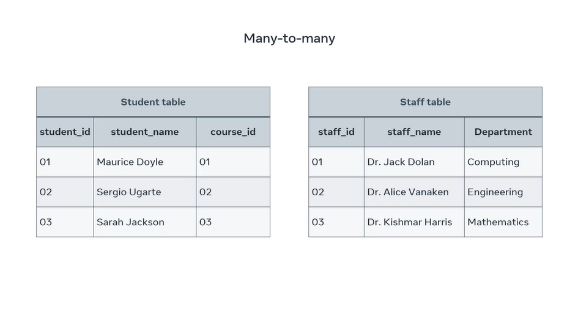
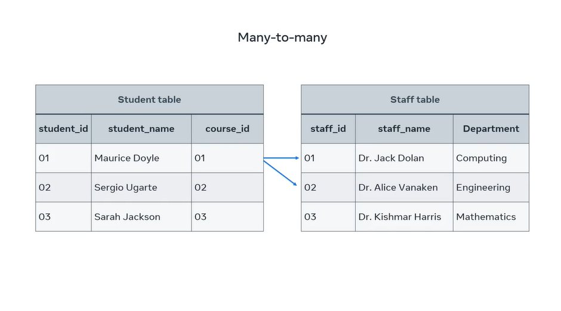
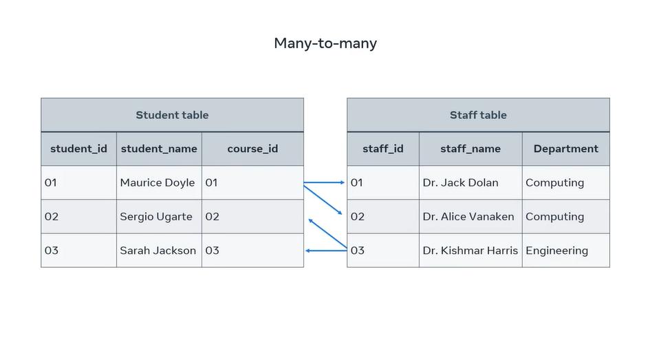
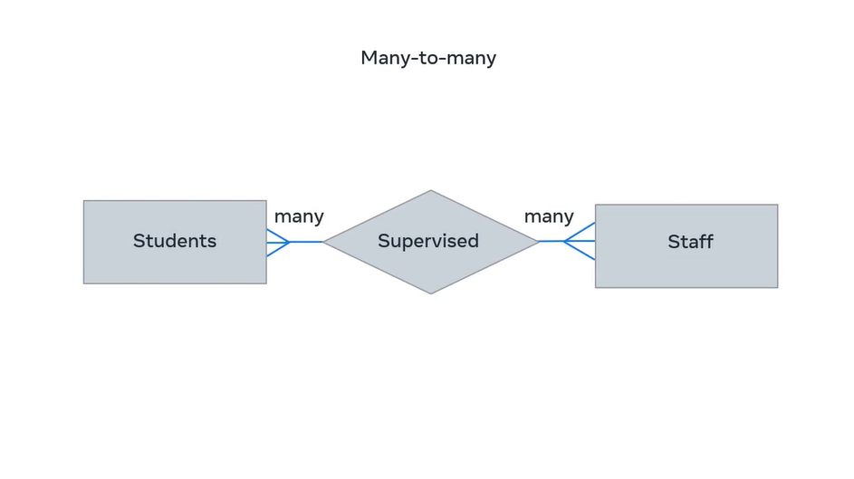

## Many-to-Many Relationship

If there are two tables, Table A and Table B, **a many-to-many (N:N) relationship means many records in Table A can relate to many records in Table B; and many records in Table B can relate to many records in Table A**.

This type of relationship associates one record of one table with multiple records of another table. The same relationship also works in the other direction. See a diagram below.

---

In this example, the student, Maurice Doyle, is undertaking two research projects and each project is supervised by different staff member.

---

Likewise, one staff member can supervise or collaborate with multiple students on their research projects.

---

These relationships can also be depicted in an ER diagram as many students are supervised by many staff.

---

You should now be able to outline the different relationships that exist between tables in a relational database model.
