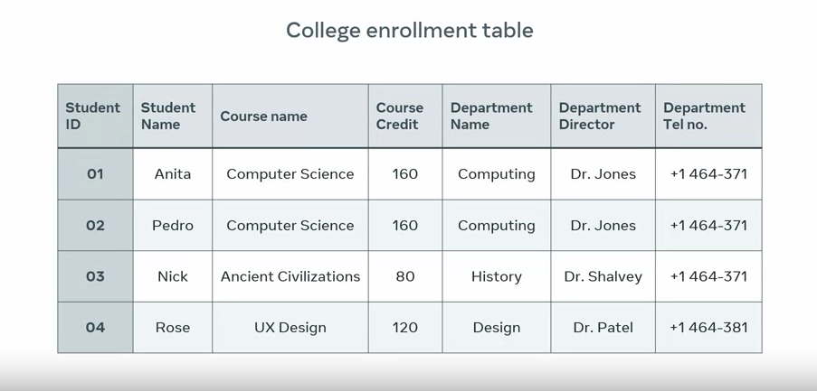
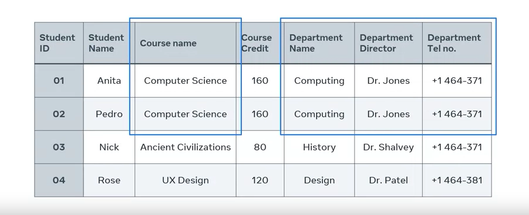
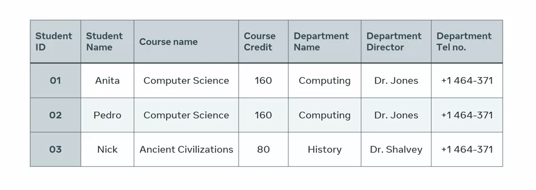
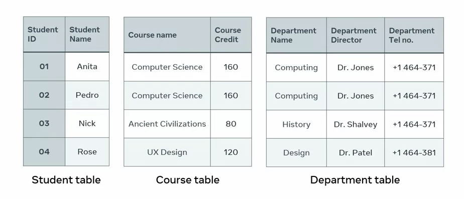

# Database Normalisation

You are familiar with the process of creating tables within a database. However, several issues are likely to arise when working with tables, such as unnecessary data duplication, problems with updating data, and the effort required to query data. Fortunately, these issues can be resolved with the use of database normalization. Here, you'll be able to explain what database normalization is and demonstrate an understanding of insert, update, and deletion anomalies. You'll also be able to list some of the issues associated with them. 

Normalization is an important process in database systems. It structures tables in a way that minimizes challenges by reducing data duplication, avoiding data modification implications, and helping to simplify data queries from the database. To gain a better understanding of normalization and the challenges it addresses, let's explore an example of a table that hasn't been normalized. In this example, I'll use a college Enrollment Table.

The table serves multiple purposes by providing a list of the college students, courses, and departments, and the outline of relationships or associations between students, courses, and departments, along with the name and contact details for the head of each department. Creating tables that serve multiple purposes always cause serious challenges and problems for database systems. The most common of these challenges include insert anomaly, update anomaly, and deletion anomaly.

## Insert Anomaly

Let's begin with an overview of insert anomaly. Insert anomaly occurs when new data is inserted into a table, which then requires the insertion of additional data. I'll use the college Enrollment Table to demonstrate an example.

In the college enrollment table, the student ID column serves as the primary key. Each field in a primary key column must contain data before new records can be added to any other column on the table. For example, I can enter a new course name in the table, but I can't add any new records until I enroll new students. And I can't enroll new students without assigning each student an ID. The ID column can't contain empty fields, so I can't insert a new course unless I insert new student data. This is the insert anomaly problem.

## Update Anomaly

An update anomaly occurs when you attempt to update a record in a table column only to discover that this requires further updates across the table. Let's return to the College Enrollment Table once again to understand how an update anomaly occurs. 

In the Enrollment Table, the course and department information is repeated or duplicated for each student in that course. This duplication increases database storage and makes it more difficult to maintain data changes. 

I'll demonstrate this with a scenario in which Dr. Jones, the Director of the Computing Department, leaves his post and is replaced with another director. I now need to update all instances of Dr. Jones in the table with the new Director's name, and I also need to update the records of every student enrolled in the department. This poses a major challenge because if I miss any students, the table will contain inaccurate or inconsistent information. This is a prime example of the update anomaly problem — updating data in one column requires updates in multiple others.

## Deletion Anomaly

Finally, a deletion anomaly occurs when the deletion of a record of data causes the deletion of more than one set of data required in the database. For example, Rose, a student assigned the ID of four, has decided to leave her course, so I need to delete her data. But deleting Rose's data results in the loss of the records for the Design Department, as they're dependent on Rose and her ID. 

This is an example of the deletion anomaly problem — removing one instance of a record of data causes the deletion of other records.

So, how can you solve these problems? As you learned earlier, the answer lies in database normalization. Normalization optimizes the database design by creating a single purpose for each table. To normalize the College Enrollment Table, I need to redesign it. As you discovered earlier, the table's current design serves three different purposes. The solution is to split the table into three, essentially creating a single table for each purpose. This means I now have a Student Table with information on each student, a Course Table that contains the records for each course, and a Department Table with information for each department. 

This separation of information helps to fix the anomaly challenges and makes it easier to write SQL queries to search for, sort, and analyze data.
