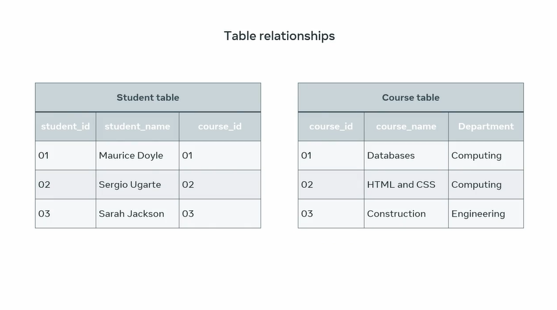
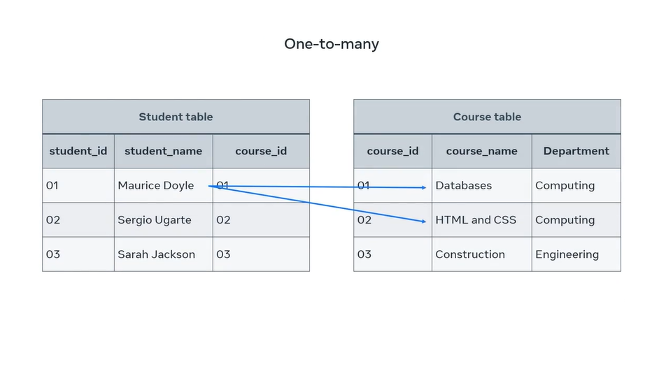
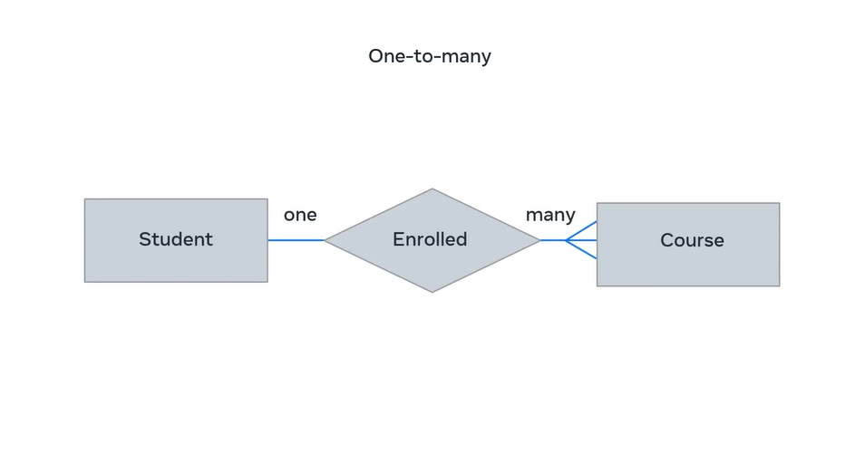
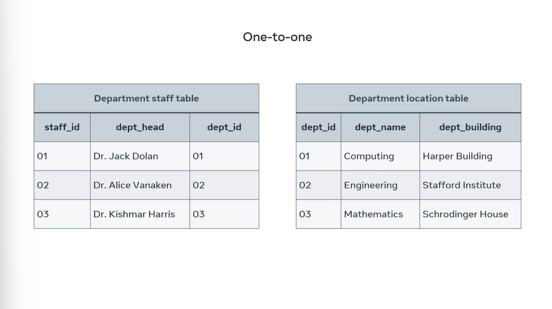
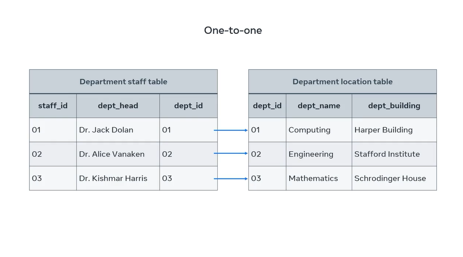
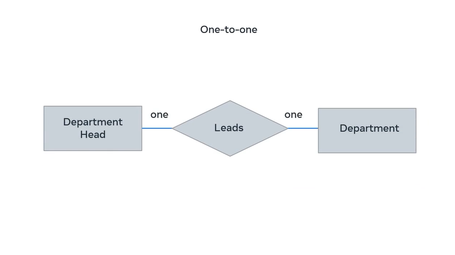
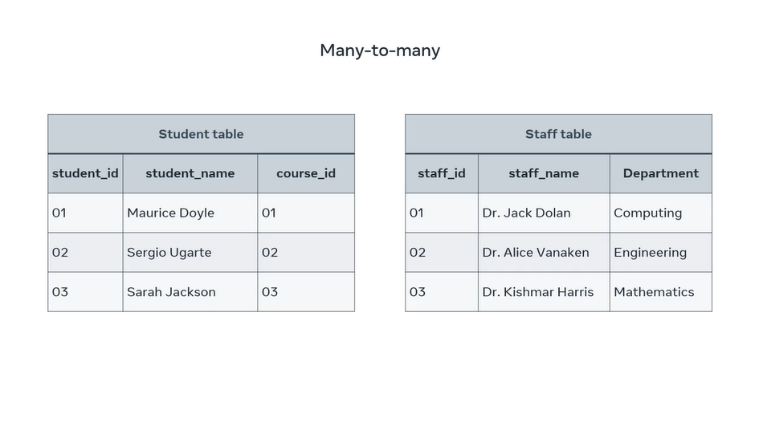
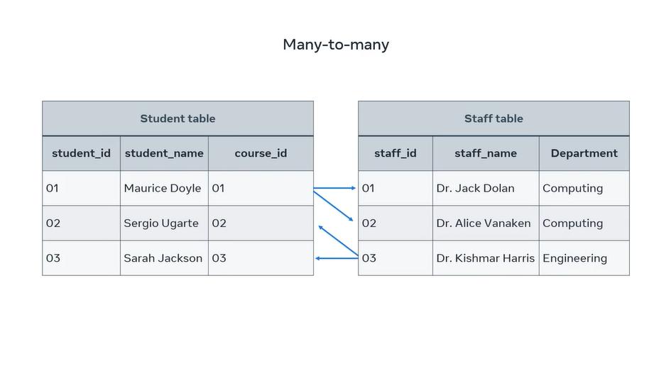
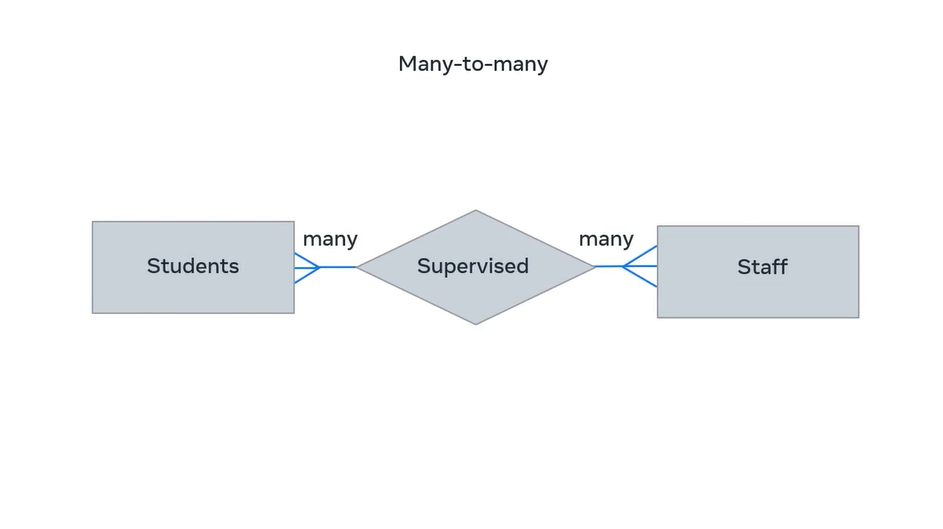

# Table Relationships

At this stage of the course, you spend some time exploring the relational model for databases. However, it's crucial that you have a proper understanding of how the relational model influences the design and structure of a database and how it helps to build relationships between tables. Once you understand how your database is structured, then you can determine how best to extract information from it.

To understand how the relational model influences our databases, let's take the examples of two tables from a college database.

The first table shows a list of students along with their assigned student and course identification numbers. The second table list courses that students can study along with the ID for each course and its department.

The big question in this example is: **which student is studying what course? Is each student studying one or multiple courses?** These are basic examples of why it's important to structure and connect tables correctly. There are three types of relationships between any two tables in a relational database.

   + One-to-many,
   + One-to-one, and
   + Many-to-many.

## One-to-Many Relationship

If there are two tables, Table A and Table B, a one-to-many (1:N) relationship means a record in Table A can relate to zero, one, or many records in Table B. Many records in Table B can relate to one record in Table A.

In a one-to-many relationship, a record of data in a row of one table is linked to multiple records in different rows of another. In the student table, a student with the id of 1 is enrolled in two courses on the course table.

One-to-many relationship can be drawn between these tables. This relationship can also be illustrated in a basic entity relationship diagram, or ERD. A student is enrolled in many courses using shapes and symbols.

The diagram depicts the two entities, student and course, in rectangle shapes with **enrolled** to describe the relationship in a diamond shape. Many is depicted using the **crow's foot** notation symbol.

The relationship can also be illustrated using a more complex ER-Diagram that depicts keys.

Course ID in the student table is a foreign key or FK. This references the primary key or PK course ID column that exists in the course table. 

## One-to-One Relationship

Let's take a look at one-to-one relationships. In order to understand one-to-one relationships, let’s take the example of two tables: Table A and Table B. A one-to-one (1:1) relationship means that each record in Table A relates to one, and only one, record in Table B. Likewise, each record in Table B relates to one, and only one, record in Table A.

In one-to-one relationships, one single record of one table is associated with one single record of another table. To demonstrate this relationship, I'll use two new tables.

One that headlines key information about the staff in each college department. The other is the department location table that records key data where the location of each department on campus. In this instance, each department head is in one department building on the college campus. Each staff member from the department staff table is associated with one record from the department table.

These relationships can also be depicted in an ER diagram as one department head leads one department.

## Many-to-Many Relationship

If there are two tables, Table A and Table B, a many-to-many (N:N) relationship means many records in Table A can relate to many records in Table B; and many records in Table B can relate to many records in Table A.

This type of relationship associates one record of one table with multiple records of another table. The same relationship also works in the other direction. See a diagram below.

In this example, the student, Maurice Doyle, is undertaking two research projects and each project is supervised by different staff member.

Likewise, one staff member can supervise or collaborate with multiple students on their research projects.

These relationships can also be depicted in an ER diagram as many students are supervised by many staff.

You should now be able to outline the different relationships that exist between tables in a relational database model.
