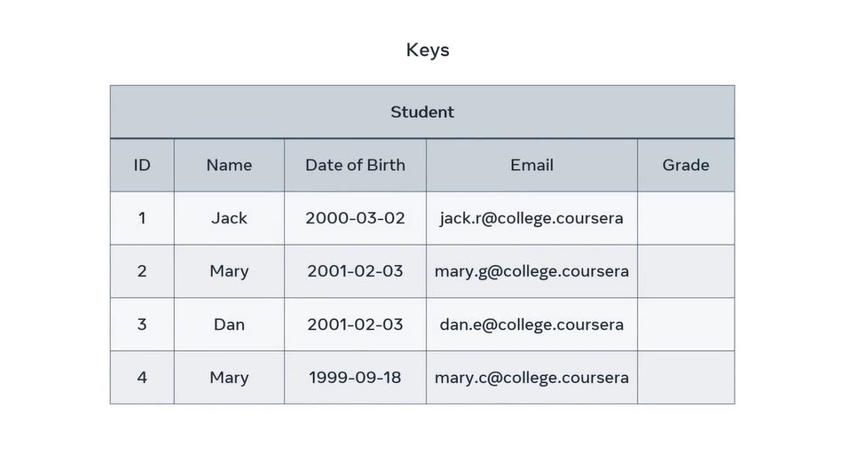

# Primary Keys

By now you're probably familiar with querying values or records within database tables. But how do you query specific records and values if they're duplicated across the table. When you come across obstacles like these, you can use keys as your solution. In this lesson, you'll learn how to explain the purpose of primary key in a database table and select a simple and composite primary key. You may have encountered several examples of primary keys during this course. In these examples, you saw that they're using tables as unique method to identify a record and prevent duplicates.

Let's take an example of a student table with five attributes: ID, name, date of birth, email, and grade.

How could we identify a specific student to enter their grade? The student Mary, on row 2. All you need to do is find the unique ID of Mary to identify a record of her data. However, in this example, you can't use the student name column because there are two students in the table called Mary. You can't use the date of birth either because another student in the table called Dan, has the same birthday. 

Neither of these records are unique to Mary, so what's the best approach? The solution is to locate a **candidate key**. This is an attribute that's unique to each row of the table and cannot have a null value. In other words, it cannot be empty. In this example, there are two possible candidate keys, the student ID and the student email.

Both rows contain a unique value for each student, so either one can be used as a primary key. Let's assign the student ID as the primary key. Whichever column you reject as the primary key becomes the **alternate** or **secondary** key. In this instance, the email column is a secondary key.

## Composite Primary Key

But what happens if you can't locate a unique value within the table? Maybe all rows of duplicated values. In this instance, you can create a **composite primary key**. Let's see the idea behind how to creating composite primary key. This type of key is the combination of two or more attributes. Let's take the example of the delivery department of an online store. They have a delivery table, that tracks the deliveries placed by their customers.

However, there's no single column with unique values in each row. No column can be considered as the primary key. In this case, the best approach is to combine the customer ID and Product code columns to create a unique value for each specific record of data.

With these columns, you can determine which customer ordered what product so together, these columns become the composite primary key. This key can be used to track the delivery status for each customer.

You're now familiar with one single column primary and composite primary key. You should now also be able to identify the most appropriate situation in which to use each one.
