# Data Normalisation

As a database engineer, you'll often encounter columns in a table filled with duplicate data and multiple values. This can make it challenging to view, search, and sort your data. However, with the correct implementation of normalization, this challenge can be effectively addressed. The normalization process makes it easier and more efficient for engineers to perform basic database tasks. It's especially useful for fixing well-known insert, delete, and update anomalies. However, to achieve database normalization, you first need to perform the three fundamental normalization forms: first normal form (1NF), second normal form (2NF), and third normal form (3NF).

## First Normal

The first normal form (1NF) presents the atomicity rule and how to enforce it, and analyze effective ways to eliminate repeating groups of data problems in datasets.

Data atomicity means that there must be only one single instance of the column attribute value in any field of the table. In other words, your tables should only have one value per field. By eliminating repeating groups of data, you can avoid unnecessary repetition in the database. Instances of repeated data can cause redundancy and inconsistency.

To better understand this, let's explore an example demonstrating data atomicity. I've built an unnormalized table called "Course Table" within a college database. 

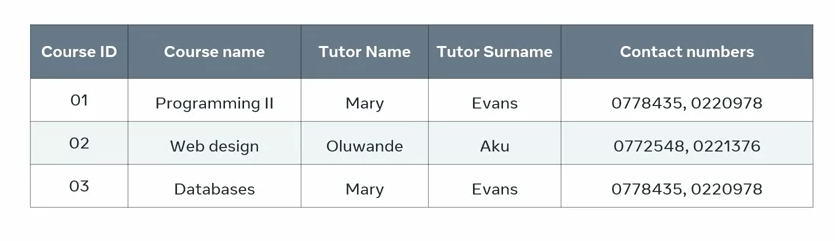

It includes information about the college's computing courses, along with the names and contact details of the course tutors. The course ID column serves as the table's primary key. However, there are multiple values in each row of the contact number column, as each row contains two contact details for each tutor — a cell phone number and a landline number. This table isn't in 1NF because it violates the atomicity rule by including multiple values in a single field. To fix this, I can create a new row for each number, solving the data atomicity problem.

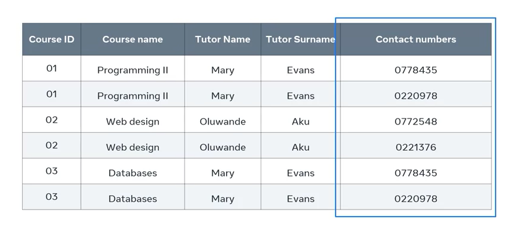

The table now has just one value in each field. However, this solution creates another problem — the primary key is no longer unique because multiple rows now have the same course ID. Another way to solve the atomicity problem while retaining the primary key is by creating two columns for contact numbers — one for cell phones and another for landlines.

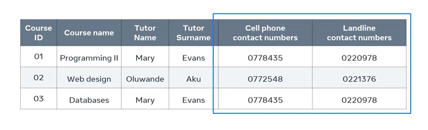

However, this still leaves the issue of unnecessary repeated groups of data. For instance, Mary Evans is the assigned tutor for two courses, so her name and contact details appear twice in the table. If she's assigned more courses, her details will continue to reappear, and it's likely that her details will appear in other tables within the database system.

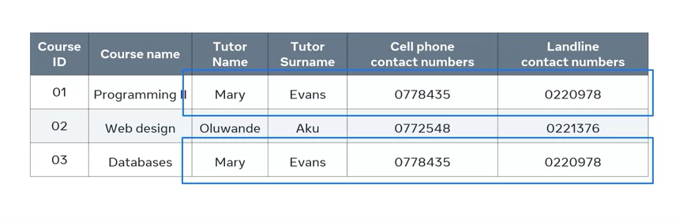

This creates another problem: if this tutor changes any of her details, I'll have to update them in this table and all others where they appear. Missing any of these tables would lead to inconsistency and invalid data within my database system. To solve this issue, I can redesign my table to adhere to 1NF.

   + First, I identify the repeating groups of data, in this case, the tutor's name and contact numbers.
   + Next, I identify the entities I'm dealing with, which are course and tutor.
   + Then, I split the course table so that I have one table for each entity: a Course Table that contains information about the courses and a Tutor Table that maintains the name and contact numbers of each tutor.

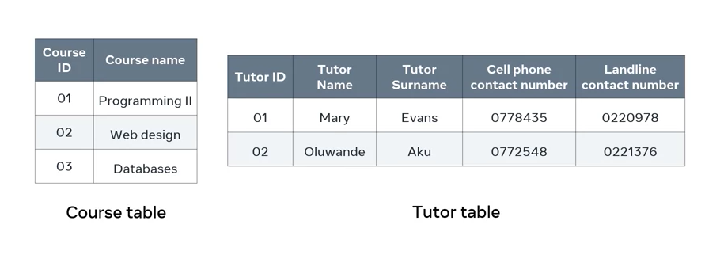

Now, I need to assign a primary key to the Tutor Table, so I select the tutor ID column. While this solves the problem of data atomicity, I also need to provide a link between the two tables. I can connect them by using a foreign key, adding the tutor ID column to the Course Table. 

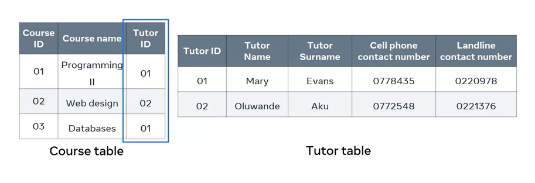

This way, both tables are linked, achieving data atomicity and eliminating unnecessary repeating groups of data.

## Second Normal

As a database engineer, you'll often encounter columns in a table filled with duplicate data and multiple values. This can make it challenging to view, search, and sort your data. However, with the correct implementation of normalization, these challenges can be addressed. The second normal form (2NF) outlines the concept of functional dependency, and define partial dependency. Database normalization is a progressive process, so it's essential to be familiar with 1NF before implementing 2NF. 

Why is database normalization necessary? If you're going to store content, you should:

   + Aim to have the best possible database
   + Have proper structure 
   + Reducing duplication, 
   + Allows for accurate data analysis and retrieval.

To achieve the best results, engineers build tables to optimize the database structure. Before learning how to designing tables in a relational database to meet the second normal form criteria, you need to understand the terms "functional dependency" and "partial dependency."

### Functional Dependency

Functional dependency refers to the relationship between two attributes in a table, where the unique value of one column determines the value of another column. To demonstrate this concept, let's consider a table known as "R."

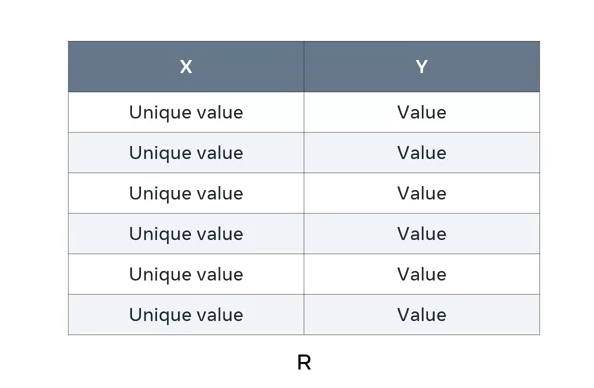

This table contains two columns, X and Y. X is a column with a set of unique values that aren't replicated elsewhere in the table, such as a primary key. Y is a column without unique values, like a non-primary key. In this relationship, Y is functionally dependent on X because X, as the primary key, only contains unique values. 

I'll explain functional dependency in more detail. Consider a "Student" table that holds key information about students in a college.

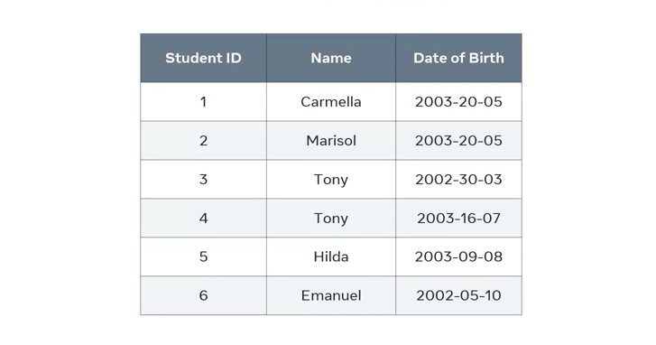

The table contains three columns: a student ID column, a name column, and a date of birth column. If I need to find the date of birth for a specific student, I can't use the name column because it has duplicate values — there are two students named Tony. I also can't use the date of birth column because there are two students who share the same date of birth. However, I can use the student ID column because all values in this column are unique, making it the table's primary key. The values of this primary key column determine the information in the other columns, meaning each column in the table is functionally dependent on the student ID column. It's the only column that can be used to return specific data.

### Partial Dependency

Partial dependency refers to tables with a composite primary key—a key that consists of a combination of two or more columns. To demonstrate this, let's use an example of a table that shows the vaccination status of patients in a hospital database.

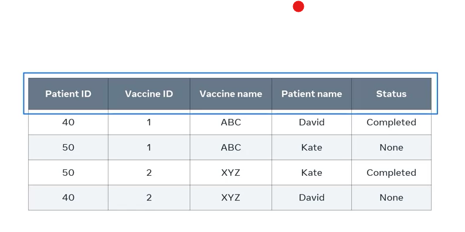

The table includes the patient ID, vaccine ID, and vaccine name, along with the vaccination status of patients David and Kate. Since no single column has unique values in each row, the best approach is to combine both the patient ID and vaccine ID columns as a composite primary key to create a unique value in each record. To ensure the vaccination table meets the second normal form (2NF), all non-key attributes (vaccine name, patient name, and status) must depend on the entire primary key value, which consists of patient ID and vaccine ID. If a non-key attribute depends on only part of the key, it creates partial dependency. 

Let's apply this rule to see if it's true for every non-key column. To check the vaccination status of patient ID 50 for vaccine 1, I need to use both the patient ID and vaccine ID keys. The combined value is the only way to return the vaccination status of a specific patient, indicating functional dependency between the status value and the primary key value. 

However, if I want to find out the vaccine name, I don't need both combined values — only the vaccine ID is necessary. This is an example of partial dependency, which should be avoided as it violates the 2NF rule. Similarly, if I want to identify the patient's name, I only need the patient ID, not the combined values.

To upgrade this table to 2NF, I must ensure all non-key columns depend on all components of the primary key. Just like from the diagram below.

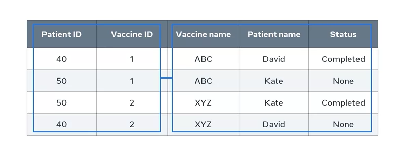

First, I identify the entities in the vaccination table, which include vaccination status (represented by the status column), vaccine (represented by the vaccine ID and vaccine name columns), and patient (represented by the patient name and patient ID columns), as seen below.

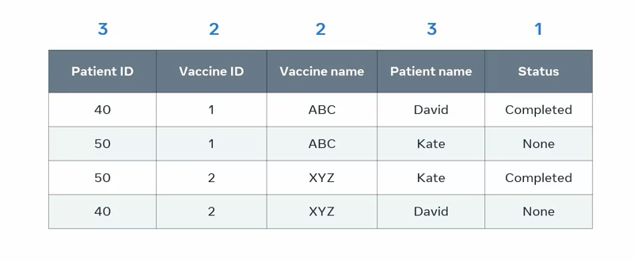

Then, I break up the table into three separate tables: a Patient table, a Vaccine table, and a Vaccination Status table. 

In each of these new tables, all non-primary key attributes depend only on the primary key value, eliminating unnecessary replication of vaccine and patient names within the vaccination table.

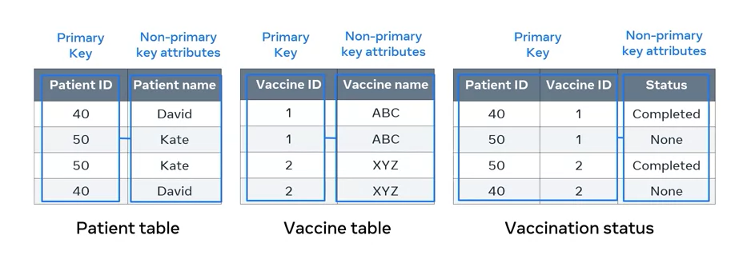

With these changes, the three tables are now in second normal form (2NF). You should now be familiar with the 2NF rule and how to upgrade a table to 2NF. Good work.

## Third Normal

When working with tables in a database, you may often encounter instances where data is repetitive. For example, two columns might contain very similar values, leading to redundancy. To address this, you might consider splitting the table to simplify the data. In relational databases, such issues of repetitive data can be resolved using what's known as third normal form, or 3NF. You'll understand how to design a database in 3NF and explain the concept of transitive dependency.

### Transitive Dependency

Before we dive in, we must know that a database must first meet the requirements of 1NF and 2NF before it can be normalized to 3NF. In addition to these rules, a database in 3NF must not contain any instances of transitive dependency. In the context of 3NF, transitive dependency means that a non-key attribute cannot be functionally dependent on another non-key attribute. In other words, non-key attributes should not depend on each other. A key attribute in a database is one that helps uniquely identify a row of data in a table.

To demonstrate the concept of transitive dependency, let's start with a basic example. Imagine a table with three columns: A, B, and C. In this scenario, the value of A determines the value of B, and the value of B determines the value of C. This relationship can be represented as A → B → C, meaning that A determines C through B. This type of relationship is what database engineers refer to as transitive dependency.

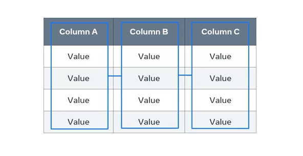

Now, let's see how this works with a more complex example. Consider a table of best-selling books within Europe, from the database of an online bookstore. The table organizes the books according to five attributes: Book ID, title, author name, author language, and country. 

In this table, the ID is the primary key, while the other attributes are non-key attributes. To retrieve information about any of these attributes, you typically use the ID of the book. For example, using the ID of 3, you could locate the author, Cormac O'Dwyer, the language, Irish, and the country, Ireland. However, it’s also possible to determine the country based on the language or vice versa, both of which are non-key attributes. For instance, in the context of Europe, if the language is French, the country is likely France, and vice versa. This creates a transitive dependency because a non-key attribute (country) depends on another non-key attribute (language). In this scenario, the relationship can be expressed as Language determines Country and Country determines Language. The other attributes in the table are fine, as they depend only on the ID primary key. For instance, you can't say that the author name determines the book title or language, as an author might write books in different languages.

To resolve this transitive dependency and remove any repetition of data, you can split the original table into two tables while ensuring they conform to the 3NF rules. In this case, you could keep the original "Top Books" table but move the "Country" and "Language" columns into a new table called "Country." The "Country" column would remain in the "Top Books" table as a foreign key to link the two tables.

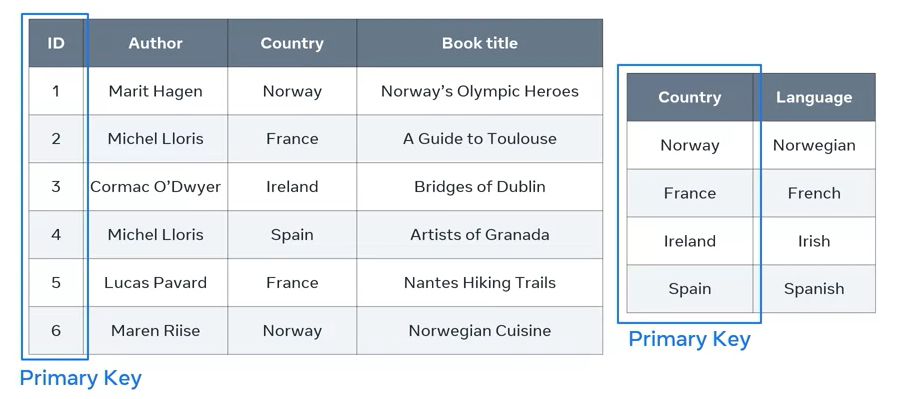

The new "Country" table would contain only four records, with no repetition of data. There's no need to include the "Language" column in the "Top Books" table, as specifying the country is enough to determine the language. Most importantly, in each table, all non-key attributes are determined solely by the primary key. This design ensures that the tables meet the requirements of 3NF.

By following these steps, you've learned how to design a database in the three normal forms and can now explain the concept behind each normal forms.
