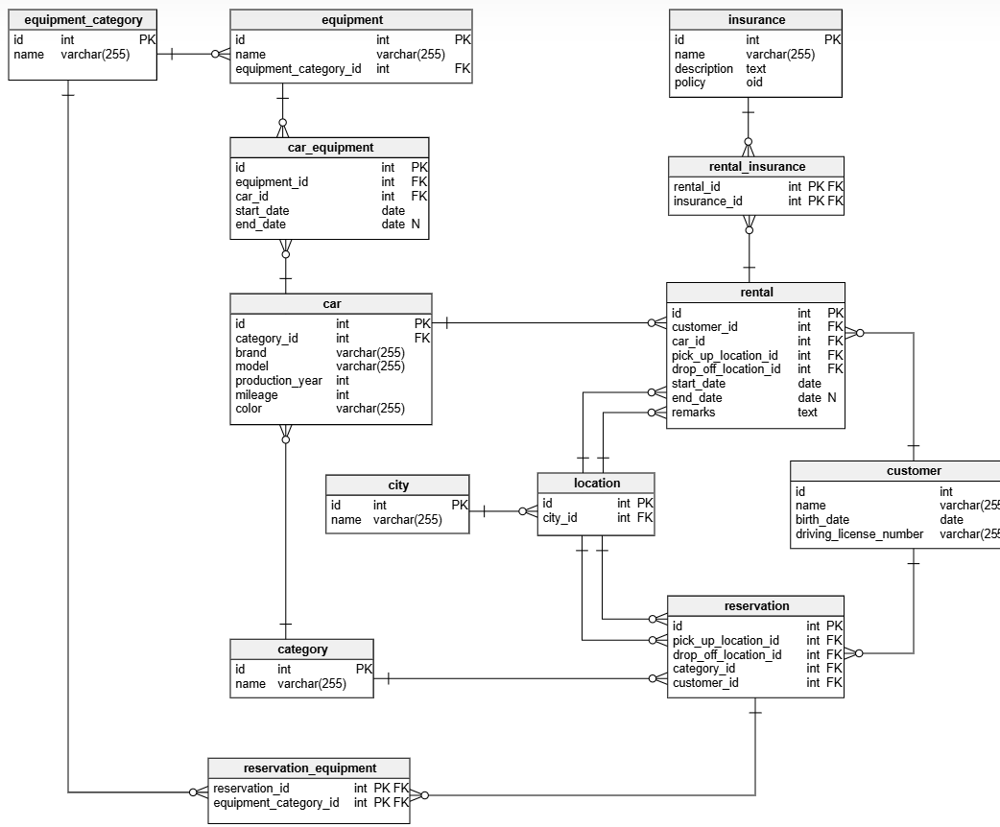
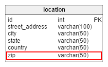
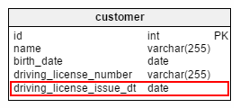

# Fully Functional Car Rental Data Model

I want to design a data model of a fully functional system for an international car rental company. The company keeps vehicles to rent in various segments (**mini**, **economy**, **intermediate**, **SUV**, **cargo** and **limousine**). It operates its operations from various cities across multiple countries. The company allows their customers to rent a car from one location (pick-up location) and drop it off in another location (drop-off location).

At this point, let’s refer to an earlier article that explains a **simple Car Rental System Model**. This model caters to all the fundamental services offered by a car rental company.

---

Before we add new functions, I would like to incorporate some minor changes into this model, namely:

+ Adding `city` as a column in the `**location**` table, and removing the city table altogether.
+ Adding one additional column, `zip` (as in ZIP code, or postal code), in the `**location**` table. This system will identify a pickup/drop-off location by its ZIP code. There are many countries where ZIP code is an alphanumeric number, so I will keep this column as a varchar column.

    

    --- 
+ Adding `driving license issue date` to the **`customer`** table. There are some countries where the maximum speed limit depends on when the license was issued to the driver.

    

    --- 
+ Renaming the **`category`** table to **`car_category`** , which describes its content more precisely.
+ Storing a customers’ flight information if the pickup location is near an airport. This enables the system to make appropriate changes to the customer’s reservation request in case of flight delays or cancellations. To do this, I add another table called `**flight_detail**` and connect it to the `**reservation**` table.

## Adding Customer Invoice Information

For invoicing, we need to store a rental value for each inventory item, including cars and equipment. The rental cost is assigned to each category, because the reservation process deals with categories rather than individual cars.

Let me add `rental_value` in the `**car_category**` and `**equipment_category**` tables.

On similar lines, there must be some cost associated with insurance. This cost is determined by the insurance company. For now, I’ll add one more column, cost, in the `**insurance**` table.

For invoicing, I create a separate table to store all invoice details. This way, these same details can easily be retrieved whenever needed. Since the computation of these values is a bit tricky, I won’t repeat them again and again for an invoice. I’ll add one table, namely `**rental_invoice**`, that is primarily connected with the `**rental**` table.

The `**rental_invoice**` table contains the following columns:

-   `id` – the primary key of this table.
-   `rental_id` – the primary key of the `**rental**` table. I will add one unique constraint on this column: there can be only one record for each rental.
-   `car_rent` – This column signifies the rental costs for the rented vehicle.
-   This cost can be determined using the following SQL:
    
    `select` `a.rental_value` `from` `car_category a, car b, rental c`
    
    `where`  `c.car_id = b.car_id` `and` `b.category_id = a.id`
    
    `and` `c.id = <rental_id>;`
    
    `</rental_id>`
    
-   `equipment_rent_total` – This column shows the amount to charge for any equipment rented out to the customer
-   The total cost can be determined using the following SQL:
    
    `select` `sum``(a.rental_value)` `from` `equipment_category a, equipment b, car_equipment c, car d, rental e`
    
    `where`  `a.id = b.equipment_category_id` `and` `b.id = c.equipment_id`
    
    `and` `c.car_id = d.id` `and` `d.id = e.car_id`
    
    `and` `e.id = <rental_id>;`
    
    `</rental_id>`
    
-   `insurance_cost_total` – This column is for the customer’s total insurance cost. This can be determined by using the following SQL
    
    `select` `sum``(a.cost)` `from` `insurance a, rental_insurance b, rental c`
    
    `where` `a.id = b.insurance_id` `and` `b.rental_id = c.id`
    
    `and` `c.id = <rental_id>;`
    
    `</rental_id>`
    
-   `service_tax` and `VAT` – As their names suggest, these columns store values for applicable service tax and VAT.
-   `total_amount_payable` – This column will contain the value of the total invoice amount. This would be the sum of following columns:
    
    _total\_amount\_payable = car\_rent + equipment\_rent\_total + insurance\_cost\_total_
    
-   `waiver_amount` and `net_amount_payable` – These columns store values for waiver amounts (if any) and the net amount due for payment. The `waiver_amount` is how much will be waived off the total invoice. It is commonly used when a rental company offers a discount to customers. The formula for determining `net_amount_payable` looks like this:
    
    _net\_amount\_payable = total\_amount\_payable – waiver\_amount_
    

**Mobile Inventory** – For a car rental company, its inventory is always mobile because it is moving from one location to another. If you’ve noticed a checkbox saying ‘returning to different location?’ when you reserve a car online, you’ve seen it in action. The system treats your request a bit differently if the returning location is NOT the same as pickup location. The system always keeps a track of its inventory as and when it is rented out and returned.

For example, one customer rents a car from Chicago, confirms that the drop off location will be different, and drives to his destination in Saint Louis. Obviously, he’ll drop off the car at the company’s Saint Louis location. In this case, as soon as he drives the car from the Chicago location, this part of the inventory is no longer tied up to that office. The car will get registered again, this time with the Saint Louis office, as soon as he is done with it.

To incorporate this mechanism, I will add one column, namely `current_location_id`, in the `**car**` table as well as the `**equipment**` table. This column holds only the valid IDs of locations from the `**location**` table.

So, with the above example, the initial location of the car is Chicago; it will be updated after the customer returns the car to the destination office.

### Setting Up Fueling Options

Most car rental companies give the following types of fueling options:

1.  **Fuel Service Advance** – the customer pays for a full tank of fuel in advance, and returns the car with an empty tank.
2.  **Fuel Service Charge** – the customer gets the car with a full tank of fuel, but pays for it based on fuel usage.
3.  **Fuel Self Service** – the customer receives the car with a full tank of fuel and returns the car with a full tank. This is the most widely-accepted option of the three.

Here, we are not concerned about which option the customer chooses. What we want is to register their choice while processing the rental request.

To meet this need, I’ll add one table, `**fuel_option**`, that stores all possible options for fueling the car. There must be one-to-one mapping between a rental request and the `**fuel_option**`, since the customer is asked to select one at the time of booking the rental.

### The Final Car Rental Data Model

  

EDIT MODEL IN YOUR BROWSER

In many areas, car rental companies are shifting toward using a keyless, self-service renting experience for their customers. They do not want to make their customers wait at a counter just to complete paperwork and pick up car keys. Instead, customers can access vehicles using a mobile app or a digital platform, which may include features like documenting the [mileage sheet](https://www.fleetio.com/tools/vehicle-mileage-log-spreadsheet) directly through their devices. Can our current data model cater to such requirements? What changes are needed in our data model to make it happen?

Do you have any thoughts on our car rental data model? Let’s start a discussion! Feel free to share your input in the comments section.