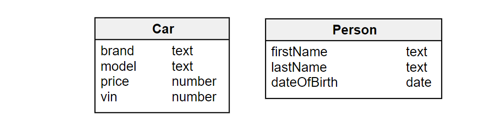
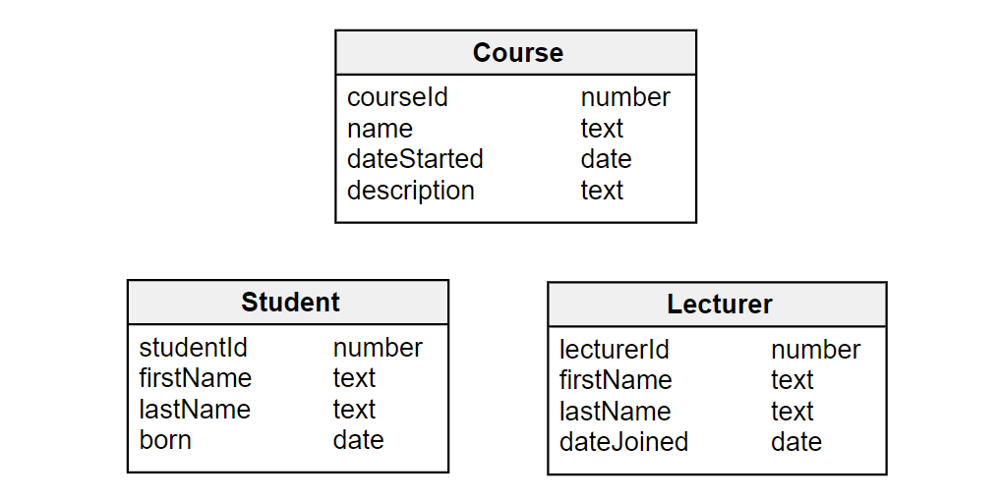

# Entities

You’re finally ready to get down to real data modeling. We’ll start off with entities and their attributes. Entities are the basic building block of every data model.

## What Is an Entity and Entity Instance?

Data models help us to identify what kind of information we’ll store in our system. We use such models to address the question ***What will the data in our system be about?***

**Entities** are the **things** or **objects** in our system. ***They represent both conceptual construct and specific objects in conceptual categories, not specific objects***. For example:

  + In a store there may be a shop assistant called Eve. When she quits and another person called James is hired, he has the same role as Eve, he is a shop assistant. Moreover, the store can also hire other shop assistants. In our system, we will only have the general entity `ShopAssistant`. This entity is the role that both Eve and James have.
  + So, Eve and James are **specific instances** of the same general concept of a “Shop Assistant”. `ShopAssistant` is the entity in our system.

Let’s try another example.

  + In a shop you have different products: a 9-carat white gold diamond ring, 7-carat yellow gold pearl earrings, and so on.
  + The ring and the earrings are instances of the same concept – in this case, the Product. So our store system should have an entity known as `Product`.

Entities are like nouns. They can be almost anything, depending on the system.

  + A car or a customer could be entities for an auto repair shop; 
  + Student, teacher and class can be entities for a school data model.
  + Patient, doctor, nurse, and room can be entities for a medical data model.
  
As you can see, **the list of entities is the vocabulary of a given system**.

To sum up, we’ll say that entities can describe physical things, people, organization units, transactions, etc. In this series, you are going to see lots of different entities.

## Naming Your Entities

Entities are represented with rectangles. Inside each rectangle, we put the **name** of the entity: `Car`, `Person`, `Doctor`, etc. Here are the entities from a **car identification system**:

The entity name should be singular (`Car` not `Cars`) and it shouldn’t be too long – we like to keep things short and simple. This is particularly important for huge data models with dozens of entities.

Most times, entities are always going to be uppercase (`Student` or `Nurse` instead of `student` or `nurse`), but other data models may use a different system. Keep in mind, though, that short and descriptive entity names are always good form.

## Entity Attributes

Each entity is associated with some details known as **attributes**. Remember shop assistants Eve and James? They have attributes: first and last names, a date of birth, eye color, and so on. Eve has two black cats and James loves playing computer games. Some of this data is important in our system (first and last names, birth date). Some of it is not relevant at all (we may love cats, but they have nothing to do with our system).

It’s not always obvious whether a certain piece of information should be stored in the system (e.g. James’ hobby might not be very important here, but it can prove useful in another system for a game development studio). It’s part of the data modeler’s work to make the decision about what is needed in the model.

We can say, then, that ***attributes are additional information about a specific instance of an entity***. In this case, the entity is `ShopAssistant`, and the specific instances are `Eve` and `James`.

So what are Eve and James’ relevant attributes? Eve Larson was born on April 21, 1987. Therefore, we can say that the attribute for Eve’s `first-name` is `Eve`. The value of the attribute `last-name` for Eve is `Larson`. And Eve’s birth date (the value of the attribute `date-of-birth`) is `21-04-1987`.

Likewise, James Green was born on June 6, 1990. So James’ `first-name` is `James`, his `last-name` is `Green`, his birth date is `09-06-1990`.

As with entities, **each attribute has a name** that tells us what information it contains. Attribute names are put inside the entity box.

When naming your attributes, avoid spaces. You can use `camelCase` to separate words in an attribute name. In this series, we’re going to keep all attribute names singular and camel case.

### **How Data Types Define Attributes**

There are many types of information that can be stored in a specific attribute: text, numbers, dates, a logical value (i.e., true or false) and various others. Each attribute can only store one kind of information; this is its **data type**.

For each attribute in an entity, you have to decide what kind of information (what data type) it will store. If, for example, you decide that the attribute `district` should contain the district number (`7`), you can’t fill the attribute with a text value later on (`Manhattan`). In our example model, a Person has a first name (text attribute), a last name (text attribute) and a date of birth (obviously, a date). A Car has a brand (text), a model name (text), a price (number) and a vehicle identification number (number).

## Identifying Entities and Attributes

In real life, it’s a bit more complicated – you need to start your work by talking to your customers, to the potential users of the system, and to domain experts. For instance, you could be given the following short description of your client’s blog:

_We publish many posts. Each post has a specific author and each author has a nickname. After the post is written, we decide on the tags associated with the post. Finally, we have to choose a category for the post._

How do we find entities and attributes in a description like this? A common tip is to look for **nouns**. Each noun in the description may turn into an entity, an attribute, or an example in your data model. **Examples** are useful for finding relationships between entities; we'll cover them later in the series.

In our short blog description, we can identify the following nouns: post, author, nickname, tag, category. These nouns can become separate entities (`Post`, `Author`, `Tag`, `Category`) or attributes (_nickname_ can become an attribute for `Author`).

### **Note**:

In this context, **"an example in your data model"** refers to a **specific instance** or **real-world occurrence** of an entity. It helps illustrate how entities and attributes relate to each other.  

For example, if you're designing a **university database**, you might identify **"Student"** as an entity. An example in your data model would be a specific student, like **"John Doe"**, which helps you understand how attributes (e.g., name, ID, major) are assigned to an entity.  

These **examples** can also reveal **relationships** between entities. For instance:  
- "John Doe is **enrolled in** CS101" → Shows a relationship between **Student** and **Course** entities.  
- "Dr. Smith **teaches** CS101" → Shows a relationship between **Instructor** and **Course** entities.  

Using real-world examples while modeling helps ensure that the structure correctly represents the relationships and constraints in the database.

Don't worry if you have a hard time identifying entities and attributes – when building a data model, it’s common to go through multiple versions before you can achieve the desired model. Some nouns start as entities and end up as attributes or vice versa. Again, this is a very typical situation in data modeling. Just start by classifying some of the nouns and then, step by step, add a few more.

### **Find the Entities and Attributes in a Simple University System**

Let’s use a basic education model to practice identifying entities and attributes. We’ll imagine that university authorities have asked us to prepare a simple system for class management. They gave us the following general description:

_There are many **students** who take up various **courses**. All courses are run by **lecturers**. We have **ID numbers** for students, courses and lecturers. When a new student comes, we need to know their **first name**, **last name** and **date of birth**. When a new lecturer comes, we write down their **first name**, **last name** and their **date of employment**. All courses have **names** and **descriptions** so that students know what they cover. We also store the **date when the course starts**._

As you can see, we highlighted the most important nouns in the description. The first two sentences reveal the most significant nouns: students, courses and lecturers. They all describe people or units in our system, so they are perfect candidates for entities.

Now, let’s look for attributes. Students have their ID numbers, first and last names, and dates of birth. Similarly, lecturers have their ID numbers, their first and last names, and their hiring date. Courses have an ID too, but they also have also names, descriptions and start dates.

Now that we have everything sorted out, we can present the description in a convenient, graphical form. As you remember, entities are represented as rectangles and attributes are listed inside them. Our final data model for a simple university system looks like this:

