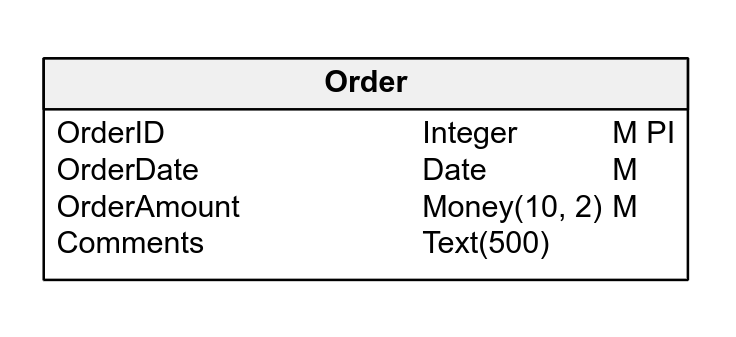
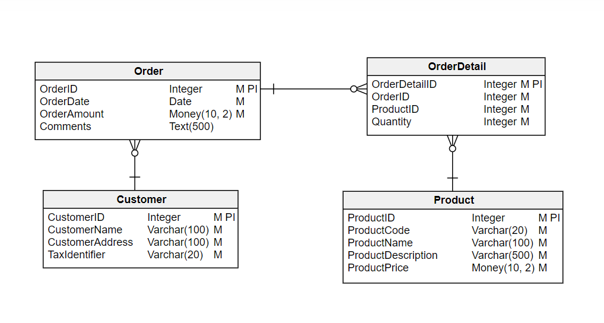
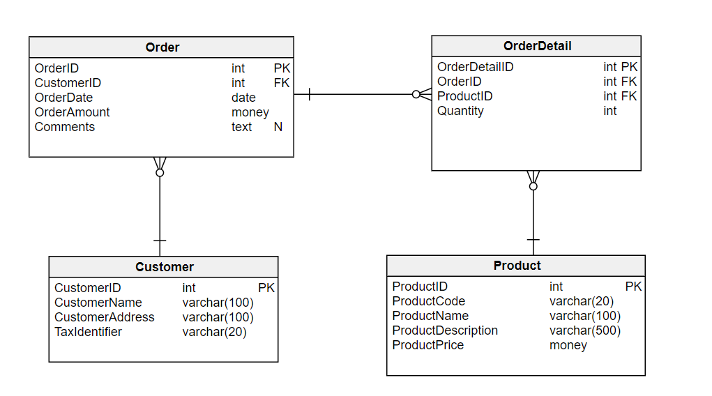
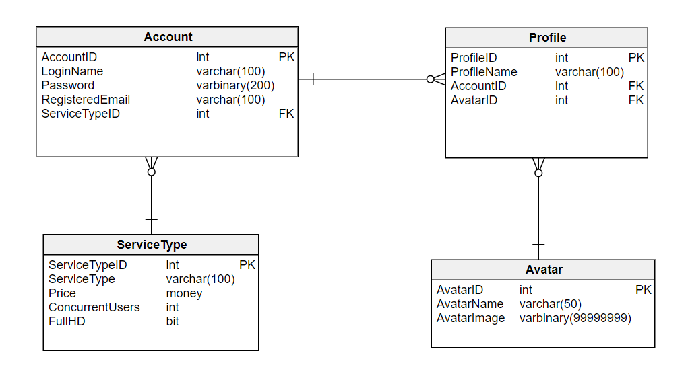
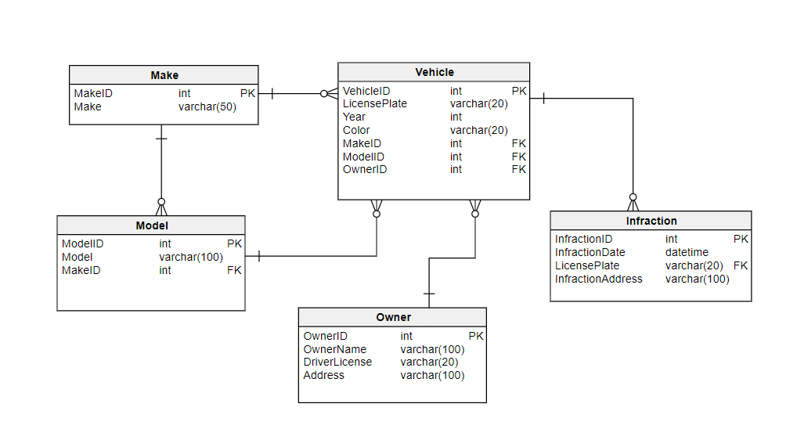
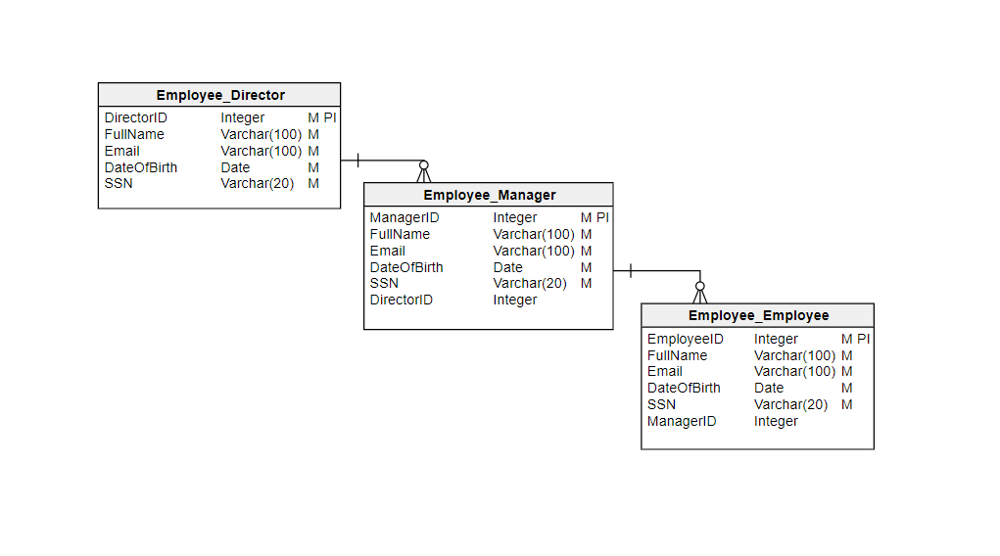
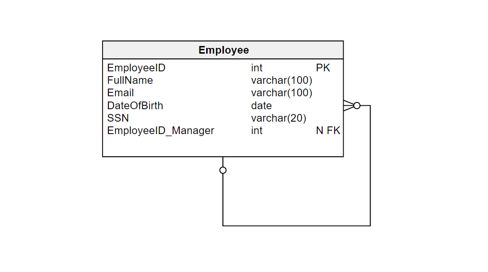

# One-to-Many Relationship

_One-to-many relationships are one of the most common database relationships. If you want to learn when and how to use one-to-many relationships, then this article is a great starting point._

You will surely use one-to-many relationships to store information in any relational database, whether you are designing enterprise-level software or just creating a simple database to keep track of your uncle’s stamp collection.

## A Brief Introduction to the Relational Model

Relational databases are a core component of any modern transactional application. The relational model is composed of tables (data organized in rows and columns) that have at least one unique key that identifies each row. Each table represents an entity. This is shown in the following example, a very simple version of a table representing customer orders:

The above diagram has a single table. Each row in the table represents one order, and each column (also known as an _attribute_) represents each individual piece of information contained in an order.

## What Are Relationships and Why Do We Need Them?

If we take a deeper look at the table used in the prior example, we will see that it does not really represent a complete order. It does not have all the information you would expect it to have. You will notice that it does not include any data related to the customer that made the order, nor does it have anything about the products or services ordered.

What should we do to complete this design to store order data? Should we add customer and product information to the **Order** table? That would require adding new columns (attributes) for customer names, tax identifiers, addresses, etc. as shown below:

| "Order ID" | "Order Date" | "Order Amount" | Customer | "Customer Address" | "Customer Phone" | "Tax Identifier" |
| --- | --- | --- | --- | --- | --- | --- |
| 1 | jun-23 | $10 248,15 | International Services Ltd | 1247 St River Blvd, Charlotte, NC | (555) 478-8741 | IS789456 |
| 2 | jun-27 | $14 785,45 | World Master Importing Inc. | 354 Mountain Hill Rd, Los Angeles, CA | (555) 774-8888 | WM321456 |
| 3 | jul-01 | $7 975,00 | First State Provisioning Llc | 444 North Highway, Houston, TX | (555) 698-7411 | FS947561 |
| 4 | jul-03 | $6 784,25 | International Services Ltd | 1247 St River Blvd, Charlotte, NC | (555) 478-8741 | IS789456 |
| 5 | jul-07 | $21 476,10 | World Master Importing Inc. | 354 Mountain Hill Rd, Los Angeles, CA | (555) 774-8888 | WM321456 |
| 6 | jul-12 | $9 734,00 | First State Provisioning Llc | 444 North Highway, Houston, TX | (555) 698-7411 | FS947561 |
| 7 | jul-17 | $14 747,45 | World Master Importing Inc. | 354 Mountain Hill Rd, Los Angeles, CA | (555) 774-8888 | WM321456 |
| 8 | jul-21 | $19 674,85 | International Services Ltd | 1247 St River Blvd, Charlotte, NC | (555) 478-8741 | IS789456 |

+ If we do that, we’ll soon run into problems. Most customers place more than one order, so this system will store customer information many times, once for each order of each customer. That does not seem like a smart move.

+ Moreover, what happens when a customer changes their phone number? If someone needs to call the customer, they may find the old number on previous orders – unless someone updates hundreds (or even thousands) of existing orders with the new information. And the same would go for any other change.

A relational model requires us to define each entity as a separate table and establish relationships between them. Storing all the information in a single table just doesn’t work.

There are several types of relationships between tables, but probably the most common is the one-to-many relationship, which is often written as 1:N. This kind of relationship means that one row in a table (usually called  the parent table) can have a relationship with many rows in another table (usually called child table). Some common examples of one-to-many relationships are:

-   One customer may make several purchases, but each purchase is made by a single customer.
-   A car maker makes many different models, but a particular car model is built only by a single car maker.
-   One company can have many phone numbers, but a phone number belongs to one company.

There are also other types of relationships between tables: **many-to-many**, and **one-to-one**.

Going back to our initial order example, the **`Customer`** table would be the parent table and the **`Order`** table the child; a customer can have many orders, while an order can belong to a single customer.

Please note that the one-to-many definition allows a row in the parent table to be associated to many rows on each child table, but it does not require it. Actually, the design allows a customer to have zero orders (i.e. a new customer who has not yet made their first purchase), one order (a relatively new customer who has made a single purchase) or many orders (a frequent customer).

### Showing One-to-Many Relationships in an ER Diagram

Let’s take a look at a more complete example of a simple customer ordering system using an ER (or entity relationship) diagram. Here’s the model:

This is a more realistic design. You will notice that there are new entities (tables) in the diagram, which now contains the tables **`Customer`**, **`Order`, `Order Detail`**, and **`Product`**. However, the most important thing you notice is that there are now **relationships** **between the tables**.

In a database model, relationships are represented by lines connecting two entities. The characteristics of these relationships are represented by different connectors:

-   When there is a single vertical line, the entity nearest that connector has only one row affected by the relationship. It’s the ‘one’ in one-to-many.
-   When there is a multi-line connector that looks like a crow foot, the entity nearest that connector has multiple rows affected by the relationship; it’s the ‘many’.

Looking at the image and knowing the notation, it is simple to understand that the diagram defines that each **`Order`** can have many **`Order Details`** and that each **`Order Detail`** belongs to a single **`Order`**.

## Implementing a One-to-Many Relationship Between Tables

To define a one-to-many relationship between two tables, the child table has to reference a row on the parent table. The practice is in the **database** folder. The steps required to define it are:

1.  Add a column to the child table that will store the value of the primary identifier for the relationship. (Actually, most database engines allow it to be any unique key from the parent table, not just the primary key.) The column can be defined as mandatory depending on your business needs; even so, foreign key columns are usually made

**Note:** It is a good practice to keep the name of the referencing columns the same as in the referenced (parent) table. This makes it even simpler to understand the relationship.

2.  Add a **foreign key** constraint on the child table. This indicates that each value stored in this new column references a row on the parent table.

Foreign key constraints are a feature available on relational database that enforces that:

1.  When you add a row to the child table, the value of the referencing column must match one (and only one) value in the parent table. (That is why a column or set of columns that make up a primary key or unique key must be referenced).
2.  If someone tries to delete a row from the parent table or tries to modify the values of the unique/primary key used as a reference **and** there’s a child table that references that row, the operation will fail.

These two features ensure that the database keeps its integrity. There is no chance of creating orders referencing a non-existing customer, nor of deleting a customer that already has orders.

As I have said before, the practice code example for this is in the **database** folder.

## Some Practical Examples of 1:N Relationships

Now let’s review some examples of real-world one-to-many-relationships.

### One-to-Many Relationship Using Primary Keys

This is probably the most common scenario when defining a one-to-many relationship. The child table uses the primary key value of the parent table to establish the relationship.

This example describes a basic online streaming service. Let’s review what’s stored in each of the tables and how they relate to the other tables in our model:

1.  Each **`ServiceType`** defines how an account ‘behaves’ (e.g. how many users can connect to the system at the same time, if the account has Full HD enabled, etc.)
    -   It has one relation with other entities. A one-to-many relationship with **`Account`**, meaning that each service type can have many accounts of that type.
2.  Each **`Account`** stores information about one customer. It has two direct relationships to other entities:
    -   Each account belongs to a single **`ServiceType`**, as explained above.
    -   This table has a one-to-many relationship with the **`Profile`** table, meaning that more than one user can connect to our system using the same account.
3.  Each **`Profile`** represents a user in our system. It has two relationships to other entities:
    -   Each profile belongs to a single **`Account`**. This allows all family members (or maybe a group of friends) to share the same account while each one has their own personal attributes (e.g. a profile name).
    -   Each profile has a unique **`Avatar`**.
4.  Each **`Avatar`** is an image that allows us to quickly identify each account user. It has one relationship with another entity:
    -   A one-to-many relationship with **`Profile`**, meaning that a single avatar can be assigned to profiles on different accounts.

### One-to-Many Relationships with Natural or Surrogate Unique Keys

The usage of surrogate primary keys is a widely accepted way of modelling tables. (Surrogate primary keys are generated by the database and have no actual business value.) This method produces keys that are simpler to use and adds some flexibility for when changes are required.

However, there are situations – e.g. when we need to interact with external systems – where using a key generated in our database is a bad approach. For those scenarios, it is usually better to use natural keys, which are unique values that are part of the entity being stored and are not automatically generated by our database.

The following example represents a basic data model of an organization that keeps track of vehicles (i.e the car’s make, model, color, and year), their owners, and any associated transit infractions. When we defined it, we used surrogate primary keys to establish the relationships between the vehicles and makes, models and owners, since all this information is handled internally by our system.

In this system, how can a police officer in another city report a car parked illegally using our vehicle primary key (`VehicleID`)? Such information is not naturally available on the parked vehicle, but the license plate is there. That means that the simplest way to receive and associate information from an external source (in this example, any police department in the country) is by using a natural unique key instead of a surrogate primary key.

The physical implementation of this logical diagram for SQL Server is available here:

### One-to-Many Relationships on the Same Table

The previous examples focused on relationships between two or more tables, but there are also scenarios where the relationship occurs between rows of the same table. This kind of one-to-many relationship is also called a hierarchical relationship; it’s used in many systems to represent tree-like structures, i.e. an organization chart, a general ledger account, or a product and its component parts.

The first time you need to create this kind of structure, you will be tempted to define a table for each of the levels in your hierarchy, as shown in the following diagram:

There are many problems to this approach:

-   All tables are almost identical and store identical information.
-   If your organization adds a new level, you’ll have to modify the data model and add a new table, new foreign keys, etc.
-   If an employee receives a promotion, you need to delete them from one table and insert them into another one.

Therefore, the best way to model this kind of structure is using a single table that references itself, as shown in this diagram:

Here we see a single **`Employee`** table and a column named `EmployeeID_Manager`. That column references another employee in the same organization who is the supervisor/manager of the current employee.

I added the `_Manager` suffix to distinguish between the ID of the current row and the ID of the manager. (We could use `ManagerID` instead, but I prefer to keep the original name of the referenced column and, in those cases where both are in the same table, add a suffix that explains the role it actually has).

Understanding hierarchical relationships is more complex than other one-to-many relationships. But if you forget about the table where all the information is stored and imagine that there are actually different tables, each of them representing a level in the hierarchy, it’s a bit easier to visualize. Imagine that you make the relationship between two entities and then combine them into one entity.

## What’s Next?

The examples provided will help you identify different scenarios that require a one-to-many relationship. You can start designing your own database structure using the [Vertabelo Database Modeler](https://vertabelo.com/), a web-based tool that allows you not only to generate a logical model but also to create a physical version of it for the database provider you need.

Now it’s your turn – use the comments section to tell us about your thoughts on this article, ask any additional questions, or share your database modelling experiences.

## Reference:

1. https://vertabelo.com/blog/one-to-many-relationship/
