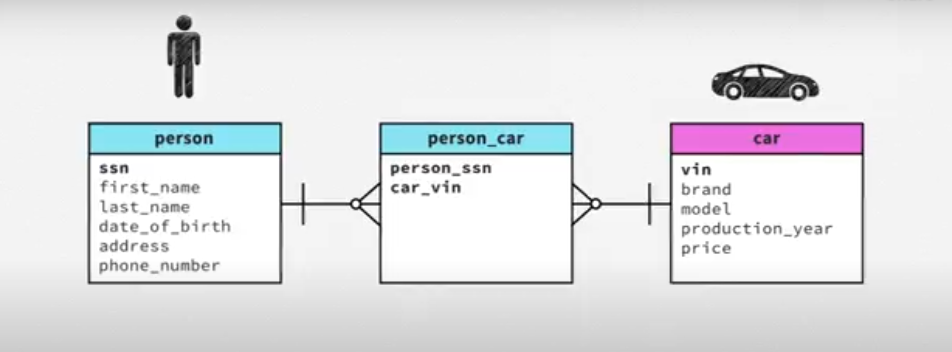
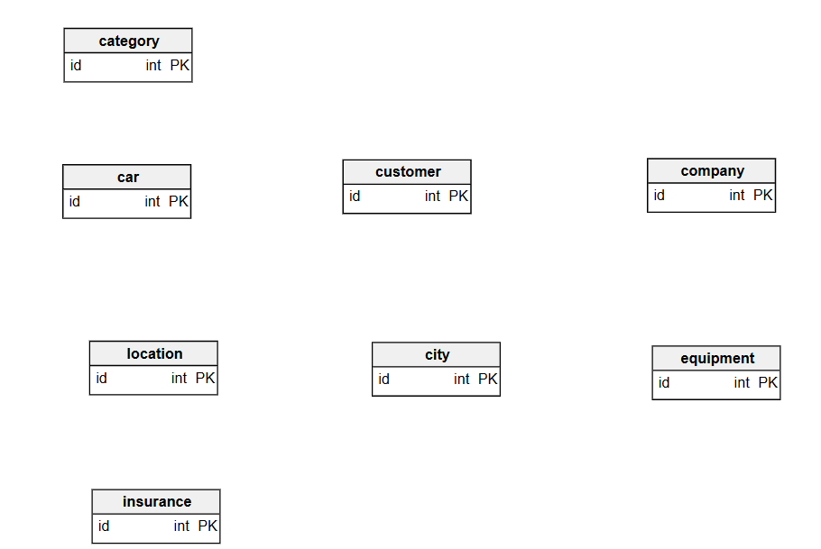
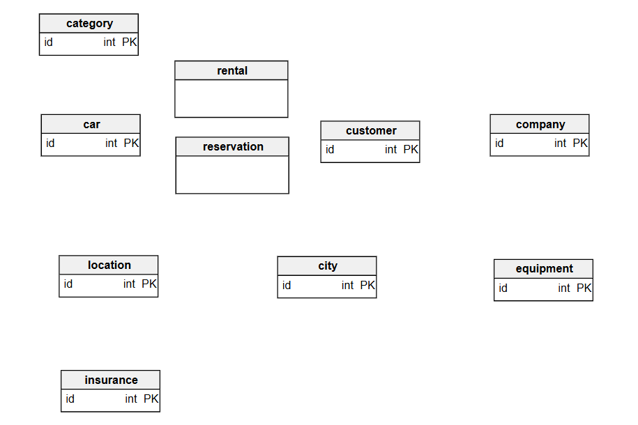
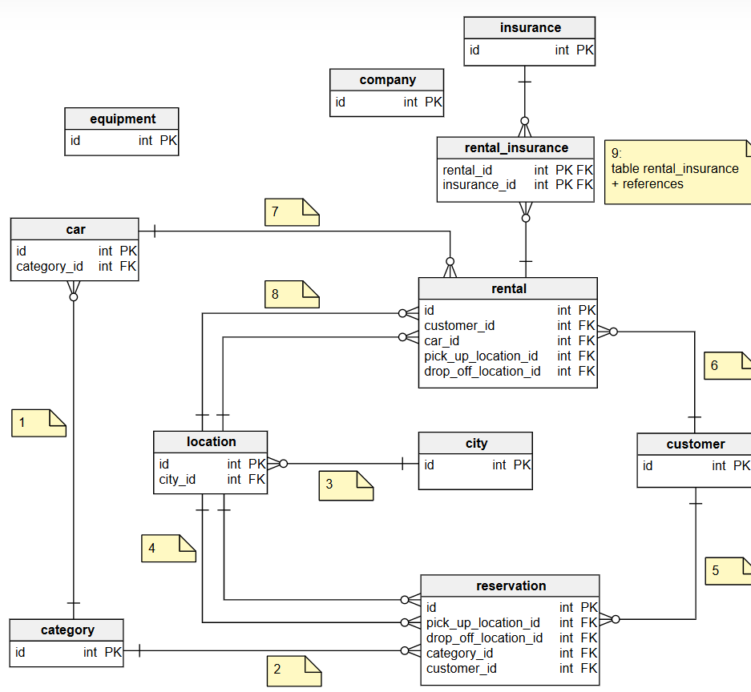
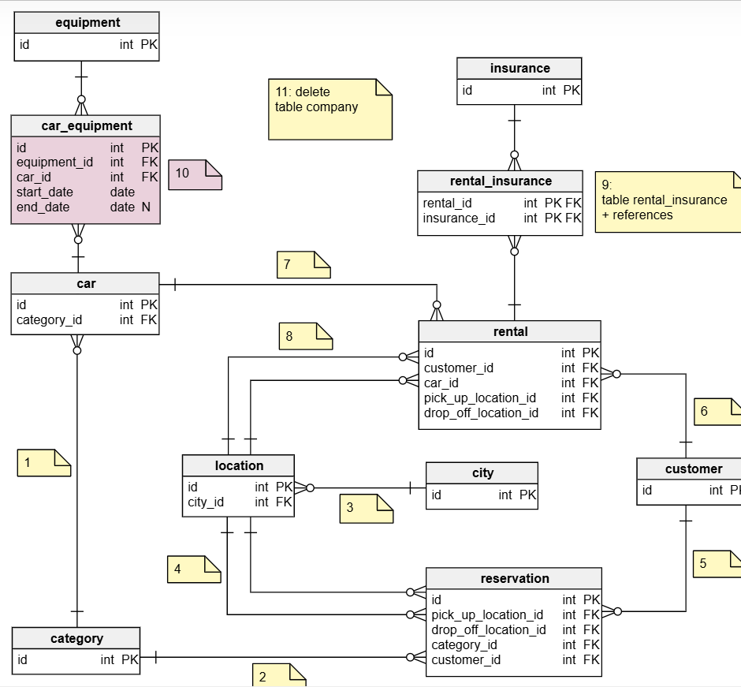

# Car Rental System

## How to Start Creating a Database Model

A database structure is made of **tables**, **columns**, and **references**.

---

Which **tables**, **columns**, and **references** should you create?

## Start With a System Description

You should always start creating a database model with a **description** of a system. In a classroom situation, a system description is given to you by a teacher. In real life, preparing a description is a **process** in its own right. I will just assume that you have the description. It doesn’t matter whether it was given to you by your client, your boss, your teacher, or you wrote it up yourself.

Take a look at the description and **highlight all nouns**. The nouns in the description can roughly be divided into three categories: tables, attributes, and examples.

### **Tables**

Tables represent primary entities in the system: people, physical objects, events, transactions, etc. For example, in a car rental system, there will be tables for **Car**, **Customer**, **Category**, **Equipment**, and so on.

There will also be tables representing events and transactions. In a car rental system, you have tables for **Reservation**, and **Rental**.

### **Attributes**

Attributes are properties associated with a primary entity. They describe features of your entity. In the database model they will be the columns in your tables.

### **Examples**

Examples help you understand data types, and relationships between tables. Examples are just that, examples. They help you understand the **datatypes** of certain attributes and they help you understand the **relationship** between different entities.

Starting with a description has the benefit of forcing you to use the same **glossary** as your users. If you create a system for a primary school, you should talk about pupils. If you create a similar system for a university, you should talk about students.

## Tables, Relationships, Columns

1.  Once your nouns are highlighted, identify the **tables**. You don’t have to model everything at once. Focus on the core functionality of the system first.
2.  When you have the tables, figure out the **relationships** between the tables. This step might lead to introducing new intermediate (junction) tables.
3.  Finally add the **columns** to the tables.

At this point, you should read the description again and see if anything is missing. I assure you there will be something to add. Add the new tables, the new relationships, and the new columns. Read the description again...

### **Things to Keep in Mind**

Creating a database model is an **iterative** process. Don’t try to model everything at once. Start with the core entities of your system. You can add more details later.

  1. **First identify the tables**
  2. **Then add references**
  3. **Finally you add columns**
  4. **Then you repeat the whole process. Add more tables, more references, and more columns**.

It is OK to ask **questions**. No matter how precise the description is, you will always have some doubts. Something will always be underspecified. Ask questions about the things you’re not sure about. **If you can’t ask questions, make a reasonable assumption and note down the assumption you make**.

There is always **more than one way** to model each system. Some models are clearly bad, but with most others it’s difficult to judge if they are right or wrong. The model depends on what the purpose of the system is, how data come to the system, even on the personal taste of the designer. As you gain experience, you’ll get more confident about your design decisions.

As an example we will create a database model for a car rental system. First, take a look at a description of the system:

_A car rental company rents cars to customers. The company owns several cars. Each car has a brand, model name, production year, mileage, color, and so on. Cars are divided into different categories: small, mid-size, large, limousines._

_The company has many locations where you can rent a car. The rental locations are located in different cities throughout the country. There can be more than one company location in a city._

_Anyone over 21 who has a valid driver’s license can rent a car. Customers under 25 or over 75 years pay different (higher) charges than other customers._

_Before renting a car, a customer usually makes a reservation for a car. A customer specifies the dates when the car will be rented, the pick-up location, the drop-off location, and the category of car he wants to rent. A customer may specify, that he wants some extra equipment in the car, for example a GPS, a car seat for a child, etc._

_When a customer rents a car, he declares the pick-up and drop-off location, and the drop-off date. The customer can buy various types of insurance. He can also decide that he doesn’t need insurance because the insurance is covered otherwise, for example by his credit card company. The customer can choose additional options such as the possibility of an early drop-off, various refueling options, etc._

_The customer pays the charges when he returns the car._

We start with highlighting all nouns: 

The next stage is to find **tables**. To give support to the iterative process that we preached beforehand, **we look for the basic entities in the system. Sometimes, the simplicity involves excluding the events and transactions for the start**. For a start, you should at least have these: **Car**, **Customer**, **Location**, **City**, **Equipment**, (Car) **Category**, **Insurance**. We put them in the diagram. **I added the `id` column in every table because every table should have some sort of id. You can always change the primary key later**.

---

The basic system entities are in the model but you should notice that we’re missing the core functionality of the system: renting cars and reservations. Remember what we said at the beginning: tables are not only physical objects but also events and transactions. You should add `reservation` and `rental` as tables as well. Here we go:

---

Now we add the references between the tables in the model. I numbered the references as I added them. The note next to each reference tells you when it was added:

1.  Each car belongs to a category,
2.  Each reservation is for a category of cars,
3.  Each location is in a city,
4.  Each reservation has a pick up and a drop off location,
5.  Each reservation is made by a customer,
6.  Each rental is made by a customer,
7.  Each rental is for a certain car,
8.  Each rental has a pick up and a drop off location.
9.  Each rental is connected to some insurance. But is there only one insurance for each rental? No. There can be many pieces of insurance connected to a rental (insurance against vehicle damage, against personal injuries, against injuring someone else’s car, ...). I added an intermediate table called `rental_insurance` connected to `rental` and `insurance` tables.

---

We’re still missing the reference between car and equipment. Is equipment permanently attached to a car or can it be moved from one car to the other? There’s no answer to that question in the description, so we’ll make a reasonable assumption: yes, it can be moved. We add a new table `car_equipment` and references between `car` and `equipment`.

We delete the `company` table. The rental company is implicitly present in the system. After all, another company will have their own system and their own database.

---

Finally, we add the columns and their datatypes. We also notice that there is no relationship between `reservation` and `equipment`. But is the reservation made for a particular piece of equipment? No, it’s made for a type of equipment: we add the table `equipment_category` and connect the tables `reservation` and `equipment` to it.

---

Are we done? Read the description again. Our database model still omits the charges. Well...

_That’s an exercise for the reader._ But if you don’t feel like practicing your database modeling skills, `https://vertabelo.com/blog/renting-out-cars-is-as-simple-as-driving-a-data-model-for-a-car-rental-company`, you can find a ready-to-use database structure for a car rental company_
