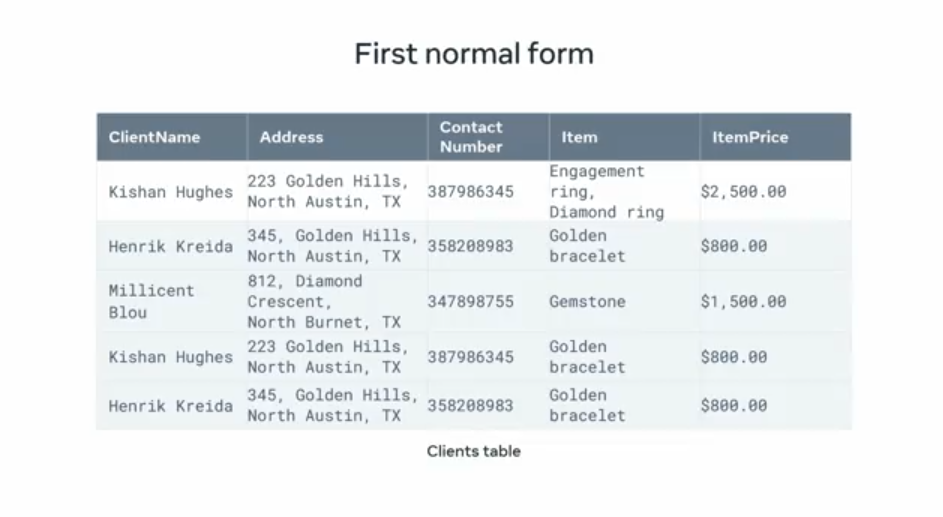
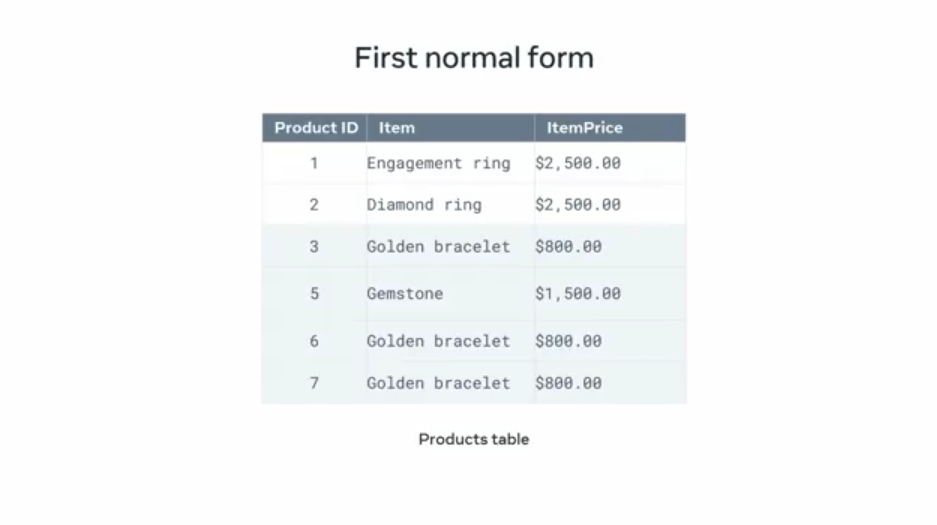
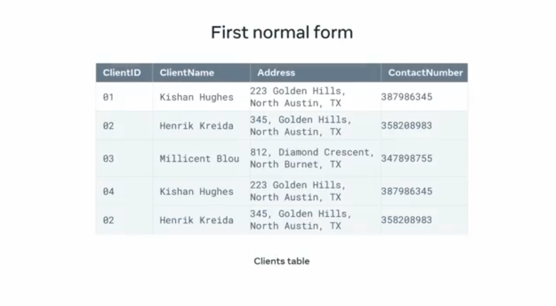
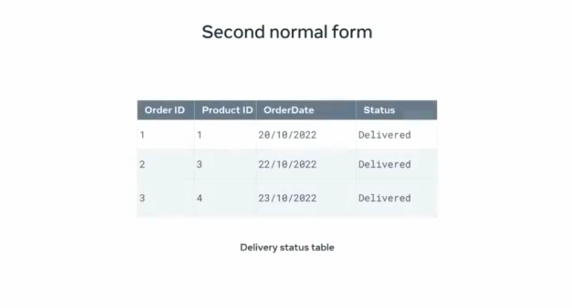
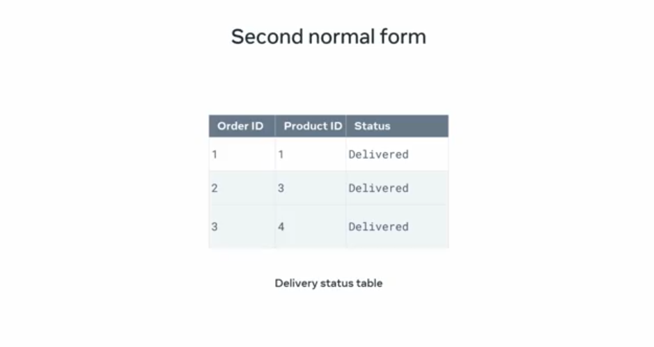
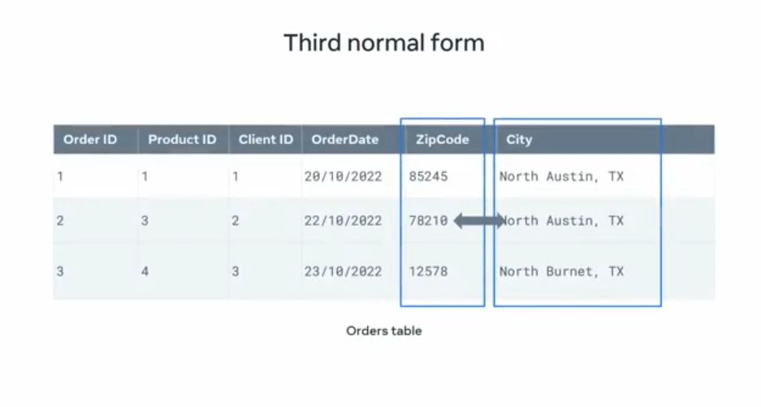
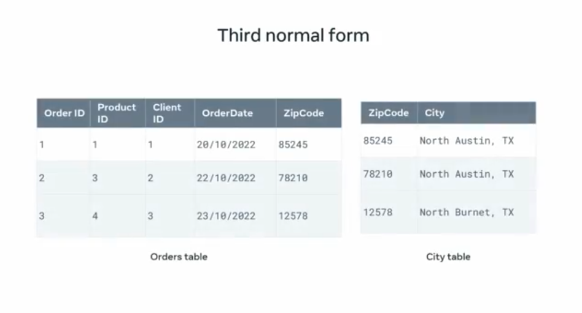

# **Normalisation of Relational Database Model**

At this stage of your database engineering journey, you should be familiar with the concept of database normalization. **When working with database tables, you can often encounter anomalies that can lead to inconsistent data.** You can solve these anomalies by applying the normalization process.

Over the next few minutes, you'll recap the importance of database normalization, and the methods for applying it within your databases.

Mangata and Gallo or M&G are building a database that holds data related to product orders. They built some tables that contain order, product, and client data. But these tables also contain several challenges around anomalies.

Review the database normalization process, then help M&G to resolve these anomalies within their database tables.

## **What is Database Normalization?**

Let's begin with a quick recap of database normalization. Normalization is an important process used in database systems. **It involves structuring tables in order to:**

- Reduce data duplication  
- Avoid data modification implications  
- Simplify data queries from the database

As you learned earlier, **database tables that don't follow the normalization process often give rise to anomalies.**

## **Common Anomalies**

The most common of these anomalies include:

- **Insertion Anomaly**: This is when new data is inserted into a table which then requires the insertion of additional data.  
- **Update Anomaly**: This occurs when you attempt to update a record in a table column only to discover that this results in further updates across the table.  
- **Deletion Anomaly**: This is when the deletion of a record of data causes the deletion of more than one set of data required in the database.

Let’s quickly recap how the three levels of data normalization can be used to help resolve or avoid these anomalies.

## **First Normal Form (1NF)**

**First normal form**, sometimes referred to as **1NF**, **enforces data atomicity and eliminates unnecessary repeating groups of data in database tables.** In other words, there must only be one instance of a value per field. Repeated groups of data cause data redundancy and inconsistency.

**Example**:  
M&G's products table stores the engagement and diamond ring products in the same cell of the item column. This violates the atomicity rule. There should only be one instance of a value per column.

 
---

**Solution**:  
You can resolve this issue by creating two new tables:

- A **products** table that holds all data related to the product entity. Assign the table a **products ID** column to identify each unique record.  
- A **clients** table that holds all data related to the client's entity. Once again, create an **ID** column to identify each unique record.

 
---

 
---

This solution removes all unnecessary repeated data from your tables.

## **Second Normal Form (2NF)**

Next, let's look at **second normal form**.

For a table to meet **second normal form** or **2NF**, it must:

- Already be in **first normal form**
- Not contain any relationships built on **functional or partial dependency**

The table must be defined with a **composite primary key**.

**Example**:  
The **delivery status** table from M&G has a composite primary key that consists of the **order ID** and the **product ID**.

 
---

To comply with the second normal form, you must identify if there's any **non-key attributes** that depend on **one part** of the composite key.

- The **order date** in the delivery status table is a non-key attribute.
- It can be determined by using the **order ID** column only.
- This is called **partial dependency**.

This isn't permitted in second normal form because all non-key attributes must be determined by using **both parts** of the composite key.

**Solution**:  
Remove the **order date** attribute from the delivery status table. Keep the **order date** column in the **orders** table.

 
---

Your table now meets **second normal form**. All non-primary key attributes depend only on the primary key value.

## **Third Normal Form (3NF)**

Finally, there's **third normal form** or **3NF**.

Third normal form:

- Removes unnecessary data duplication  
- Ensures data consistency and integrity  
- Resolves issues of **transitive dependency**

A table must adhere to **first** and **second normal form** before you can apply **third normal form**.

**Example**:  
The **city** and **zip code** in the M&G orders table are non-key attributes. However, it's possible to determine the **city** value based on the **zip code** value. If you change the zip code value, you need to change the city name value.

 
---

This means a non-key attribute depends on another non-key attribute, which violates the third normal form.

**Solution**:  
Split the table into two tables:

- An **orders** table with all related data  
- A **city** table with two columns: **zip code** and **city name**

 
---

All non-key attributes are now determined only by the primary key in each table. The tables now meet the requirements of **3NF**.

## **Conclusion**

Applying the three fundamental forms of normalization is a good way to resolve any anomalies that could arise within your database. You can resolve any issues of data redundancy and inconsistency by modeling your database so that it's easy to use, access, and query.

You should now be familiar with the process of normalization and how to apply it to your database. Great work.
