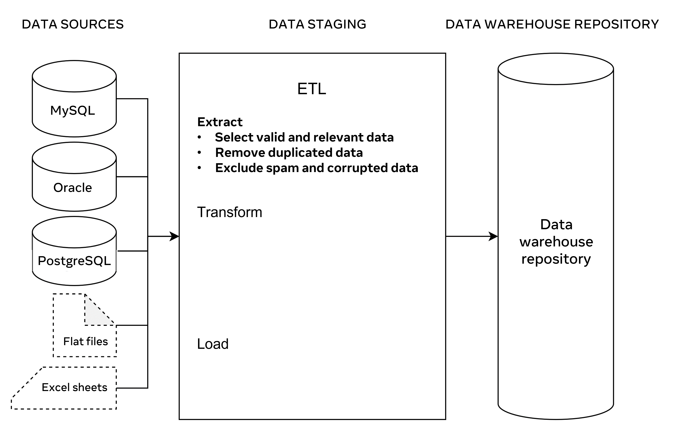
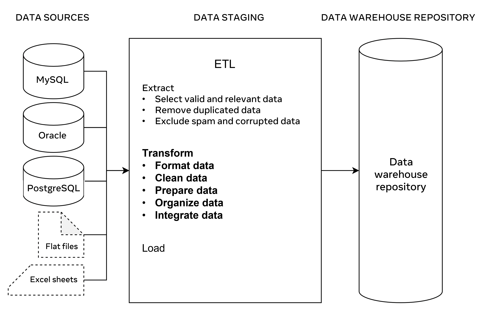
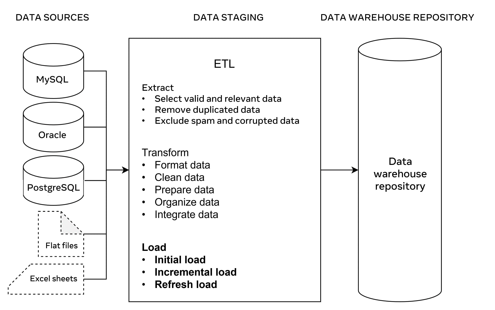

# **The Data Warehouse ETL Process**

**This reading provides more details about the data warehouse ETL processes.** It provides an overview of the process, an in-depth exploration of each process step, and a list of useful tools that you can use when working with a data warehouse.

## **Overview**

ETL is an acronym for “Extract, Transform, and Load”. It is an essential part of the data staging phase in the data warehouse architecture. **ETL describes the set of processes that extract data from different source systems, transform the data into a suitable format, and load it into a data warehouse repository for data analytics.**

Typically, data warehousing includes complex ETL processes and requires active involvement from stakeholders including data engineers, data analysts, business analysts, testers and managers.

**As a database engineer, you should carefully evaluate any changes that impact the business in your design of ETL processes in a data warehouse.** You must ensure a complete separation between the **analytical operations** and the **day-to-day transactional operations.** You also need a scalable solution that can process  huge amounts of data.

## **How does ETL work?**

The **ETL three step process represents the pipeline** that moves data from its various sources and integrates it in a data warehouse. There are three steps in this process:

- Data extraction.
- Transformation, and
- Loading.
    

Let’s take a few minutes to explore each of these process steps in more detail.

## **Step 1: Data Extraction**

This step in **the process involves extracting data from multiple sources into the staging area.**

For example,  Global Super Store may use different database management systems and files to maintain their data in the logistics, operations, sales and marketing departments. This could include MySQL, Oracle, PostgreSQL, Excel sheets and flat files as illustrated in the following diagram.

---

Global Super Store extract data from each of these sources in the staging area. When you design this process, it is important that you:

-   Extract relevant data only to avoid data overloading.
-   Include valid data and remove all duplications to obtain more accurate results.
-   Exclude spam and corrupted data, as this will save a lot of effort during data cleaning and preparation.
-   Validate data against the initial data in the sources to ensure it can be used in the same way in the data warehouse.

## **Step 2: Transformation**

This process requires converting data from one format into another, or from one structure into another according to the predefined data model established in the data warehouse. This is a crucial step to integrate data in the data warehouse repository.

Data already built-in to the relational database may not necessarily require a transformation. It may be imported directly as is to the data warehouse repository. However, you may need to clean and prepare the data before you use it for data analytics.

For example, if a customer’s first name and last name values are stored separately in two different columns then they can be concatenated in a ‘full name’ field before they are loaded into the data warehouse repository. Or if data includes buying and selling costs, then you can create new calculated field for data profit. 

Data transformation becomes more crucial when you work with raw data (like the atomic type of data that a computer cannot make useful information of it on its own). Good examples of raw data include computer logs, user navigation cookies and search histories. These types of data can be found in flat files, or in comma separated values (CSV) files.

In a data warehouse you should include structured data for data analytics. To do this, you should organize transformed data in tables, define data with specific datatypes, and set constraints in tables and columns. This creates records of related data that can be accessed, queried and analyzed to present useful information. 

The main tasks in the transformation process include formatting, cleaning, preparing, organizing and integrating data, as illustrated in the following diagram.

---

It is also important to ensure data integrity and consistency in the Transform phase. For example, a customer’s name may be spelled in different ways in different data sources such as John or Jon. Or a phone number could be recorded in different ways (For example, with and without country code). Dates and times could also be collected in different formats.

## **Step 3: Loading**

This process is the last step in ETL. In this step, large amounts of data are loaded into the data warehouse repository.  So, it’s important to deploy some recovery mechanisms in case of data loading failure. This means that you can resume the loading process from the point of failure **without data loss** and while also **maintaining data integrity.**

In this context, you can perform three types of data loading:

-   **Initial load:** Populates extracted data to the data warehouse repository.
-   **Incremental load:** Loads new data from the data sources to the current repository.
-   **Full refresh load:** Erases the contents of the database in the data warehouse repository either partially or totally and re-populates it with fresh new data.
    

---

## **ETL Tools**

There are several tools available that you can use to carry out these ETL processes. **These tools automate the extract, transform and load processes into an advanced level.** Some examples of these tools include:

-   **Oracle:** The industry-leading database that offers a wide range of choices of different data warehouse solutions.
-   **Amazon RedShift:** A simple and cost-effective data warehousing tool that can be used to analyze all types of data.
-   **MarkLogic:** A data warehousing solution that makes data integration easier and faster than other tools. It can query different types of data like search engine data, flat files and RDF.
    

## **Conclusion**

ETL provides a systematic approach for moving data from various data sources into a data warehouse. The data warehouse provides a central data repository that supports different types of data analytics and reporting. Therefore, a well-designed and documented ETL process is essential for developing an optimized and useful data warehouse.
