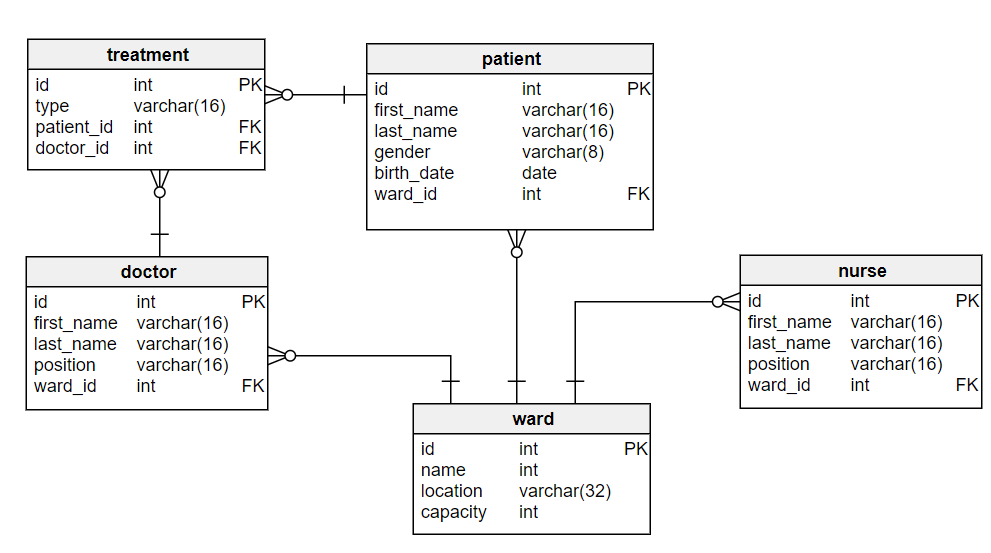

# Database Modeling

Data modeling is an essential step in the process of creating any complex software. It helps developers understand the domain and organize their work accordingly.

## Do I Really Need Data Modeling?

As a novice developer, you often start your programming adventure with **simple** applications like the sieve of Eratosthenes or enumerating the Fibonacci sequence. In such cases, a data model is not required – these programs are quite simple and they have a clearly defined input and clearly defined output. The difficulty of these tasks lies in the algorithm which has to work correctly and quickly. The data themselves are easy to understand: you provide some parameters and you get a set of numbers as a result.

Enterprise software is a totally different story. These are big programs which aid **business processes**. For instance, you may think about the software which your university uses. It is definitely much more complicated than the sieve of Eratosthenes:

1. There will be a part responsible for student admission.
   + Then there will be a part dealing with students’ exams and midterm results in various subjects.
   + And speaking of exams and subjects, there must be a part which helps organize the university schedule.
2. What about academic staff?
   + We need a part where we can determine who teaches what, who’s on maternity or sabbatical leave and who’s taken a day off to regain sanity after too many hours spent with undergraduates.
   + And by the way, we still need a part responsible for graduates, their diplomas etc.

Quite a system, isn’t it? And there are many other parts yet to mention.

**When you create software for university management, you need to consider many areas**

| Part | Description |
| --- | --- |
| Student admission | Takes care of acquiring new students, the application process etc. |
| Student results | Organizes the results of tests, exams etc. |
| University schedule | Responsible for planning when and where each class takes place |
| Academic staff | Information on academics, their assignments, holidays etc. |
| Graduates | Data on graduates, their diplomas etc. |
| … | ... |

Obviously, when you create university software, you can’t design the application “on the go” as you do when writing a solution for the sieve of Eratosthenes. If you do, you will quickly notice that there are many decisions you should have made and you didn’t as well as many things your customers should have told you and they didn’t – as a result, you will end up rewriting the application over and over.

Creating enterprise software is a complex process with **many stages**: analysis, design and modeling are some of the essential steps we take before we even get down to the actual implementation. In such applications, we first need to talk to our customer and get to know the domain of the software – that is, what are the main concepts, how they are related to each other and what are their functions?

### Learn the Domain, Learn the Language

My favorite example to illustrate this is road design. My brother works for a road designing company. I remember one journey home when he started commenting on the street lights we were passing: “Oh, these street lights are really old-fashioned. You don’t use ones like these anymore”. I was quite surprised and I said “What? They are regular street lamps to me”. This was an eye-opening experience to me: I always took road design for granted, the street lamps were always there and I never paid particular attention to them. But what seemed almost transparent for me was someone else’s regular job: they actually had to design where the street lights would be and what they would look like. If I ever were to create software for road design, I’d have to learn a lot. Road design engineers probably have a whole **vocabulary** on street lights. To them, whether the road goes here or five meters to the right, whether the lamps are placed every six or seven meters does matter. And this is true about any domain.

Hospitals, restaurants, insurance companies, banks, real estate agents. Whatever **domain** you think about, you probably have a basic idea what it is about. You know that hospitals are for treating people and restaurants for feeding them. But this knowledge is not enough when you create software – you have to **go deep into details**. Of course, it doesn’t mean you have to become a road design engineer to create road design software or get a medical diploma to create hospital software. But you have to learn the very basics.

### How Can a Data Model Help Me?

This is where data models come in handy. When you create a data model, it makes you focus on the details. You can present your model to a **business person** and ask if you got that right. Of course, the notation will need some explaining, but with a bit of practice, the business person will be able to understand the data models and help you. You don’t know much about the domain and your customer doesn’t know much about creating software – data models work here as a common language and enable mutual understanding.

## What Is a Data Model Exactly?

Data models work as a simplified **abstraction of reality**. In a real hospital, each patient is different and must be treated individually. In software, however, we talk about an abstract patient. The same applies for restaurants and any other field. Each time, you need to make decisions about what information is important and should be **included** in the data model and what to omit. In a hospital, you should know the gender of the patient. But the gender of the same person won’t be of much importance in a restaurant. In complex applications, you often need to answer hundreds of such questions before you write a single line of code.

### What Does a Data Model Look Like?

So what does a **data model** look like, actually? It is usually created in a **graphical** form. You have to create a diagram which identifies the main concepts in the domain, their features and relationships. The concepts often take the form of named rectangles. In the case of a hospital, they could be named: patient, doctor, ward etc. The relationships between them are illustrated as lines or arrows connecting the rectangles. The rectangles can be annotated in various ways to show additional information. You could for example list all the necessary information for a patient: name, age, gender etc.

There are many graphical notations that data modelers use. While there are some differences, the basic principles stay the same in all notations. And they all serve the same purpose: to understand the underlying domain.

## Reference:

1. https://vertabelo.com/blog/database-modeling-course-why-do-you-need-data-modeling/
2. https://vertabelo.com/blog/database-modeling-course-entities-and-attributes/
