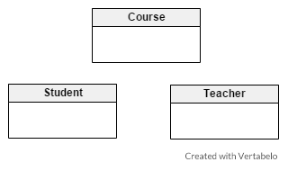
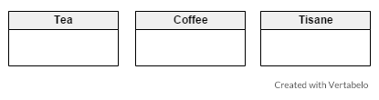
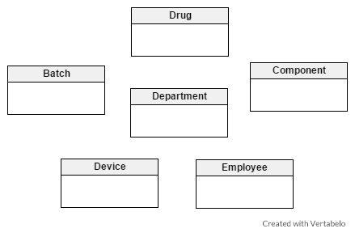
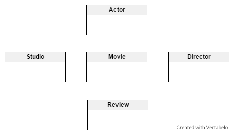
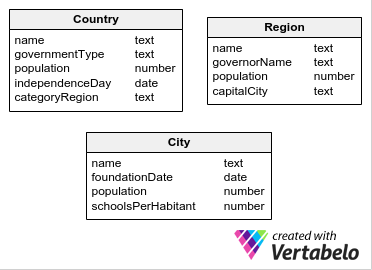
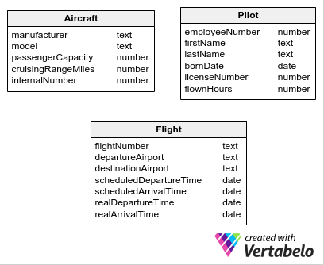
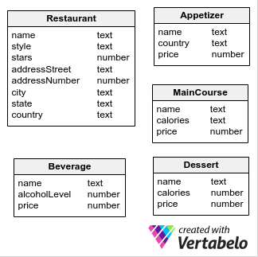
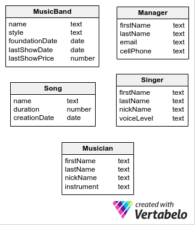

# Identifying Entities and Attributes

In data modeling, we will see a set of exercises to practice finding entities. Well, here they are. Have fun!

## Problem 1: Language School

Mr. Trotter, the proprietor of a rapidly-growing language school, wants to introduce a new system in his company. He can no longer keep track of all the information on his own, so he’s asked for our help. He is a bit chaotic, though. This is what he said:

_There are dozens of new people coming here and I no longer know what to do! For example, last week a girl named Hannah came and she wanted to become a student, but I couldn’t find my notebook so I couldn’t write her surname down. Then she asked about the kind of courses we offer and well… we have lots of them, so I showed her the calendar where I write down all the classes. She picked Chinese and then asked who taught it. Well, I said, we have many teachers here, so I started looking in my e-mail box to see who I wrote about teaching Chinese this term. It took longer than I expected and Hannah left. What a pity!_

Based on the description, suggest a few entities for Mr. Trotter’s new system so that he can run his school more effectively.

### Solution

At first, Mr. Trotter provides the example of Hannah who wants to sign up for a course. In our system, she would be one of many instances of the entity Student. Students in our system sign up for a Course, which is another good candidate for an entity. Finally, the girl asks about the Teacher – naturally, we want to keep track of them as well, so they become the third entity.

## Problem 2: Busy Writer

Joanne L. Bowling works for various companies and writes things for them. She is very busy and would like to have convenient application that keeps track of everything she has written. This application will be in the form of a portfolio. This is how she described her work:

_I’m very talented and I write tons of different things. For instance, last week I wrote an article about the latest economic crisis for a newspaper. I don’t know much about economics, but I read a bit and I was able to compose a nice little article. On the other hand, a month ago another famous newspaper published a serial I did. Well, that one was about the history of art in the Netherlands. I already had some knowledge in the field because 5 years ago I wrote a book on Rembrandt – which was published last year, by the way. It’s almost always the same when I work with newspapers; their assignments are quick and easy. It’s another story with publishing houses, though. Verification, editing... there are so many steps and so many deadlines that I need to remember!_

Based on the description, suggest a few general entities that could be used in an application for Joanne to track everything she’s written. Think about the following question: what kind of things has she written and where has she published them?

### Solution

As we can see, Joanne writes two kinds of compositions. The first are shorter articles that are published in newspapers. They are quick assignments and don’t require much information. The second type of composition is longer and more complicated – writing books. They are published by publishing houses. It’s better to keep them as a separate entity. All in all, we have two main categories of things Joanne writes: Article and Book. We also have two categories of companies who publish them: Newspaper and Publishing House.

## Problem 3: Tea Shop

Mark Tee owns a small shop down a side street in a medium-sized town. It only had a few customers – until one day a famous blogger discovered it during his travels and published a post about it. He said that Mark’s shop is the best source of tea in the world. Mark now has so many clients that he no longer knows what’s in stock. He needs a system that will help him organize his products. This is what he said:

_People buy my products all day long and I need to keep track of what I have in stock. I sell various things. Tea is the most important of them, of course. I am very detailed when it comes to tea: I need information about the grade, color, origin... Every single variety has at least some of these properties._

_I also sell coffee, but coffee is different and different things are used to describe it. And then there is the herbal stuff like rooibos or yerba mate. Tea enthusiasts call these tisanes or infusions; they’re not really ‘tea’ and I don’t need much additional information about them in my system._

Read the description above and suggest a few different entities for Mark’s stock management system.

### Solution

As you can see, there are three kinds of products and therefore three entities in our system: Tea, Coffee and Tisane. (We do not treat rooibos or yerba mate separately, because Mark doesn’t really differentiate between them.)

## Problem 4: Pharmaceutical Company

A pharmaceutical company which manufactures drugs would like to have a system which will help with its management. This is the description sent to us one of the company’s employees:

_In our company, the products are of course various drugs with specific properties. We produce painkillers, antibiotics, and other drugs. They are manufactured in various departments. In each department, there are employees. Employees are qualified for carrying out specific types of production. In the course of their work, the employees use special devices to help make the drugs. Of course, they wouldn’t produce anything without the proper components! Oh, and by the way, the production is divided into batches – groups of products manufactured in one operation. All of this is necessary for our company. We need to store detailed information about every part of it in our system._

On the basis of the above description, suggest some entities to be used in the pharmaceutical company system.

### Solution

In the above company, production is based on Batches which consist of Drugs. Drugs are made from Components. There are also various Departments with specific Devices and Employees. These six bolded nouns become our entities.

## Problem 5: Movie Database

John is a zealous film student and wants to create a new website about movies. He described the idea this way:

_There will be information about various things in my database. First of all, there will be movies, different kinds of them. In each movie, there are actors – I want to store information about them too. Not only professional data, like the movies they played in, but also some funny things or some personal information. Then, there are directors. They are very important in movies, so I want to write about them too. And movie studios, of course! Not many websites mention them, but they are important to me as well. Finally, there will be reviews for all of the movies._

Based on the above description, suggest some entities for John’s movie database.

### Solution

We can clearly identify 5 entities in the description: Movie, Actor, Director, Studio and Review.

## Problem 6: Countries

Find the right entities and their attributes to represent all the countries in the world, their interior regions (which can be called states, provinces, or regions) and their cities. We want to represent each country’s name, continent, date of independence, type of government and population. For each region (or province, state, etc.) we wish to store the capital city, the name of the governor, and the population. Finally, for each city we want to have the name, founding date, population, and the number of schools per inhabitant. We would also like to represent what every country calls its interior regions.

### Solution:

From the domain problem description, we can clearly identify 3 entities: Country, Region and City.

For the Country entity we find the following attributes: name, governmentType, population and independenceDay.

For the Region entity, we discover the attributes name, governorName, population and capitalCity.

For City, we have name, foundationDate, population and schoolsPerHabitant.

Data modelling is done in stages called iterations. At this point, we iterate. We go back to the Country entity and add a new attribute. The last sentence of the description asked us to represent each country’s name for its interior regions. That name should be at the country level, so we will add a new attribute called categoryRegion to the Country entity.

### Question:

The population is represented at the Country, Region and City levels. Do you think this is correct? Is there duplicate information being stored? How do you allow for this?

## Problem 7: Aircraft

A new budget airline wants to enter the market and needs a simple system to manage its assets. To help us build the right system, we asked a few people to define key information for any new airline. Based on the comments below, suggest a few entities with attributes for an airplane management system.

##### An experienced pilot:

_I’ve worked at quite a few airlines and I’ve spent thousands of hours in the air. They always ask for the same information when I change employers. First, they want to know my name, my birthday – many airlines only employ pilots within a certain age range. And they always need to check my certification – I have a special license number which helps them do that. The number of hours flown is also very important; it tells them a lot about the pilot. Lucky me that I’m so experienced! And, of course, I’m always given an employee number – I don’t know why, but they refer to me using the number instead of my surname._

##### An aircraft manufacturer’s representative:

_Every airline needs aircraft. The whole description of any airplane is very complex and I could go on describing my products for ages, but the white-collar guys from airlines are usually only interested in the basic info. Of course, they want to know how many passengers can fly a in an airplane – helps them to calculate the costs, benefits etc. And they always ask about the cruising range so they know how far each plane can fly. Of course, they need the manufacturer name and the model name to put in their books. Oh, and from what I heard, they always give special internal numbers to any aircraft they purchase._

##### An air traffic controller:

_There are some basic facts that we keep about each flight at our airport. The flight must have a certain number for identification reasons, (like FG 432). We need to know the departure and arrival airports. And time is very important, too. We store not only the scheduled departure and arrival time, but also the real times – airplanes can be late or can even arrive ahead of schedule._

### Solution:

In our description, we clearly identify 3 entities: Aircraft, Pilot and Flight. Then we find the attributes of each entity.

For the Aircraft entity we have manufacturer, model, passengerCapacity, cruisingRangeMiles and internalNumber.

For the Pilot entity we discover the following attributes: employeeNumber, firstName, lastName, birthDate, licenseNumber and flownHours.

Finally, for Flight we identify the flightNumber, departureAirport, destinationAirport, scheduledDepartureTime, scheduledArrivalTime, realDepartureTime, and realArrivalTime.

To simplify this data model, we make the assumption that all flights are scheduled on all days of the week.

### Problem 8: Restaurant Guide

Samuel wants to create an online restaurant guide. There are many such websites already, but he wants to focus on the particular dishes available rather than on the restaurant themselves. He’s really enthusiastic about his idea and this is how he described it to us:

_I want to describe restaurants in detail on my site, so I need the basic stuff like their names and addresses. The address must be precise: not only the street and the number, but also the city, state and country. Yes, country; I want to go international! Besides, I want each of them to be given a particular style, like, you know, Chinese, Italian, or something like that. Each of them will be ranked with a certain number of stars._

_More importantly, I want to focus on the food! Restaurants serve thousands of meals, and for each of them, I need the dish’s name and type – appetizer, main course, or dessert. There are various appetizers in various countries, so I need to store information about appetizer origins, too. And for main courses… well, I think it will be nice to provide the number of calories for people on diets. Desserts should also contain this sort of information._

_And I want EACH dish to be shown, together with its current price! Oh, that reminds me: let’s put beverages on there too. The name, the price… and maybe the level of alcohol, come to think of it._

Based on the above description, suggest a few entities and their attributes for Samuel’s online restaurant guide.

### Solution:

The first entity we have is Restaurant with the attributes of name, addressStreet, addressNumber, city, state and country. Other attributes in Restaurant are: stars and style.

Our next idea could be to create an entity called Meal and give it the attributes name, type and price. However, if we read the complete problem description, we will find specific attributes for desserts, main courses and appetizers. So we decide to scrap Meal and go with 3 entities: Main_course, Appetizer and Dessert.

For MainCourse, we will have the following attributes: name, category and price.

For the Appetizer entity, we have attributes called name, country and price.

For Dessert we find the attributes name, calories and price.

Finally, the Beverage entity with has the attributes name, alcoholLevel and price.

### Problem 4: Music Bands

A music production company wants to model the world of music bands. We met with one of its representatives and asked him a few questions. Read the interview below and find the right entities and their attributes for a model of music bands.

_**Vertabelo:** What kind of people are there in the world of music?_

_**Representative:** Many, but I think we just need a few. Bands consist of singers and musicians. And, of course, their managers. For all of them, we want their first and last names in the system. Singers and musicians usually have a nickname, too. Musicians play a certain instrument and singers have a particular voice type, like soprano or tenor._

_**V:** What about managers? How do you keep in touch with them?_

_**R:** It depends. Some of them prefer cell phones for quick communication, others like to be sent emails so they can think everything through. I think we need both kinds of information here._

_**V:** And all of these people…_

_**R:**…form music bands, yes. Each band has a name, of course. They usually play various kinds of music, but we always assign them to only one style, like rock or metal. That’s important. We need to know how long they’ve played together, because young bands have a tendency to come up and disappear very quickly. We usually want to know when they played their most recent concert and what the ticket price was._

_**V:** Do you need anything else?_

_**R:** We need to store information about songs. Wow, songs are complicated. They have specific kinds of lyrics, a certain key, a number of instruments involved... really complicated stuff._

_V: And is all of this important for you?_

_**R:** Well, yes, but we actually have a system for songs already, so here we can… well, I think we’ll be good with just the song name and duration. And maybe the creation date._

### Solution:

The first entity we find is MusicBand with the attributes name, mainStyle, foundationDate, lastShowDate and lastShowPlace.

The next entity is Musician, where we have the following attributes: firstName, lastName, nickName and instrument.

The Singer entity pursues a similar pattern: we have as attributes the singer’s firstName, lastName, nickName, and voiceLevel.

Our next entity is Song, which has the following attributes: name, duration and creationDate.

Finally, the last entity we identified is Manager; it has the attributes of firstName, lastName, emailAddress and cellPhone.

## References:

1. https://vertabelo.com/blog/database-modeling-course-problem-set-1-identifying-entities/
2. https://vertabelo.com/blog/database-modeling-course-problem-set-2-identifying-entities-and-attributes/
