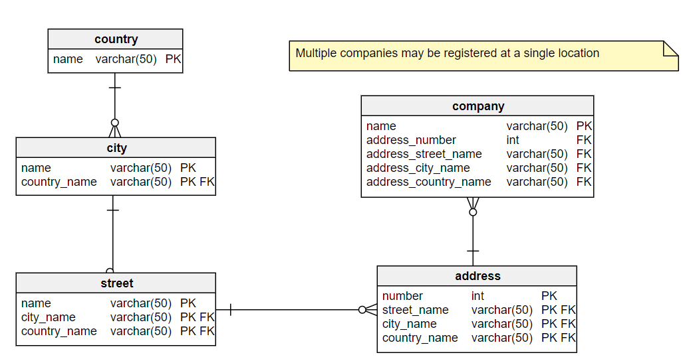
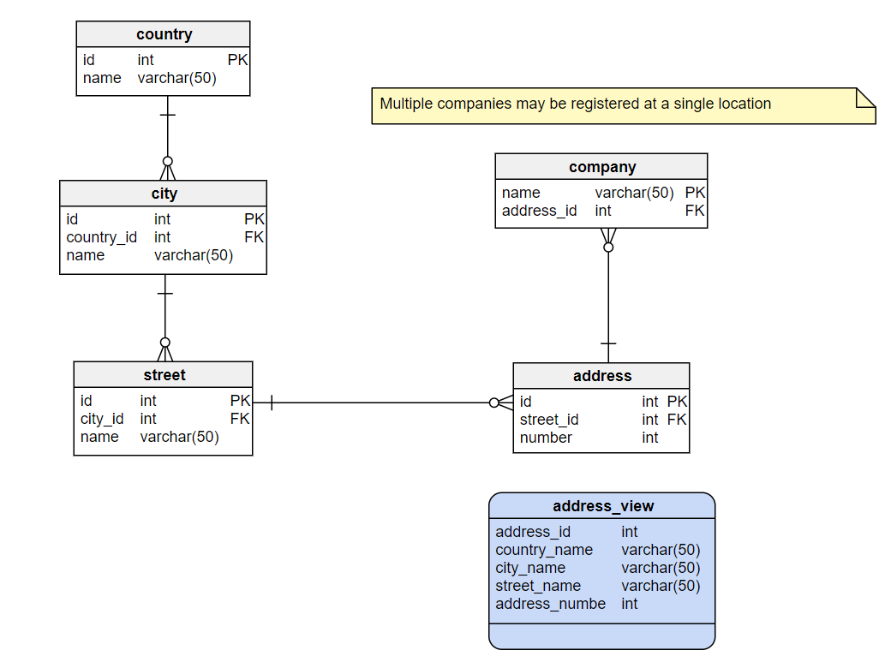

# Primary Keys

Suppose we design a database. We’ve created some tables, each one has a few columns. Now we need to choose columns to be primary keys (PK) and make references between tables. And here some inexperienced designers face the dilemma – should a primary key be natural or surrogate?

There’s one and only one answer to that question: **it depends**. If anyone ever tried to convince you that you should have only natural keys or only surrogate keys, just smile :)

Above all, you must understand that a primary key doesn’t differ much from any other key (that is – a subset of columns with a `UNIQUE` constraint) except that:

1.  it cannot hold `NULL` values,
2.  it will be referenced as a foreign key in other tables.

In fact, a primary key is just a key that we give an additional semantic to like “this is how I’ll reference rows in that table from other tables.” This is one among many candidate keys that we can choose from as the most fitting for a rows’ selection. Sometimes it’s a subset of natural columns (that is – those mapping to real life), yet sometimes we definitely should add an ID column.

When you choose PK for a table A, you must remember that any other table’s foreign key referencing table A will consist of all columns from the PK. This has two consequences:

-   if you chose natural PK and the values of its columns may change, then you need to update those values in **all tables with foreign keys**;
-   if a PK consists of many columns, your foreign keys will also be multi-column. My experience shows that primary keys with more than 2 columns are unreasonable. The database model becomes unreadable, querying the data is frustrating, and finally... a DB designer has more work to do :)

So here is my advice: **use a surrogate primary key whenever values in the natural key could possibly change or when a natural key would be too complex**. Just look at this example:



Here we’ve got the drawbacks of natural keys. The table `country` is self-explanatory. The PK of the table `city` must be both `name` and `country_name` because there may be many cities with the same name in different countries. It’s the same with the tables `street` and `address`. We end up with a 4-column foreign key at the table `company`. Personally, I wouldn’t like to query such a database in order to find all companies registered at a specified location... What’s more, imagine what we would need to do if a government decided to change the name of one city. Unless you created foreign keys with `ON UPDATE CASCADE` action, it would be a nightmare!

Now, take a look at that:



This approach eliminates all the above problems. If you need to change the name of a city, it is now a single statement. You could say that it’s much more difficult to query for specific addresses. Well, at a first glance – you’re right. But this can be solved easily with a single view:

```sql
CREATE VIEW `address_view` AS
SELECT
	`address.id` AS "address_id",
	`country.``name` AS "country_name",
	`city.``name` AS "city_name",
	`street.``name` AS "street_name",
	`address.number` AS "address_number"
FROM `country`
JOIN `city` ON (country.id = city.country_id)
JOIN `street` ON (city.id = street.city_id)
JOIN `address` ON (street.id = address.street_id);

```

You don’t have to worry about inserting values into such `id` columns. Just use your RDBMS features, such as `SERIAL` data type in PostgreSQL, the `AUTO_INCREMENT` attribute in MySQL, or `GENERATED ALWAYS AS IDENTITY` SQL standard clause.

You may interpret the above to mean that surrogate keys are always better than natural keys. It’s not true. Basically, using surrogate keys sometimes makes no sense. If you have a technical table with unchangeable codes, there’s no need to add an unnecessary column for a surrogate key. If a natural candidate key consists of small number of columns (ideally just one) and its values don’t change – **use it as a natural primary key**.

Finally, for those who are skeptical about using surrogate keys, note that even in real world there are plenty of examples of such identifiers. Social security number, barcode numbers, driver’s license ID – they are all sets of meaningless numbers. Just identifiers. Just like in the tables from the example above.

When designing a database, always use common sense. Design it in a way the DB can be easily manageable, is easy to use, and is easy to understand. It’s not always possible, but go in this direction. I assure you that software developers working with such a database will be really grateful.


## References:

1. https://vertabelo.com/blog/natural-and-surrogate-primary-keys/?form=MG0AV3
