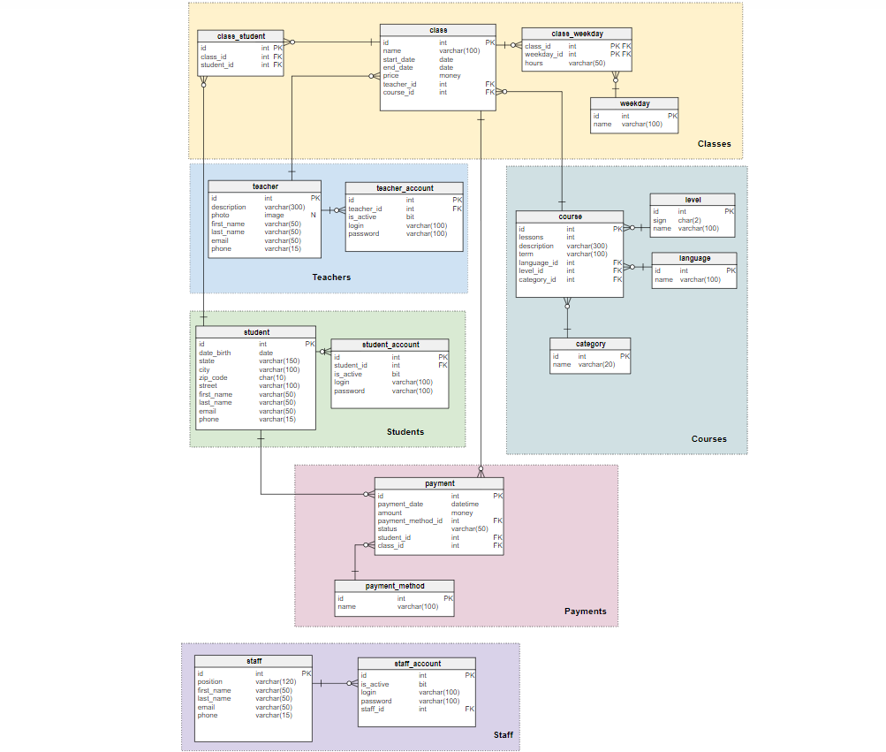
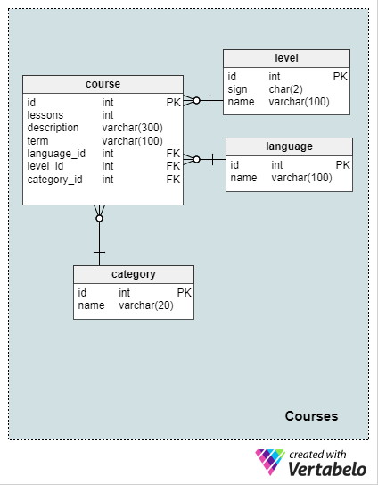
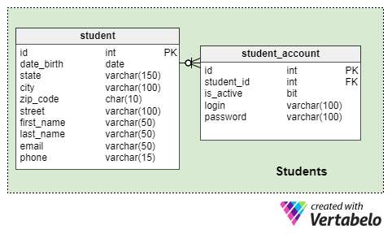
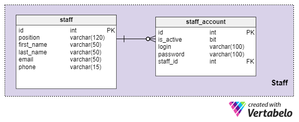
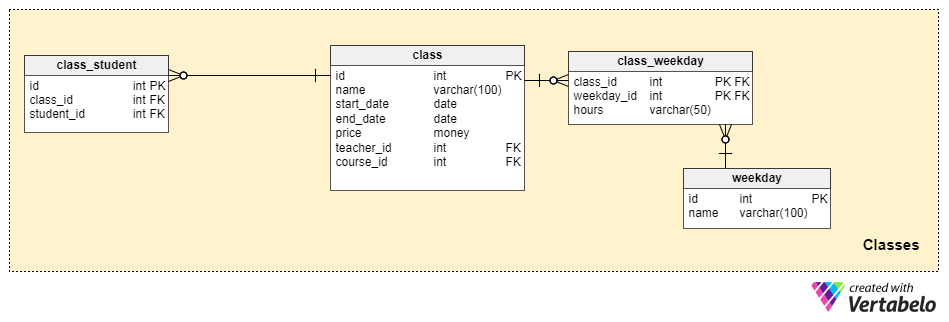
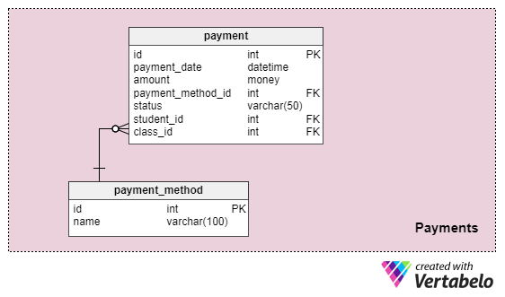

# A Language School Database Model

Site: https://vertabelo.com/blog/a-language-school-database-model/.

Knowing a foreign language is an important skill, especially in a global economy. In this article, we look at a data model that can help run a language school.

Learning a language can be challenging, but enrolling in a language school should be easy. You can enroll at the school itself, or you can use an online form. In this article, we’ll examine a data model that allows for online registration as well as other functions common to language schools.

### Language School Requirements

First of all, the application must allow users to register and to log into the system. A user may be a student, a teacher, or a school staff member.

People can enroll in a course online or in person at the school. The school staff should be able to enter student information, confirm their course reservation, and assign students to a specific class. Students can pay for their courses online or at the school.

Additionally, staff should be able to create new classes and assign students to them. The model should be able to store details about students, teachers, languages, levels, and courses. There should also be a way to check if payments have been made.

### The Data Model

The diagram above shows the data model I’ve designed for a language school. It consists of six subject areas:

-   `Courses`
-   `Students`
-   `Teachers`
-   `Staff`
-   `Classes`
-   `Payments`

I will describe each of these areas individually.

### Courses

This area stores information about languages, levels, age categories (to ensure the course is age-appropriate) and course details. There are four tables: `**language**`, `**level**`, `**category**`, and `**course**`.

The `**language**` table stores the names of languages we teach, such as English, German, French, Spanish, etc. It contains these fields:

-   `id` – The primary key of the table.
-   `name` – The language name, e.g. “English”, “German”, etc.

Both of these columns are mandatory.

The `**level**` table stores information about the proficiency level associated with a course. This can be expressed in a name (“novice”) or a symbol (“A1”, “C2”, etc.) This code is different in different parts of the world, but we will limit it to two characters. This table contains:

-   `id` – The primary key of the table.
-   `name` – A name representing the level of proficiency, e.g. _Novice_, _High_, _Expert_, _Conversational_, etc.
-   `code` – A two-character symbol for the course’s language level, like A1, C2, NL, D, 2+, etc. Note that this is a CHAR(2) datatype.

All of these columns are mandatory.

Language students are often of different ages, which means the lesson content will be different. The `**category**` table is important, as it enables us to categorize courses by age group. It contains the following fields:

-   `id` – The primary key of the table.
-   `name` – A category name like “children”, “youth”, “adult”, etc. Courses in each category will have specially prepared material for that age group.

Both columns are mandatory.

Last in this area is the very important `**course**` table. It contains all course details and has these columns:

-   `id` – The primary key of the table.
-   `language_id` – References the `**language**` table.
-   `level_id` – References the `**level**` table.
-   `category_id` – References the `**category**` table.
-   `lessons` – Denotes the number of lessons in the course.
-   `description` – A short description of the course.
-   `term` – How long the course lasts.

All columns in this table are mandatory.

### Students

This subject area stores students’ details like address, date of birth, name, email, and phone number. It also stores their application account information. All data is held in two tables, `**student**` and `**student_account**`.

The `**student**` table stores each student’s name, contact information, date of birth, email, and phone number. The date of birth is important because courses are personalized by age groups.

The fields in this table are:

-   `id` – The primary key of the table.
-   `date_birth` – The student’s date of birth.
-   `state` – The state where the student lives.
-   `city` – The city where the student lives.
-   `zip_code` – The ZIP code of the student’s mailing address.
-   `street` – The street and number of the student’s mailing address.
-   `first_name` – Self-explanatory.
-   `last_name` – Self-explanatory.
-   `email` – Self-explanatory.
-   `phone_number` – Self-explanatory.

All columns in this table are mandatory.

The second and last table in this subject area is `**student_account**`. Its columns are:

-   `id` – The primary key of the table.
-   `student_id` – References the `**student**` table.
-   `login` – The student’s user login.
-   `password` – The student’s password.
-   `is_active` – Denotes if an account is active using a bit value: “0” for inactive, “1” for active. This allows the admin to block or unblock accounts.

All columns in this table are mandatory.

Why separate the data in `**student_account**` from what’s in `**student**`? Some people will enroll in the office, without using the web application. They won’t have a web app account, so it makes sense to keep these two sets of information separate.

### Teachers

This subject area stores teachers’ names, optional contact data, their qualifications or credentials, and optional teacher photos. It contains two tables: `**teacher**` and `**teacher_account**`. Notice that a teacher can have an online account with the web app, but it is not required.

The `**teacher**` table has the following columns:

-   `id` – The primary key of the table.
-   `description` – Describes the teacher’s qualifications.
-   `photo` – An optional photo of the teacher.
-   `first_name` – Self-explanatory.
-   `last_name` – Self-explanatory.
-   `email` – Self-explanatory.
-   `phone` – Self-explanatory.

All columns in this table except `photo` are mandatory.

The second table in this area is the `**teacher_account**` table. These are its columns:

-   `id` – The primary key of the table.
-   `teacher_id` – References the `**teacher**` table.
-   `login` – Stores a user login for the teacher.
-   `password` – Stores the password for the teacher’s account.
-   `is_active` – Denotes if an account is active using a bit value: “0” for inactive, “1” for active. This allows the admin to block or unblock accounts.

All columns in this table are mandatory.

The reason for having separate `**teacher**` and `**teacher_account**` tables is the same as for the students: some people will not have an app account.

### Staff

This subject area contains information about language school employees, such as managers and secretaries. There are two tables, `**staff**` and `**staff_account**`.

The `**staff**` table has the following columns:

-   `id` – The primary key of the table.
-   `position` – The job title.
-   `first_name` – Self-explanatory.
-   `last_name` – Self-explanatory.
-   `email` – Self-explanatory.
-   `phone` – Self-explanatory.

All columns in this table are mandatory.

The second and last table in this area is the `**staff_account**` table. These are its columns:

-   `id` – The primary key of the table.
-   `staff_id` – References the `**staff**` table.
-   `login` – Stores the employee’s user login.
-   `password` – Stores the employee’s password.
-   `is_active` – Denotes if an account is active using a bit value: “0” for inactive, “1” for active. This allows the admin to block or unblock accounts.

All fields are mandatory.

### Classes

This subject area contains data about course classes. A course can be made up of one or many classes. Each class is made up of a number of lessons (or sessions) that take place on certain days. We also need a reference table between the `**weekday**` and `**class**` tables called `**class_weekday**`. We’ll also have a table called `**class_student**` that lets us associate classes and the students enrolled in them.

The `**weekday**` table stores the weekdays our school is open. The columns in this table are:

-   `id` – The primary key of the table.
-   `name` – The name of a weekday (“Monday”, “Tuesday”, etc).

All columns in this table are required.

The `**class_weekday**` table contains the following columns. Notice that the first two are foreign keys, relating this table to other tables in the subject area:

-   `class_id` – References the `**class**` table.
-   `weekday_id` – References the `**weekday**` table.
-   `hours` – Indicates the time when each class is held, e.g. ‘9.30 – 10.30’.

All columns in this table are required.

This table relates to data in the `**class**` and `**weekday**` tables. It is needed because we will have more than one class during each weekday, and each class might be held on more than one weekday.

The `**class**` table is essential to this subject area. It stores the following columns:

-   `id` – The primary key of the table.
-   `name` – The name of a course class. Note that this is one instance of a course, such as “Intermediate German Spring 2018”.
-   `start_date` – The date of the first lesson of this class.
-   `end_date` – The date of the last lesson of this class.
-   `price` – The price for this class.
-   `teacher_id` – References the `**teacher**` table and associates a teacher with this specific class.
-   `course_id` – References the `**course**` table. Remember that one course can be implemented as several different classes.

All columns in this table are mandatory.

Finally, we come to the `**class_student**` table. We can expect that the same student will enroll in more than one class. And one class most likely will have several students. This table is needed for these relationships. These are its columns:

-   `id` – The primary key of the table.
-   `student_id` – References the `**student**` table.
-   `class_id` – References the `**class**` table.

All columns in this table are required.

### Payment

Our last subject area records payment information related to students and classes. It stores details about the total amount per course, the payment method used, and the status of a payment. We use two tables to do this, `**payment_method**` and `**payment**`.

The `**payment_method**` table has only two columns:

-   `id` – The primary key of the table.
-   `name` – The payment method name (i.e. “cash”, “credit card”, “debit card”, etc). If a student doesn’t have an online account, they may pay in cash.

Both columns are required.

The `**payment**` table has the following columns:

-   `id` – The primary key of the table.
-   `payment_date` – The date payment was received.
-   `amount` – The amount paid for the class.
-   `payment_method_id` – The payment method used.
-   `status` – The status of the payment (like “pending”, etc).
-   `student_id` – References the `**student**` table and relates a student with a payment.
-   `class_id` – References the `**class**` table and relates a payment with a specific class.

All columns are required.

### What Would You Add to This Data Model?

This data model was designed to let language schools run a web application. This app would let students, teachers, and staff enter data into the school’s database. Plus, it would allow students to enroll in various classes and courses online.

Of course, there are areas where this model can be extended. What would you add? What would you change? Tell us in the comments section below.
