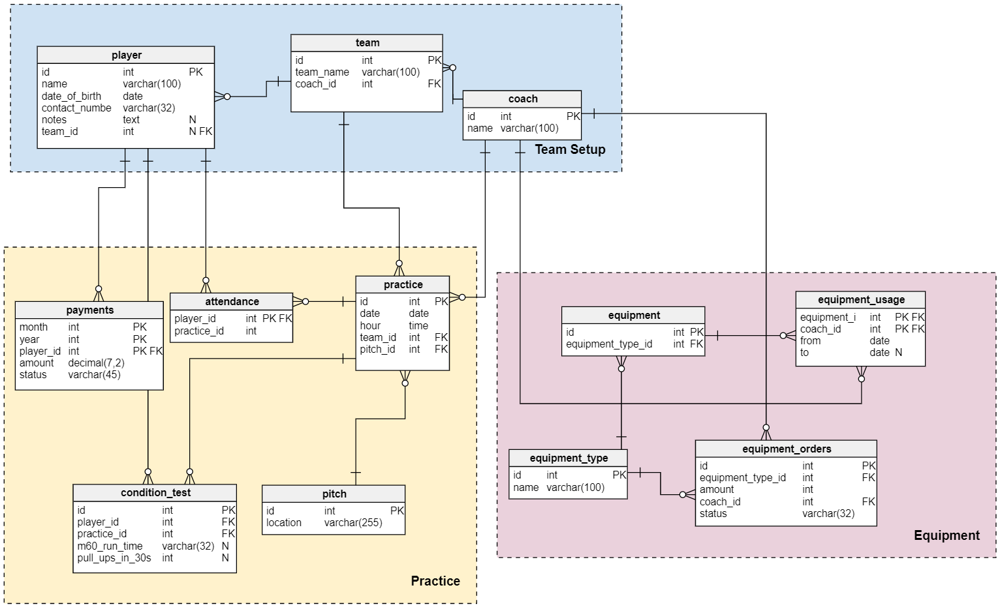
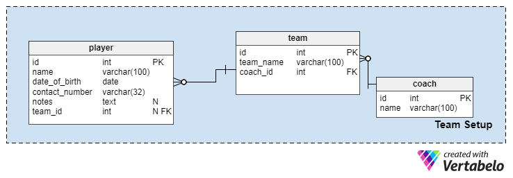
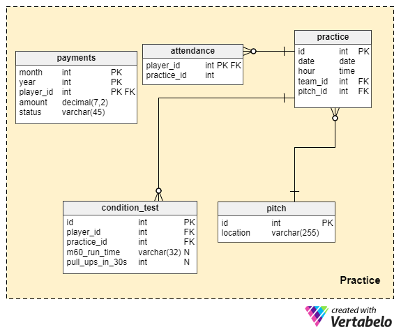
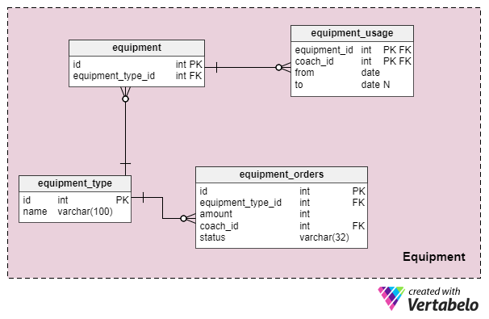

# A Sports School Data Model

Site: https://vertabelo.com/blog/a-sports-school-data-model/.

Team sports are very popular, especially among kids and teens. In this article, we look at a data model that can help run a sports school.

Exercise helps us stay fit and healthy, but exercising by yourself can be boring. Unless you can motivate yourself, you might not get the exercise you planned. To stay fit, people of all ages join a local team and practice together. It’s much more fun!

In recent years, there’s been a huge increase in organized sports for kids and young adults. This has given rise to sports schools: places where enthusiasts of team sports can go to sharpen their skills and improve their physical fitness. We’re going to look at a data model that could fuel a sports school.

### How Do Sports Schools Work?

Let’s take one common scenario. A sports coach retires, but he still needs to make some money. He decides to teach kids how to play soccer. He starts by spreading this information among his former students, putting up a note at a local primary school, and contacting parents who might be interested in enrolling their kids in soccer school. When enough people are interested, he finds a pitch (soccer field) that he can rent for two hours twice a week. He adds his desired profit to the rental cost, divides the total amount by the approximate number of future students, and tells parents about the cost and date of the first practice.

And that’s pretty much it. Kids come, play some ball, and everyone’s happy. In our data model, I’m going to extend this scenario to include multiple coaches, but this type of school is the main idea.

### The Data Model

I’ve divided the data model into three sections:

-   “`Team Setup`”
-   “`Practice`”
-   “`Equipment`”

We’ll go into each what each section contains and what it does. The sections are listed in the order that we’ll discuss them.

### Team Setup

The primary focus of this data model is the people: the players and coaches. Players are usually assigned to teams that practice together, guided by a coach.

Let’s start with the “player” table:

-   “`id`” – The primary key, which also identifies the individual player.
-   “`name`” – The name of the player.
-   “`date_of_birth`” – The player’s date of birth. This provides the age of the player and may be used to create age-based teams.
-   “`contact_number`” – The phone number used to contact the player (or their parents).
-   “`notes`” – Additional information about the player, such as medical conditions or specialized exercises.
-   “`team_id`” – References the “`**team**`” this player is assigned to. This can be NULL because a player may not be assigned to a team.

The “`**team**`” table has:

-   “`id`” – The primary key, which also identifies the team in our database.
-   “`team_name`” – The team name, which can be decided by the players.
-   “`coach_id`” – The team’s “`**coach**`”.

Next, we have the coaches. The “coach” table is very simple; it contains only coaches’ names and internal ID numbers. However, you can extend this table by adding fields for phone numbers, addresses, etc.

-   “`id`” – The primary key and the ID of the coach in our system.
-   “`name`” – The name of the coach.

### Practice

A practice is a single training session. Each practice takes place on a pitch on a given day, with a coach in charge of it all. Sports schools need to plan and schedule practices. They need to keep a history of past practices and which players participated in each one.

In the “`**practice**`” table, we’ll find:

-   “`id`” – The primary key.
-   “`date`” – The date of that practice session.
-   “`hour`” – The time when that practice session started or will start.
-   “`team_id`” – References the “`**team**`” that is participating or had participated in the practice session.
-   “`pitch_id`” – References the “`**pitch**`” or location where the practice was or will be.
-   “`coach_id`” – References the “`**coach**`” who will train or had trained players during this practice session. This is usually (but not always) the team’s coach.

We want to store what players were (or should be) at the practice. We’ll use a very simple table called “`**attendance**`” to manage this:

-   “`player_id`” – References a “`**player**`”.
-   “`practice_id`” – References a specific “`**practice**`” session.

If our sports school is for kids, we can use this information to make sure all players are present for each practice. If a kid isn’t there, we can call the parents to see if everything is okay.

Earlier I mentioned the “pitch\_id”, which of course corresponds to a record in the “pitch” table:

-   “`id`” – The primary key of the table.
-   “`location`” – The address of the pitch.

This table could be extended to support indoor and outdoor playing surfaces, like gyms, courts, etc.

Since our school’s purpose is to make people better at some sport, we’ll want to track the progress of each player. We’ll do this by administering a physical condition test at one practice and then subsequent tests at intervals we choose. The results will be added to the “`**condition_test**`” table:

-   “`id`” – The primary key of the table.
-   “`player_id`” – References the “`**player**`” tested.
-   “`practice_id`” – References the “`**practice**`” where the test took place. This also gives us the date of the test.
-   “`m60_run_time`” – How long it took the player to run 60 meters, stored as a VARCHAR string using a “mm:ss.ms” format.
-   “`pull_ups_in_30s`” – How many pull ups the player did in 30 seconds.

The last two fields in this table denote parts of the condition test. I included two in the model as an example, but the actual number and type of conditioning tests depends on the sport and the school. All of the fields in this table are optional, as the player may not need to take every fitness test.

Since we’re running a business here, we’re going to charge our players (or their parents) every month for the school. To track this information, we’ll use the “payments” table, which has the following records:

-   “`month` and year” – The period for which payment is due.
-   “`player_id`” – References the “`**player**`” for whom the amount is due.
-   “`amount`” – The amount the player (or their parents) owes our school.
-   “`status`” – The status of the payment. Possible values include “pending”, “completed”, or “canceled”.

### Equipment

Sports schools often have equipment they need to keep track of. In this section, we’ll define all the types of equipment we have. We’ll also record how many items of each type are in our inventory. This table enables coaches to request new equipment as well.

Let’s start with the broader category: what kinds of equipment we have on hand. We’ll store the categories (e.g. soccer ball, bags, etc.) in the “`**equipment_type**`” table:

-   “`id`” – The primary key.
-   “`name`” – A short description of the item (e.g. “football”, “whistle”, “marker”, etc).

Now we can record each item in our inventory. We will do this by assigning them an ID number in the “`**equipment**`” table:

-   “`id`” – The primary key of the table and a unique ID number for each piece of equipment we have.
-   “`equipment_type_id`” – References the “`**equipment_type**`”.

We may have five identical whistles, but each of them is a separate entry in the “`**equipment**`” table. They may even have their ID numbers written on them.

When a coach takes an item from our inventory, we’ll add a record to the “`**equipment_usage**`” table:

-   “`equipment_id`” – References the “`**equipment**`” table and identifies the exact item.
-   “`coach_id`” – References the “`**coach**`” table.
-   “`from`” – The date when the item was checked out of school inventory.
-   “`to`” – The when the coach returned the item. Note: This field is optional because it will be left blank while the coach is using the item.

The last table in this model is the “`**equipment_orders**`” table, which allows coaches to place orders for new equipment. The school will purchase the equipment for the inventory. These are the fields:

-   “`id`” – The primary key of this table.
-   “`equipment_type_id`” – References the “`**equipment_type**`” table and denotes the type of items needed.
-   “`amount`” – How many individual items of that equipment type we need to order.
-   “`coach_id`” – References the “`**coach**`” who placed the order.
-   “`status`” – Sample order statuses include “Pending” and “Complete”.

### How Would You Change This Sports School Data Model?

This is a very basic model to help manage a sports school. There are quite a few ways we can improve and extend it. I mentioned pitch types and personal details for coaches, but that’s just a start. I created the model with a single sport in mind, but it isn’t necessarily limited to one sport. How could we include others?

How would you change this model? Did I miss anything crucial? Tell us in the comments section below.